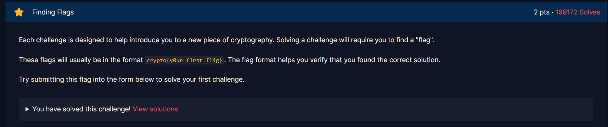

# **Introduction**
 

## **Finding Flags**

### Given
- Khái niệm cơ bản: Bài tập giới thiệu rằng mỗi thử thách mật mã (cryptography) sẽ yêu cầu bạn tìm một "flag" (cờ).

- Định dạng: Flag thường có định dạng chuẩn là crypto{...} (ví dụ để bạn biết mình đã tìm đúng kết quả).

- Dữ liệu cho sẵn: Đề bài đã cho lộ luôn đoạn flag cần tìm ngay trong phần mô tả là crypto{y0ur_f1rst_fl4g}.
### Goal
- Hiểu được cách hoạt động và định dạng nộp bài của hệ thống.

- Lấy được flag và nộp (submit) vào form của bài tập để hoàn thành thử thách đầu tiên.

### Solution

- Chỉ cần sao chép chính xác chuỗi text này: crypto{y0ur_f1rst_fl4g}

- Dán nó vào ô nhập đáp án (submit form) ở bên dưới bài tập và nhấn nộp bài là xong. (Như trong hình thì hệ thống đã báo "You have solved this challenge!" nghĩa là đã giải thành công).


## **2. Great Snakes**
Đây là bài làm quen với việc cho file .py hoạt động
Chúng ta có được file `great_snakes.py` với nội dung:
```python
#!/usr/bin/env python3

import sys
# import this

if sys.version_info.major == 2:
    print("You are running Python 2, which is no longer supported. Please update to Python 3.")

ords = [81, 64, 75, 66, 70, 93, 73, 72, 1, 92, 109, 2, 84, 109, 66, 75, 70, 90, 2, 92, 79]

print("Here is your flag:")
print("".join(chr(o ^ 0x32) for o in ords))

```
 ### **Chạy file với py3 ta được flag:**
`crypto{z3n_0f_pyth0n}`


## **3. Network Attacks**

### Given 
Mục tiêu: Kết nối tới server qua Socket, trao đổi dữ liệu bằng định dạng JSON để nhận Flag.

Địa chỉ server: socket.cryptohack.org port 11112.

Yêu cầu: Gửi một đối tượng JSON với key là "buy" và value là "flag".

### Goal 
Bài toán yêu cầu chúng ta thực hiện 3 bước chính:

Thiết lập kết nối TCP: Sử dụng thư viện mạng để kết nối tới IP/Port của server.

Định dạng dữ liệu JSON: Server không nhận văn bản thuần túy (plaintext) mà yêu cầu cấu trúc JSON: {"buy": "flag"}.

Xử lý phản hồi: Đọc dữ liệu trả về từ server để trích xuất chuỗi Flag.

Tại sao không dùng pwntools?
Mặc dù đề bài gợi ý dùng pwntools, nhưng thư viện này gặp lỗi khi cài đặt trên môi trường Windows (do phụ thuộc vào thư viện unicorn yêu cầu trình biên dịch C++). Vì vậy, phương pháp tối ưu và nhẹ nhàng nhất là sử dụng thư viện socket và json có sẵn trong Python.

### Solution
```python
import socket
import json

# Thông tin mục tiêu
HOST = "socket.cryptohack.org"
PORT = 11112

# Bước 1: Tạo kết nối Socket
# create_connection giúp tự động xử lý việc phân giải tên miền và kết nối TCP
s = socket.create_connection((HOST, PORT))
f = s.makefile('rw') # Tạo interface để đọc/ghi dễ dàng như thao tác với file

# Bước 2: Nhận thông báo chào mừng
# Server gửi 4 dòng giới thiệu, chúng ta cần đọc hết để làm sạch buffer
for _ in range(4):
    print(f.readline().strip())

# Bước 3: Gửi payload JSON
# Theo yêu cầu đề bài: {"buy": "flag"}
request = {"buy": "flag"}
payload = json.dumps(request) + '\n' # Chuyển dict thành chuỗi JSON và thêm ký tự xuống dòng
f.write(payload)
f.flush() # Đảm bảo dữ liệu được gửi đi ngay lập tức

# Bước 4: Nhận Flag
response = f.readline()
print("-" * 20)
print(f"Phản hồi từ Server: {response.strip()}")
print("-" * 20)

s.close()
```
### Flag:

```
Welcome to netcat's flag shop!
What would you like to buy?
I only speak JSON, I hope that's ok.

Sending: {'buy': 'flag'}
--------------------
KẾT QUẢ:
{"flag": "crypto{sh0pp1ng_f0r_fl4g5}"}
```
```crypto{sh0pp1ng_f0r_fl4g5}```
