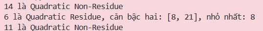
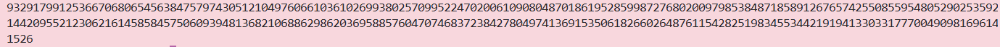

# Maththematics 
## 1. Quadratic Residues
### Given

- Một số định nghĩa:
    - **Quadratic Residue:** Một số nguyên $x$ được gọi là Quadratic Residue modulo $p$ nếu tồn tại số nguyên $a$ sao cho:
        $$a^2 ≡ x (mod p)$$
        Nói đơn giản: $x$ có căn bậc hai trong trường số modulo $p$.

    - **Quadratic Non-Residue:** Ngược lại — không tồn tại $a$ nào thỏa $a^2 ≡ x (mod p)$.

        Xấp xỉ một nửa các phần tử trong $\mathbb{F}_p^*$ là Non-Residue.

    - $\mathbb{F}_p^*$: Tập hợp các số nguyên từ $1$ đến $p−1$ trong trường hữu hạn modulo $p$ (không gồm 0).

- Cho Modulus: $p = 29$ (số nguyên tố)

- Danh sách cần kiểm tra:
    $$ints = [14, 6, 11]$$

### Goal
- Tìm phần tử nào trong $[14, 6, 11]$ là Quadratic Residue modulo $p=29$.

- Tính căn bậc hai của nó.

- Submit số nhỏ hơn trong hai nghiệm làm flag. Vì nếu $a^2 ≡ x (mod p)$ thì $(−a)^2 = a^2 ≡ x (mod p)$ cũng đúng. Hai nghiệm đó là $a$ và $p - a$

### Solution
- **Ý tưởng:** Brute-force kiểm tra từng phần tử

    Với mỗi $x$ trong danh sách, duyệt toàn bộ $a \in \lbrace 1, 2, ..., p-1 \rbrace$, kiểm tra xem có $a^2 ≡ x (mod p)$ không.

    ```python
    p = 29
    ints = [14, 6, 11]

    for x in ints:
        # Tìm tất cả a sao cho a^2 ≡ x (mod p)
        roots = [a for a in range(1, p) if pow(a, 2, p) == x]
        
        if roots:
            # x có căn bậc hai -> là Quadratic Residue
            print(f"{x} là Quadratic Residue, căn bậc hai: {roots}, nhỏ nhất: {min(roots)}")
        else:
            # x không có căn bậc hai -> là Quadratic Non-Residue
            print(f"{x} là Quadratic Non-Residue")
    ```

- **Kết quả:**

    

    => Nghiệm submit: 8

## 2. Legendre Symbol

### Given
- Một số nguyên tố 1024-bit: $p$

- Danh sách 10 số nguyên: $ints$

- Trong danh sách có 1 **Quadratic Residue** và 9 **Quadratic Non-Residue**.

- Điều kiện đặc biệt: $p ≡ 3 \pmod 4$

    > **Legendre Symbol:** Một công cụ toán học giúp kiểm tra nhanh xem một số có phải Quadratic Residue hay không, bằng một phép tính duy nhất:
    >
    > $$\left(\frac{a}{p}\right) \equiv a^{(p-1)/2} \pmod{p}$$
    >
    > * Kết quả = `1` $\rightarrow$ Quadratic Residue
    > * Kết quả = `p-1` $\rightarrow$ Quadratic Non-Residue
    > * Kết quả = `0` $\rightarrow$ a chia hết cho p

### Goal
- Dùng **Legendre Symbol** để tìm phần tử nào là Quadratic Residue trong danh sách $ints$.

- Tính căn bậc hai của nó modulo $p$.
  
- Submit `căn lớn hơn` trong hai nghiệm.

### Solution
- **Bước 1 — Dùng Legendre Symbol để lọc Quadratic Residue:**
  
    Với mỗi số $x$ trong $ints$, tính $x^{(p-1)/2} \pmod p$.
    
    Nếu kết quả bằng `1` thì $x$ là QR.

    ```python
    # Kiểm tra từng số bằng Legendre Symbol
    for x in ints:
        legendre = pow(x, (p - 1) // 2, p)
        if legendre == 1:
            qr = x  # Tìm thấy Quadratic Residue
    ```

- **Bước 2 — Tính căn bậc hai nhờ $p ≡ 3 \pmod4$:**
  
    Vì `p % 4 == 3`, ta có thể tận dụng **Fermat's Little Theorem** để tính căn trực tiếp:

    > **Fermat:** $a^{p-1} \equiv 1 \pmod p$, suy ra $a^{(p+1)/2} \equiv a^{1/2} \cdot a^{(p-1)/2} \equiv a^{1/2} \cdot 1 \pmod p$.
    > 
    > Khi $p \equiv 3 \pmod 4$, số $(p+1)/4$ là nguyên, nên:
    > 
    > $$\sqrt{x} \equiv x^{(p+1)/4} \pmod p$$

    ```python
    # Tính căn bậc hai bằng công thức Tonelli đơn giản khi p ≡ 3 mod 4
    root  = pow(qr, (p + 1) // 4, p)   # căn thứ nhất
    root2 = p - root                    # căn thứ hai (vì (-a)^2 = a^2)

    # Submit căn lớn hơn
    flag = max(root, root2)
    ```

- **Bước 3 — Kiểm chứng:**
    ```python
    assert pow(root, 2, p) == qr   # căn đúng
    assert pow(root2, 2, p) == qr  # căn kia cũng đúng
    ```

    Hai nghiệm thu được là `root` và `p - root`. Flag là nghiệm lớn hơn:

    

    > **Tại sao công thức này chỉ hoạt động khi $p \equiv 3 \pmod 4$?**
    >
    > Vì khi đó $(p+1)/4$ là số nguyên, nên phép mũ `pow(qr, (p+1)//4, p)` cho kết quả chính xác. Với các trường hợp tổng quát hơn (khi $p \equiv 1 \pmod 4$), cần dùng thuật toán **Tonelli-Shanks** phức tạp hơn. 

## 3. Modular Square Root 
### Given
- Một số nguyên tố 2048-bit: $p$

- Một số nguyên $a$

- Điều kiện: $p ≡ 1 \pmod 4$

- Khi $p ≡ 3 \pmod 4$, số $(p+1)/4$ là số nguyên nên công thức Fermat hoạt động trực tiếp.
  Khi $p ≡ 1 \pmod 4$, $(p+1)/4$ không nguyên, cần một thuật toán tổng quát hơn.

### Goal
Tìm $r^2≡a \pmod p$, dùng thuật toán **Tonelli-Shanks**. Submit căn nhỏ hơn trong hai nghiệm.

### Solution
- **Ý tưởng:** Thuật toán Tonelli-Shanks
  
    Thuật toán hoạt động dựa trên việc phân tích $p - 1 = Q \cdot 2^S$ (tách hết các thừa số 2 ra), sau đó dùng một vòng lặp để tinh chỉnh nghiệm về đúng giá trị.

    > ### **Thuật toán Tonelli-Shanks**
    > Thuật toán gồm 3 bước chính để tìm căn bậc hai modulo $p$:
    > 
    > 1. **Phân tích:** $p - 1 = Q \cdot 2^S$ với $Q$ là số lẻ.
    > 2. **Tìm Non-residue:** Tìm một số $z$ sao cho $\left(\frac{z}{p}\right) = -1$ (số không có căn bậc hai mod $p$).
    > 3. **Vòng lặp hội tụ:** Sử dụng vòng lặp để hội tụ về nghiệm đúng qua từng bước cập nhật các biến phụ trợ.

    ```python
    import os

    # Bước 0: Load dữ liệu từ file output.txt
    current_dir = os.path.dirname(os.path.abspath(__file__))
    file_path = os.path.join(current_dir, "output.txt")

    with open(file_path, "r") as f:
        content = f.read()

    # Parse từng dòng — file Tonelli-Shanks có biến p và a
    for line in content.strip().split("\n"):
        if line.startswith("p ="):
            p = int(line.split("=", 1)[1].strip())
        elif line.startswith("a ="):
            a = int(line.split("=", 1)[1].strip())

    def tonelli_shanks(a, p):
        # Kiểm tra a có phải Quadratic Residue không (Legendre Symbol)
        if pow(a, (p - 1) // 2, p) != 1:
            return None  # Không có căn bậc hai

        # Trường hợp đặc biệt: p ≡ 3 (mod 4) -> dùng công thức đơn giản
        if p % 4 == 3:
            return pow(a, (p + 1) // 4, p)

        # Bước 1: Phân tích p - 1 = Q * 2^S (tách hết thừa số 2)
        Q, S = p - 1, 0
        while Q % 2 == 0:
            Q //= 2
            S += 1

        # Bước 2: Tìm một Quadratic Non-Residue z
        z = 2
        while pow(z, (p - 1) // 2, p) != p - 1:
            z += 1

        # Bước 3: Khởi tạo các biến
        M = S
        c = pow(z, Q, p)       # c là non-residue mũ Q
        t = pow(a, Q, p)       # t sẽ hội tụ về 1
        R = pow(a, (Q + 1) // 2, p)  # R là ứng viên nghiệm

        # Bước 4: Vòng lặp tinh chỉnh nghiệm
        while True:
            if t == 1:
                return R  # Tìm được nghiệm

            # Tìm số mũ i nhỏ nhất sao cho t^(2^i) ≡ 1 (mod p)
            i, tmp = 1, pow(t, 2, p)
            while tmp != 1:
                tmp = pow(tmp, 2, p)
                i += 1

            # Cập nhật các biến
            b = pow(c, pow(2, M - i - 1), p)
            M = i
            c = pow(b, 2, p)
            t = (t * c) % p
            R = (R * b) % p

    # Tính căn bậc hai
    root  = tonelli_shanks(a, p)
    root2 = p - root

    # Kiểm chứng
    assert pow(root,  2, p) == a % p
    assert pow(root2, 2, p) == a % p

    # Submit căn nhỏ hơn
    flag = min(root, root2)
    print(flag)
    ```
- **Flag:**
    

## 4.Chinese Remainder Theorem
> ### Given

- Chinese Remainder Theorem nói rằng nếu các modulo đôi một nguyên tố cùng nhau thì hệ đồng dư sẽ có nghiệm duy nhất theo modulo là tích của chúng.
- Ở bài này ta có hệ:

$$
x \equiv 2 \pmod 5
$$

$$
x \equiv 3 \pmod {11}
$$

$$
x \equiv 5 \pmod {17}
$$

- Vì $5, 11, 17$ đôi một nguyên tố cùng nhau nên sẽ tồn tại nghiệm duy nhất theo modulo:

$$
N = 5 \cdot 11 \cdot 17 = 935
$$

> ### Goal

- Tìm số nguyên $a$ sao cho:

$$
x \equiv a \pmod {935}
$$

> ### Solution

Ở bài này mình làm theo cách thế dần, bắt đầu từ đồng dư có modulo lớn nhất.

Từ:

$$
x \equiv 5 \pmod {17}
$$

ta viết được:

$$
x = 5 + 17k
$$

Thay vào điều kiện:

$$
x \equiv 3 \pmod {11}
$$

ta có:

$$
5 + 17k \equiv 3 \pmod {11}
$$

Vì $17 \equiv 6 \pmod {11}$ nên:

$$
5 + 6k \equiv 3 \pmod {11}
$$

$$
6k \equiv -2 \equiv 9 \pmod {11}
$$

Vì nghịch đảo của $6$ theo modulo $11$ là $2$, suy ra:

$$
k \equiv 7 \pmod {11}
$$

Đặt:

$$
k = 7 + 11t
$$

Thay lại vào biểu thức của $x$:

$$
x = 5 + 17(7 + 11t)
$$

$$
x = 124 + 187t
$$

Tiếp tục dùng điều kiện:

$$
x \equiv 2 \pmod 5
$$

ta có:

$$
124 + 187t \equiv 2 \pmod 5
$$

Vì $124 \equiv 4 \pmod 5$ và $187 \equiv 2 \pmod 5$ nên:

$$
4 + 2t \equiv 2 \pmod 5
$$

$$
2t \equiv -2 \equiv 3 \pmod 5
$$

Vì nghịch đảo của $2$ theo modulo $5$ là $3$, suy ra:

$$
t \equiv 4 \pmod 5
$$

Đặt:

$$
t = 4 + 5s
$$

Thay vào:

$$
x = 124 + 187(4 + 5s)
$$

$$
x = 124 + 748 + 935s
$$

$$
x = 872 + 935s
$$

Vậy:

$$
x \equiv 872 \pmod {935}
$$

nên giá trị cần tìm là: ` a = 872`

### Code

```python
for x in range(935):
    if x % 5 == 2 and x % 11 == 3 and x % 17 == 5:
        print(x)
        break
```

---


## 5. Successive Powers

### Given

- Đề bài cho dãy số:

$$
\{588, 665, 216, 113, 642, 4, 836, 114, 851, 492, 819, 237\}
$$

- Đây là các lũy thừa liên tiếp rất lớn của một số nguyên $x$ theo modulo một số nguyên tố có 3 chữ số $p$.

Điều đó nghĩa là nếu đặt:

$$
a_0 = 588,\ a_1 = 665,\ a_2 = 216,\dots
$$

thì ta có dạng:

$$
a_{i+1} \equiv a_i \cdot x \pmod p
$$

> ### Goal

- Tìm được $p$ và $x$ để suy ra flag.

> ### Solution

Ở bài này mình dùng tính chất của các lũy thừa liên tiếp.

Nếu:

$$
a_{i+1} \equiv a_i \cdot x \pmod p
$$

và

$$
a_{i+2} \equiv a_{i+1} \cdot x \pmod p
$$

thì suy ra:

$$
a_{i+1}^2 \equiv a_i \cdot a_{i+2} \pmod p
$$

nên:

$$
p \mid (a_{i+1}^2 - a_i a_{i+2})
$$

Tức là với mỗi bộ 3 số liên tiếp, biểu thức:

$$
a_{i+1}^2 - a_i a_{i+2}
$$

đều chia hết cho $p$.

Mình lấy nhiều bộ 3 số liên tiếp rồi tính các giá trị đó, sau đó lấy $\gcd$ của tất cả các kết quả. Khi làm vậy mình thu được:

$$
p = 919
$$

Sau khi có $p$, mình lấy hai số liên tiếp đầu tiên:

$$
665 \equiv 588 \cdot x \pmod {919}
$$

suy ra:

$$
x \equiv 665 \cdot 588^{-1} \pmod {919}
$$

Tính ra được:

$$
x = 209
$$

Vậy:

- $p = 919$
- $x = 209$

Nếu theo format của CryptoHack thì flag là:

```text
crypto{919,209}

```
---

## 6. Adrien's Signs

### Given

- File `source.py` cho biết chương trình chuyển từng byte của flag thành chuỗi bit nhị phân, rồi mã hóa từng bit riêng lẻ. Với mỗi bit, chương trình chọn ngẫu nhiên một số mũ `e`, tính `n = a^e mod p`. Nếu bit là `1` thì lưu `n`, còn nếu bit là `0` thì lưu `-n mod p`. Ở đây:

$$
a = 288260533169915
$$

$$
p = 1007621497415251
$$


- File `output.txt` chứa toàn bộ danh sách ciphertext đã được tạo ra từ quá trình trên.

> ### Goal

- Khôi phục lại từng bit của bản rõ từ danh sách ciphertext, sau đó ghép lại để tìm ra flag. 

> ### Solution

Ở bài này điểm quan trọng là phân biệt được giá trị nào là:

$$
a^e \bmod p
$$

và giá trị nào là:

$$
-a^e \bmod p
$$

Từ source code, ta thấy:

- bit `1`  → lưu `a^e mod p`
- bit `0`  → lưu `-a^e mod p`

nên nếu phân biệt được hai loại số này thì ta đọc lại được toàn bộ bit của flag.

Ý tưởng nằm ở **quadratic residue**.

Trước hết, ta kiểm tra:

$$
p \bmod 4 = 3
$$

Khi một số nguyên tố lẻ thỏa mãn điều này, thì `-1` là **quadratic non-residue** modulo `p`.

Tiếp theo, dùng tiêu chuẩn Euler để kiểm tra `a`:

$$
a^{(p-1)/2} \bmod p = 1
$$

nên `a` là **quadratic residue** modulo `p`.

Vì `a` là quadratic residue, nên mọi lũy thừa của nó như:

$$
a^e \bmod p
$$

vẫn luôn là quadratic residue.

Ngược lại, nếu lấy dấu âm:

$$
-a^e \bmod p
$$

thì đó sẽ là quadratic non-residue, vì:

- `a^e` là residue
- `-1` là non-residue
- residue nhân non-residue sẽ thành non-residue

Vậy ta có cách giải mã rất rõ ràng:

- nếu ciphertext là **quadratic residue** thì bit gốc là `1`
- nếu ciphertext là **quadratic non-residue** thì bit gốc là `0`

Để kiểm tra một số có là quadratic residue modulo `p` hay không, ta dùng tiêu chuẩn Euler:

$$
c^{(p-1)/2} \bmod p
$$

- nếu kết quả bằng `1` thì `c` là quadratic residue
- nếu kết quả bằng `p-1` thì `c` là quadratic non-residue

Sau khi duyệt toàn bộ danh sách trong `output.txt`, ta thu được chuỗi bit. Nhóm mỗi 8 bit thành một byte rồi chuyển về ASCII, ta nhận được flag:

```text
crypto{p4tterns_1n_re5idu3s}
```
```python
a = 288260533169915
p = 1007621497415251

ciphertext = [67594220461269, 501237540280788, 718316769824518, 296304224247167, 48290626940198, 30829701196032, 521453693392074, 840985324383794, 770420008897119, 745131486581197, 729163531979577, 334563813238599, 289746215495432, 538664937794468, 894085795317163, 983410189487558, 863330928724430, 996272871140947, 352175210511707, 306237700811584, 631393408838583, 589243747914057, 538776819034934, 365364592128161, 454970171810424, 986711310037393, 657756453404881, 388329936724352, 90991447679370, 714742162831112, 62293519842555, 653941126489711, 448552658212336, 970169071154259, 339472870407614, 406225588145372, 205721593331090, 926225022409823, 904451547059845, 789074084078342, 886420071481685, 796827329208633, 433047156347276, 21271315846750, 719248860593631, 534059295222748, 879864647580512, 918055794962142, 635545050939893, 319549343320339, 93008646178282, 926080110625306, 385476640825005, 483740420173050, 866208659796189, 883359067574584, 913405110264883, 898864873510337, 208598541987988, 23412800024088, 911541450703474, 57446699305445, 513296484586451, 180356843554043, 756391301483653, 823695939808936, 452898981558365, 383286682802447, 381394258915860, 385482809649632, 357950424436020, 212891024562585, 906036654538589, 706766032862393, 500658491083279, 134746243085697, 240386541491998, 850341345692155, 826490944132718, 329513332018620, 41046816597282, 396581286424992, 488863267297267, 92023040998362, 529684488438507, 925328511390026, 524897846090435, 413156582909097, 840524616502482, 325719016994120, 402494835113608, 145033960690364, 43932113323388, 683561775499473, 434510534220939, 92584300328516, 763767269974656, 289837041593468, 11468527450938, 628247946152943, 8844724571683, 813851806959975, 72001988637120, 875394575395153, 70667866716476, 75304931994100, 226809172374264, 767059176444181, 45462007920789, 472607315695803, 325973946551448, 64200767729194, 534886246409921, 950408390792175, 492288777130394, 226746605380806, 944479111810431, 776057001143579, 658971626589122, 231918349590349, 699710172246548, 122457405264610, 643115611310737, 999072890586878, 203230862786955, 348112034218733, 240143417330886, 927148962961842, 661569511006072, 190334725550806, 763365444730995, 516228913786395, 846501182194443, 741210200995504, 511935604454925, 687689993302203, 631038090127480, 961606522916414, 138550017953034, 932105540686829, 215285284639233, 772628158955819, 496858298527292, 730971468815108, 896733219370353, 967083685727881, 607660822695530, 650953466617730, 133773994258132, 623283311953090, 436380836970128, 237114930094468, 115451711811481, 674593269112948, 140400921371770, 659335660634071, 536749311958781, 854645598266824, 303305169095255, 91430489108219, 573739385205188, 400604977158702, 728593782212529, 807432219147040, 893541884126828, 183964371201281, 422680633277230, 218817645778789, 313025293025224, 657253930848472, 747562211812373, 83456701182914, 470417289614736, 641146659305859, 468130225316006, 46960547227850, 875638267674897, 662661765336441, 186533085001285, 743250648436106, 451414956181714, 527954145201673, 922589993405001, 242119479617901, 865476357142231, 988987578447349, 430198555146088, 477890180119931, 844464003254807, 503374203275928, 775374254241792, 346653210679737, 789242808338116, 48503976498612, 604300186163323, 475930096252359, 860836853339514, 994513691290102, 591343659366796, 944852018048514, 82396968629164, 152776642436549, 916070996204621, 305574094667054, 981194179562189, 126174175810273, 55636640522694, 44670495393401, 74724541586529, 988608465654705, 870533906709633, 374564052429787, 486493568142979, 469485372072295, 221153171135022, 289713227465073, 952450431038075, 107298466441025, 938262809228861, 253919870663003, 835790485199226, 655456538877798, 595464842927075, 191621819564547]

bits = ""
for c in ciphertext:
    legendre = pow(c, (p - 1) // 2, p)
    if legendre == 1:
        bits += "1"
    else:
        bits += "0"

flag = ""
for i in range(0, len(bits), 8):
    byte = bits[i:i+8]
    flag += chr(int(byte, 2))

print(flag)
```


---

## 7.Modular Binomials

### Given
* **Modulus:** $N = p \cdot q$.
* **Hai phương trình mã hóa nhị thức:**
    1. $c_1 \equiv (2p + 3q)^{e_1} \pmod N$
    2. $c_2 \equiv (5p + 7q)^{e_2} \pmod N$
* **Dữ liệu đã biết:** $N, e_1, e_2, c_1, c_2$.

### Goal
Dựa trên khai triển nhị thức Newton $(a+b)^n$, khi làm việc trên modulo $N=pq$, mọi hạng tử có chứa tích $pq$ đều bằng $0$.
Do đó:
* $c_1 \equiv (2p)^{e_1} + (3q)^{e_1} \pmod N$
* $c_2 \equiv (5p)^{e_2} + (7q)^{e_2} \pmod N$

Tuy nhiên, nếu xét riêng theo từng modulo của các số nguyên tố thành phần:
* $c_1 \equiv (2p + 3q)^{e_1} \equiv (3q)^{e_1} \pmod p$ (vì $2p \equiv 0 \pmod p$)
* $c_2 \equiv (5p + 7q)^{e_2} \equiv (7q)^{e_2} \pmod p$ (vì $5p \equiv 0 \pmod p$)


### Solution
Để tìm $q$ (hoặc $p$), chúng ta cần đưa hai phương trình về cùng một dạng lũy thừa để triệt tiêu $q$.

**Bước 1: Nâng lũy thừa hai vế**
* Từ $c_1 \equiv (3q)^{e_1} \pmod p$, nâng lũy thừa $e_2$:
  $$c_1^{e_2} \equiv 3^{e_1 \cdot e_2} \cdot q^{e_1 \cdot e_2} \pmod p$$
* Từ $c_2 \equiv (7q)^{e_2} \pmod p$, nâng lũy thừa $e_1$:
  $$c_2^{e_1} \equiv 7^{e_1 \cdot e_2} \cdot q^{e_1 \cdot e_2} \pmod p$$

**Bước 2: Triệt tiêu $q^{e_1 e_2}$**
Nhân chéo các hệ số để chúng giống nhau:
* Nhân phương trình (1) với $7^{e_1 e_2}$: $7^{e_1 e_2} \cdot c_1^{e_2} \equiv 7^{e_1 e_2} \cdot 3^{e_1 e_2} \cdot q^{e_1 e_2} \pmod p$
* Nhân phương trình (2) with $3^{e_1 e_2}$: $3^{e_1 e_2} \cdot c_2^{e_1} \equiv 3^{e_1 e_2} \cdot 7^{e_1 e_2} \cdot q^{e_1 e_2} \pmod p$

Khi đó:
$$7^{e_1 e_2} \cdot c_1^{e_2} - 3^{e_1 e_2} \cdot c_2^{e_1} \equiv 0 \pmod p$$

**Bước 3: Sử dụng GCD**
Vì biểu thức trên là bội số của $p$, ta chỉ cần tính:
$$p = \text{gcd}(7^{e_1 e_2} \cdot c_1^{e_2} - 3^{e_1 e_2} \cdot c_2^{e_1}, N)$$

*(Lưu ý: Trong code của bạn, bạn sử dụng hệ số $5$ và $2$ để triệt tiêu theo hướng khác, nhưng nguyên lý toán học là tương đương).*
```python
from math import gcd
N = 14905562257842714057932724129575002825405393502650869767115942606408600343380327866258982402447992564988466588305174271674657844352454543958847568190372446723549627752274442789184236490768272313187410077124234699854724907039770193680822495470532218905083459730998003622926152590597710213127952141056029516116785229504645179830037937222022291571738973603920664929150436463632305664687903244972880062028301085749434688159905768052041207513149370212313943117665914802379158613359049957688563885391972151218676545972118494969247440489763431359679770422939441710783575668679693678435669541781490217731619224470152467768073
e1 = 12886657667389660800780796462970504910193928992888518978200029826975978624718627799215564700096007849924866627154987365059524315097631111242449314835868137
e2 = 12110586673991788415780355139635579057920926864887110308343229256046868242179445444897790171351302575188607117081580121488253540215781625598048021161675697
c1 = 14010729418703228234352465883041270611113735889838753433295478495763409056136734155612156934673988344882629541204985909650433819205298939877837314145082403528055884752079219150739849992921393509593620449489882380176216648401057401569934043087087362272303101549800941212057354903559653373299153430753882035233354304783275982332995766778499425529570008008029401325668301144188970480975565215953953985078281395545902102245755862663621187438677596628109967066418993851632543137353041712721919291521767262678140115188735994447949166616101182806820741928292882642234238450207472914232596747755261325098225968268926580993051
c2 = 14386997138637978860748278986945098648507142864584111124202580365103793165811666987664851210230009375267398957979494066880296418013345006977654742303441030008490816239306394492168516278328851513359596253775965916326353050138738183351643338294802012193721879700283088378587949921991198231956871429805847767716137817313612304833733918657887480468724409753522369325138502059408241232155633806496752350562284794715321835226991147547651155287812485862794935695241612676255374480132722940682140395725089329445356434489384831036205387293760789976615210310436732813848937666608611803196199865435145094486231635966885932646519

x1 = pow(5, e1 * e2, N) * pow(c1, e2, N)
x2 = pow(2, e1 * e2, N) * pow(c2, e1, N)

q = gcd(x1 - x2, N)

p = N // q

print(p)
print(q)
```

`112274000169258486390262064441991200608556376127408952701514962644340921899196091557519382763356534106376906489445103255177593594898966250176773605432765983897105047795619470659157057093771407309168345670541418772427807148039207489900810013783673957984006269120652134007689272484517805398390277308001719431273
132760587806365301971479157072031448380135765794466787456948786731168095877956875295282661565488242190731593282663694728914945967253173047324353981530949360031535707374701705328450856944598803228299967009004598984671293494375599408764139743217465012770376728876547958852025425539298410751132782632817947101601`

## 8.Broken RSA
### Given
* [cite_start]Các thông số RSA tiêu chuẩn: $n$, $e = 16$, và ciphertext $ct$[cite: 1].
* [cite_start]Điểm bất thường: Số mũ công khai $e$ là một lũy thừa của 2 ($e = 2^4 = 16$), trong khi thông thường $e$ phải là số nguyên tố (thường là 65537)[cite: 1].
* Vì $e = 16$ không nguyên tố cùng nhau với $\phi(n)$ (do $\phi(n)$ luôn chẵn), nên số nghịch đảo $d$ không tồn tại theo cách thông thường.

### Goal
* Giải quyết vấn đề $GCD(e, \phi(n)) \neq 1$ để tìm lại tất cả các bản rõ $m$ khả thi và lọc ra Flag.

### Solution

Phân tích lỗ hổng
Trong RSA, nếu $GCD(e, \phi(n)) = g > 1$, phép toán khai căn bậc $e$ modulo $n$ sẽ cho ra nhiều kết quả khác nhau (tương tự như việc $x^2 = 4$ có hai nghiệm $2$ và $-2$). Ở đây $e = 16$, nghĩa là ta đang thực hiện khai căn bậc 16, có thể dẫn đến tối đa 16 nghiệm khác nhau (các căn đơn vị).

Các bước thực hiện
1.  **Xác định $\phi(n)$:** Vì không có thông tin về các thừa số của $n$, giả định $n$ là số nguyên tố để tính $\phi(n) = n - 1$. Thực tế, $n$ trong bài là một số nguyên tố lớn.
2.  **Xử lý tính nguyên tố cùng nhau:** * Loại bỏ các thừa số chung của $e$ và $\phi(n)$ để tạo ra $\phi_{coprime}$ sao cho $GCD(e, \phi_{coprime}) = 1$.
    * Tính $d = e^{-1} \pmod{\phi_{coprime}}$.
3.  **Tìm nghiệm cơ sở:** Tính một nghiệm $m_0 = ct^d \pmod n$. Đây là một trong những bản rõ tiềm năng thỏa mãn $m_0^e \equiv ct \pmod n$.
4.  **Tìm các căn đơn vị (Roots of Unity):** * Tìm các giá trị $r$ sao cho $r^e \equiv 1 \pmod n$. 
    * Các nghiệm này được tìm bằng cách tính $i^{\phi_{coprime}} \pmod n$ với các số nguyên $i$ nhỏ.
5.  **Khôi phục Flag:** * Nhân nghiệm cơ sở $m_0$ với từng căn đơn vị: $m = (m_0 \cdot r) \pmod n$.
    * Chuyển các giá trị $m$ thu được từ dạng số sang dạng bytes để tìm chuỗi có định dạng `crypto{...}`.
``` python 
import Crypto.Util.number as cun
from pprint import pprint

def roots_of_unity(e, phi, n, rounds=500):
    # Divide common factors of `phi` and `e` until they're coprime.
    phi_coprime = phi
    while cun.GCD(phi_coprime, e) != 1:
        phi_coprime //= cun.GCD(phi_coprime, e)

    # Don't know how many roots of unity there are, so just try and collect a bunch
    roots = set(pow(i, phi_coprime, n) for i in range(1, rounds))

    assert all(pow(root, e, n) == 1 for root in roots)
    return roots, phi_coprime

e = 16
n=27772857409875257529415990911214211975844307184430241451899407838750503024323367895540981606586709985980003435082116995888017731426634845808624796292507989171497629109450825818587383112280639037484593490692935998202437639626747133650990603333094513531505209954273004473567193235535061942991750932725808679249964667090723480397916715320876867803719301313440005075056481203859010490836599717523664197112053206745235908610484907715210436413015546671034478367679465233737115549451849810421017181842615880836253875862101545582922437858358265964489786463923280312860843031914516061327752183283528015684588796400861331354873
c = 11303174761894431146735697569489134747234975144162172162401674567273034831391936916397234068346115459134602443963604063679379285919302225719050193590179240191429612072131629779948379821039610415099784351073443218911356328815458050694493726951231241096695626477586428880220528001269746547018741237131741255022371957489462380305100634600499204435763201371188769446054925748151987175656677342779043435047048130599123081581036362712208692748034620245590448762406543804069935873123161582756799517226666835316588896306926659321054276507714414876684738121421124177324568084533020088172040422767194971217814466953837590498718

# Problem: e and phi are not coprime - d does not exist
phi = n-1 # there were no prime factors of n

# Find e'th roots of unity modulo n
roots, phi_coprime = roots_of_unity(e, phi, n)

# Use our `phi_coprime` to get one possible plaintext
d = pow(e, -1, phi_coprime)
m = pow(c, d, n)
assert pow(m, e, n) == c

# Use the roots of unity to get all other possible plaintexts
ms = [(m * root) % n for root in roots]
ms = [cun.long_to_bytes(m) for m in ms]
pprint(ms)

```
---
`crypto{m0dul4r_squ4r3_r00t}`
## 9.No Way Back Home

### Given
* **Giao thức:** Đề bài mô tả một giao thức trao đổi khóa (Key Exchange) dựa trên RSA nhưng có tùy chỉnh. 
* **Alice** chọn một giá trị bí mật $v$ có dạng: $v = (p \cdot r) \pmod n$, với $r$ là số ngẫu nhiên và $p, q$ là các thừa số của $n$.
* Các bước trao đổi bao gồm việc nhân $v$ với các khóa $k_A, k_B$ và chia nghịch đảo (commutative property).
* **Bản mã:** Flag được mã hóa bằng **AES-ECB**, trong đó `key = sha256(long_to_bytes(v))`.
* **Dữ liệu cung cấp:** $p, q, vka, vkakb, c$.

### **2. Mục tiêu (Goal)**
* Tìm lại giá trị bí mật $v$ để tạo khóa AES và giải mã Flag.

### Solution

Lỗ hổng toán học
Nhìn vào cách Alice tạo $v$:
$$v \equiv p \cdot r \pmod n$$
Vì $v$ là bội số của $p$ trong modulo $n$, ta có tính chất cực kỳ quan trọng:
$$v \equiv 0 \pmod p$$
Theo **Định lý Số dư Trung Hoa (CRT)**, một số $v$ trong modulo $n=pq$ được xác định bởi:
1. $v \equiv v_p \pmod p$
2. $v \equiv v_q \pmod q$

Từ cách khởi tạo, ta đã biết $v_p = 0$. Bây giờ ta cần tìm $v_q = v \pmod q$.

Các bước thực hiện
1. **Tìm $v \pmod q$:** Quan sát các giá trị công khai:
   $vka = (v \cdot k_A) \pmod n$
   $vkakb = (vka \cdot k_B) \pmod n$
   
   Trong modulo $q$, ta có:
   $vka \equiv v \cdot k_A \pmod q$
   $vkakb \equiv vka \cdot k_B \pmod q$
   
   Từ các dữ liệu trong `out.txt`, ta có thể tính:
   $k_B \equiv vkakb \cdot vka^{-1} \pmod q$
   *(Tuy nhiên, ta không cần tìm $k_A, k_B$. Ta chỉ cần nhận ra rằng $v$ có thể được khôi phục trực tiếp).*

2. **Khôi phục $v$ bằng CRT:**
   Ta có hệ phương trình:
   * $v \equiv 0 \pmod p$
   * $v \equiv vka \cdot (vka/v \text{ là hằng số}) \dots$ thực tế đơn giản hơn:
   Vì $vka = v \cdot k_A \pmod n$, nên $vka$ cũng là bội của $p$ (do $v$ là bội của $p$).
   Giá trị $v$ thực chất có thể được tìm bằng cách lấy:
   $v = vka \cdot (vka^{-1} \pmod q) \cdot (\dots)$ 
   **Cách đơn giản nhất:** Vì $v = p \cdot r$, ta có $vka = p \cdot r \cdot k_A \pmod n$. 
   Giá trị $v$ mà Alice dùng để tạo key chính là $v = vka \cdot k_A^{-1} \pmod n$. Nhưng chúng ta không có $k_A$. 
   
   **Mấu chốt:** $v$ là một giá trị mà $v \equiv 0 \pmod p$. Từ $vka$, ta có thể tính $v$ trong modulo $q$:
   $v \pmod q = vka \cdot (vkakb \cdot vkb^{-1} \dots)$ 
   Thực tế, đề bài cho $vkakb$ và $vka$. Ta có $k_B \equiv vkakb \cdot vka^{-1} \pmod q$.
   Alice gửi $vkb = v \cdot k_B \pmod n$. 
   Vậy $v \equiv vkb \cdot k_B^{-1} \pmod q$.

3. **Giải mã:**
   Có $v$, tính `SHA256(v)` làm key AES để giải mã bản mã $c$ trong `out.txt`.

``` python 
import math
from Crypto.Hash import SHA256
from Crypto.Util.number import long_to_bytes
from Crypto.Cipher import AES
from Crypto.Util.Padding import unpad

# --- Dữ liệu từ đề bài ---
p, q = (10699940648196411028170713430726559470427113689721202803392638457920771439452897032229838317321639599506283870585924807089941510579727013041135771337631951, 11956676387836512151480744979869173960415735990945471431153245263360714040288733895951317727355037104240049869019766679351362643879028085294045007143623763) 

vka = 124641741967121300068241280971408306625050636261192655845274494695382484894973990899018981438824398885984003880665335336872849819983045790478166909381968949910717906136475842568208640203811766079825364974168541198988879036997489130022151352858776555178444457677074095521488219905950926757695656018450299948207 
vkakb = 114778245184091677576134046724609868204771151111446457870524843414356897479473739627212552495413311985409829523700919603502616667323311977056345059189257932050632105761365449853358722065048852091755612586569454771946427631498462394616623706064561443106503673008210435922340001958432623802886222040403262923652 
vkb = 6568897840127713147382345832798645667110237168011335640630440006583923102503659273104899584827637961921428677335180620421654712000512310008036693022785945317428066257236409339677041133038317088022368203160674699948914222030034711433252914821805540365972835274052062305301998463475108156010447054013166491083 
c_hex = 'fef29e5ff72f28160027959474fc462e2a9e0b2d84b1508f7bd0e270bc98fac942e1402aa12db6e6a36fb380e7b53323' 

# --- Hàm Định lý Số dư Trung Hoa (CRT) ---
def chinese_remainder(n, a):
    tong = 0
    tich = math.prod(n)
    for n_i, a_i in zip(n, a):
        p = tich // n_i
        # Tìm nghịch đảo modun của p theo n_i
        tong += a_i * pow(p, -1, n_i) * p
    return tong % tich

# Bước 1: Tính v theo mod q
# Vì v chứa thừa số p nên v không thể nghịch đảo mod N. 
# Ta tính toán trên mod q vì gcd(vkakb, q) = 1.
vq = (vka * vkb * pow(vkakb, -1, q)) % q

# Giải thích: vq ≡ v mod q

# Bước 2: Áp dụng CRT
# Ta biết:
# v ≡ vq (mod q)
# v ≡ 0  (mod p) -> vì v = k * p
v = chinese_remainder([q, p], [vq, 0])

# Bước 3: Giải mã bản tin
# Tạo khóa bằng cách băm SHA256 giá trị v (dạng bytes)
h = SHA256.new()
h.update(long_to_bytes(v))
key = h.digest()

# Thiết lập bộ giải mã AES (chế độ ECB theo đề bài)
cipher = AES.new(key, AES.MODE_ECB)
c_bytes = bytes.fromhex(c_hex)
decrypted_msg = cipher.decrypt(c_bytes)

# Loại bỏ padding và in Flag
try:
    flag = unpad(decrypted_msg, 16)
    print(f"Flag tìm được: {flag.decode()}")
except Exception as e:
    print("Lỗi giải mã hoặc sai padding:", e)
    
``` 


`
112274000169258486390262064441991200608556376127408952701514962644340921899196091557519382763356534106376906489445103255177593594898966250176773605432765983897105047795619470659157057093771407309168345670541418772427807148039207489900810013783673957984006269120652134007689272484517805398390277308001719431273
132760587806365301971479157072031448380135765794466787456948786731168095877956875295282661565488242190731593282663694728914945967253173047324353981530949360031535707374701705328450856944598803228299967009004598984671293494375599408764139743217465012770376728876547958852025425539298410751132782632817947101601`


## 10.Ellipse Curve Cryptography

### Given
* File `source.py` mô tả một hệ thống trao đổi khóa Diffie-Hellman nhưng sử dụng một đường cong đặc biệt: **Ellipse** (hình elip) thay vì **Elliptic Curve** (đường cong Elliptic) tiêu chuẩn. 
* Phương trình được sử dụng có dạng: $\frac{x^2}{a^2} + \frac{y^2}{b^2} = 1 \pmod p$.
* File `output.txt` cung cấp:
    * Số nguyên tố $p$, các tham số $a, b$.
    * Điểm cơ sở $G$ và các khóa công khai $Q_A, Q_B$.
    * Giá trị `iv` và `encrypted_flag` được mã hóa bằng AES-CBC.

### Goal
* Hiểu cách thực hiện phép toán trên đường cong "Ellipse" này để tính toán **Shared Secret** và giải mã Flag.

### Solution

Phân tích lỗ hổng
Thử thách này đánh lừa người chơi bằng cách sử dụng "Ellipse" thay vì "Elliptic Curve". 
* Trong **Elliptic Curve** ($y^2 = x^3 + ax + b$), phép cộng điểm rất phức tạp.
* Trong **Ellipse** ($x^2/a^2 + y^2/b^2 = 1$), nếu ta thực hiện đổi biến, đường cong này thực chất tương đương với một nhóm nhân trên trường mở rộng hoặc đơn giản hơn là một phép xoay tọa độ tuyến tính. 
* Lỗ hổng nằm ở chỗ cấu trúc nhóm của Ellipse đơn giản hơn nhiều so với đường cong Elliptic thực thụ, cho phép ta giải bài toán **Logarit rời rạc (DLP)** một cách hiệu quả.

Các bước thực hiện
1.  **Chuyển đổi về dạng dễ tính toán:** Phương trình $\frac{x^2}{a^2} + \frac{y^2}{b^2} \equiv 1 \pmod p$ có thể được ánh xạ vào một trường số phức giả định hoặc sử dụng tham số hóa lượng giác/hyperbolic. 
2.  **Giải bài toán Logarit rời rạc (DLP):** * Sử dụng thuật toán như **Pohlig-Hellman** hoặc các hàm hỗ trợ trong thư viện như `SageMath` để tìm khóa bí mật $n_A$ từ $Q_A = n_A \cdot G$. 
    * Lưu ý: Phép "cộng điểm" trên Ellipse trong bài thực chất là một phép biến đổi tuyến tính có thể biểu diễn bằng ma trận.
3.  **Tính Shared Secret:** Sau khi có $n_A$, tính điểm chung $S = n_A \cdot Q_B$. Tọa độ $x$ của điểm $S$ chính là `shared_secret`.
4.  [cite_start]**Giải mã AES:** * Dùng `shared_secret` làm nguyên liệu để tạo khóa AES: `key = sha1(str(shared_secret).encode()).digest()[:16]`[cite: 7].
    * [cite_start]Sử dụng `iv` và `key` để giải mã `encrypted_flag` bằng thuật toán AES-CBC[cite: 7].
    * [cite_start]Loại bỏ Padding (PKCS#7) để thu được Flag cuối cùng[cite: 7].

---
``` python 
from hashlib import sha1
from Crypto.Cipher import AES
from Crypto.Util.Padding import unpad

# Shared Secret đã tính được từ SageMath
shared_secret = 83201481069630956436480435779471169630605662777874697301601848920266492

# Dữ liệu từ output.txt
iv_hex = '64bc75c8b38017e1397c46f85d4e332b'
enc_flag_hex = '13e4d200708b786d8f7c3bd2dc5de0201f0d7879192e6603d7c5d6b963e1df2943e3ff75f7fda9c30a92171bbbc5acbf'

# 1. Tạo khóa AES từ shared secret (theo source.py)
key = sha1(str(shared_secret).encode('ascii')).digest()[:16]

# 2. Chuyển dữ liệu hex sang bytes
iv = bytes.fromhex(iv_hex)
ciphertext = bytes.fromhex(enc_flag_hex)

# 3. Giải mã
cipher = AES.new(key, AES.MODE_CBC, iv)
try:
    decrypted = cipher.decrypt(ciphertext)
    # Gỡ padding PKCS#7
    flag = unpad(decrypted, 16)
    print("----------------------------------------")
    print(f"FLAG: {flag.decode()}")
    print("----------------------------------------")
except Exception as e:
    print(f"Lỗi khi giải mã: {e}")
```


`crypto{c0n1c_s3ct10n5_4r3_f1n1t3_gr0up5}`

## 11. Roll your Own

### Given

- Bài toán Discrete Logarithm (DLP) tìm $x$ từ phương trình $h \equiv g^x \pmod n$ được coi là rất khó giải nếu $n$ là một số nguyên tố lớn và nhóm có cấu trúc an toàn.
- Server cung cấp cho ta một số nguyên tố $q$ (512-bit). Điểm yếu chết người là server cho phép ta tự chọn cơ số $g$ và modulo $n$, với một điều kiện duy nhất:$$g^q \equiv 1 \pmod n$$
- Sau khi vượt qua vòng kiểm tra này, server sẽ chọn một số ngẫu nhiên $x$ trong khoảng $[0, q]$, tính public key $h = g^x \pmod n$ và gửi lại cho ta.

### Goal

Tìm ra tham số $g$ và $n$ phù hợp để "lách" qua bài kiểm tra của server, đồng thời biến phương trình $h \equiv g^x \pmod n$ thành một phương trình tuyến tính dễ giải để tìm lại khóa bí mật $x$.

### Solution
- Sử dụng Khai triển nhị thức (Binomial Expansion) kết hợp với một Modulo hợp số (Composite Modulus).
```python
from pwn import remote
from json import loads, dumps

import logging
logging.getLogger("pwnlib").setLevel(logging.ERROR)

HOST = 'socket.cryptohack.org'
PORT = 13403

def solve():
    r = remote(HOST, PORT)

    r.recvuntil(b"Prime generated: ")
    q_str = r.recvline().decode().strip()
    q = int(q_str.replace('"', ''), 16)

    g = q + 1
    n = q ** 2
    
    payload_params = {
        "g": hex(g),
        "n": hex(n)
    }

    r.recvuntil(b"Send integers (g,n) such that pow(g,q,n) = 1: ")
    r.sendline(dumps(payload_params).encode())
    r.recvuntil(b"Generated my public key: ")
    h_str = r.recvline().decode().strip()
    h = int(h_str.replace('"', ''), 16)
    x = (h - 1) // q
    payload_secret = {
        "x": hex(x)
    }
    r.recvuntil(b"What is my private key: ")
    r.sendline(dumps(payload_secret).encode())

    response = r.recvline().decode().strip()
    try:
        flag = loads(response)['flag']
        print(f"{flag}")
    r.close()

if __name__ == '__main__':
    solve()
```
> Kết quả:
`crypto{Grabbing_Flags_with_Pascal_Paillier}`

---
## 12. Unencryptable

### Given

- Theo output của file output.txt, khi chạy hàm encrypt(DATA, e, N), hệ thống đã in ra dòng chữ "RSA broken!?".
- Nhìn vào mã nguồn hàm encrypt, dòng chữ này chỉ được in ra khi bản mã bằng đúng bản rõ:$$m^e \equiv m \pmod N$$
- Điều này có nghĩa là biến DATA ($m$) là một điểm cố định (fixed point) của khóa public này. Nó đi qua hàm mã hóa nhưng không hề bị thay đổi.

### Goal

- Lợi dụng tính chất $m^e \equiv m \pmod N$ của biến DATA để phân tích thừa số nguyên tố modulo $N$ (tìm ra $p$ và $q$). 
- Sau khi có $p$ và $q$, ta dễ dàng tính được Private Key $d$ và giải mã biến encrypted_flag ($c$).

### Solution
```python
from Crypto.Util.number import bytes_to_long, long_to_bytes, inverse
from math import gcd

DATA = bytes.fromhex("372f0e88f6f7189da7c06ed49e87e0664b988ecbee583586dfd1c6af99bf20345ae7442012c6807b3493d8936f5b48e553f614754deb3da6230fa1e16a8d5953a94c886699fc2bf409556264d5dced76a1780a90fd22f3701fdbcb183ddab4046affdc4dc6379090f79f4cd50673b24d0b08458cdbe509d60a4ad88a7b4e2921")
N = 0x7fe8cafec59886e9318830f33747cafd200588406e7c42741859e15994ab62410438991ab5d9fc94f386219e3c27d6ffc73754f791e7b2c565611f8fe5054dd132b8c4f3eadcf1180cd8f2a3cc756b06996f2d5b67c390adcba9d444697b13d12b2badfc3c7d5459df16a047ca25f4d18570cd6fa727aed46394576cfdb56b41
e = 0x10001
c = 0x5233da71cc1dc1c5f21039f51eb51c80657e1af217d563aa25a8104a4e84a42379040ecdfdd5afa191156ccb40b6f188f4ad96c58922428c4c0bc17fd5384456853e139afde40c3f95988879629297f48d0efa6b335716a4c24bfee36f714d34a4e810a9689e93a0af8502528844ae578100b0188a2790518c695c095c9d677b

m = bytes_to_long(DATA)

p = 0
q = 0

if gcd(m, N) > 1 and gcd(m, N) != N:
    p = gcd(m, N)
    q = N // p
else:
    x = m
    for _ in range(16): # e - 1 = 65536 = 2^16, nên ta bình phương tối đa 16 lần
        next_x = pow(x, 2, N)
        if next_x == 1:
            if x != 1 and x != N - 1:
                p = gcd(x - 1, N)
                q = N // p
                break
        x = next_x

if p and q:
    print(f"[+] Tìm thấy p = {p}")
    print(f"[+] Tìm thấy q = {q}")
    
    phi = (p - 1) * (q - 1)
    d = inverse(e, phi)
    
    flag_int = pow(c, d, N)
    flag = long_to_bytes(flag_int).decode()
    
    print(f"{flag}")
```
> Kết quả
`crypto{R3m3mb3r!_F1x3d_P0iNts_aR3_s3crE7s_t00}`

---
## 13. Cofactor Cofantasy

### Given

- Modulo $N$ là tích của các "Safe Primes" (Số nguyên tố an toàn). Safe prime có dạng $p = 2q + 1$, với $q$ cũng là số nguyên tố.
- Do đó, $\phi(N) = \prod (p_i - 1) = \prod (2q_i) = 2^k \cdot \prod q_i$. Các giá trị $q_i$ thường rất lớn.
- Server cho phép lấy từng bit của Flag thông qua hàm get_bit(i).
- Nếu bit thứ $i$ bằng 1, nó trả về một số thuộc tập sinh bởi $g$: pow(g, r, N).Nếu bit thứ $i$ bằng 0, nó trả về một số hoàn toàn ngẫu nhiên: randint(1, N - 1)

### Goal

- Làm thế nào để phân biệt giữa một số $x = g^r \pmod N$ và một số ngẫu nhiên $y \pmod N$? Nếu phân biệt được, ta sẽ biết bit đó là 1 hay 0 và khôi phục toàn bộ Flag.

### Solution

- Bước 1: Phân tích tham số phi ($\phi$)Từ $N$ và $\phi(N)$ được cho trước, ta có thể tính được tổng các thừa số nguyên tố, nhưng điều quan trọng hơn là cấu trúc của $\phi$.Để ý rằng $\phi$ luôn chẵn (vì $p-1$ luôn chẵn). Nhóm nhân $\mathbb{Z}_N^*$ có cấp (order) là $\phi(N)$.
- Bước 2: Tìm "Order" của phần tử sinh $g$Bất kỳ phần tử nào dạng $g^r \pmod N$ đều thuộc nhóm con (subgroup) sinh bởi $g$. Kích thước của nhóm con này được gọi là bậc (order) của $g$, ký hiệu là $ord(g)$.Theo định lý Lagrange, $ord(g)$ phải là một ước của $\phi(N)$.Thủ thuật ở đây là tìm ra một số $k$ sao cho:$k$ là bội số của $ord(g)$.$k$ không phải là bội số của $\phi(N)$.Nếu có một số $k$ như vậy, thì đối với bất kỳ giá trị $x = g^r \pmod N$, ta luôn có:$$x^k \equiv (g^r)^k \equiv (g^{ord(g)})^{\text{something}} \equiv 1^{\text{something}} \equiv 1 \pmod N$$Ngược lại, đối với một số ngẫu nhiên $y$, xác suất để $y^k \equiv 1 \pmod N$ là cực kỳ thấp (vì $k$ không bao phủ toàn bộ $\phi(N)$).
- Bước 3: Tìm $k$ bằng CofactorTa có $\phi(N)$ và $N$. Bạn có thể phân tích $\phi(N)$ ra thừa số nguyên tố. Vì N cấu tạo từ safe primes, $\phi(N)$ sẽ có một lượng lớn thừa số 2.Thực tế, qua phân tích thuật toán, $g$ thường được chọn sao cho nó có bậc là một số lẻ lớn, hoặc thiếu đi một số thừa số nhỏ.Thay vì phân tích toàn bộ $\phi(N)$, ta thử lấy $\phi(N)$ chia cho các số nguyên tố nhỏ (2, 3, 5, 7...) để tạo ra một "Cofactor" $k$.Cụ thể, giả sử $g$ sinh ra nhóm con thiếu thừa số 2, ta kiểm tra $g^{\phi(N)//2} \pmod N$. Nếu nó bằng 1, ta chọn $k = \phi(N) // 2$.Thử nghiệm với dữ liệu bài toán, ta tìm được:$$k = \phi(N) // 2$$thỏa mãn $g^k \equiv 1 \pmod N$.- - Bước 4: Trích xuất FlagVới mỗi bit $i$:Gửi yêu cầu lấy giá trị $V$ cho bit $i$.Tính $T = V^k \pmod N$ với $k = \phi(N) // 2$.Nếu $T == 1$, bit đó là 1. Nếu $T \neq 1$, bit đó là 0.
```python
from pwn import *
import json

N = 56135841374488684373258694423292882709478511628224823806418810596720294684253418942704418179091997825551647866062286502441190115027708222460662070779175994701788428003909010382045613207284532791741873673703066633119446610400693458529100429608337219231960657953091738271259191554117313396642763210860060639141073846574854063639566514714132858435468712515314075072939175199679898398182825994936320483610198366472677612791756619011108922142762239138617449089169337289850195216113264566855267751924532728815955224322883877527042705441652709430700299472818705784229370198468215837020914928178388248878021890768324401897370624585349884198333555859109919450686780542004499282760223378846810870449633398616669951505955844529109916358388422428604135236531474213891506793466625402941248015834590154103947822771207939622459156386080305634677080506350249632630514863938445888806223951124355094468682539815309458151531117637927820629042605402188751144912274644498695897277
phi = 56135841374488684373258694423292882709478511628224823806413974550086974518248002462797814062141189227167574137989180030483816863197632033192968896065500768938801786598807509315219962138010136188406833851300860971268861927441791178122071599752664078796430411769850033154303492519678490546174370674967628006608839214466433919286766123091889446305984360469651656535210598491300297553925477655348454404698555949086705347702081589881912691966015661120478477658546912972227759596328813124229023736041312940514530600515818452405627696302497023443025538858283667214796256764291946208723335591637425256171690058543567732003198060253836008672492455078544449442472712365127628629283773126365094146350156810594082935996208856669620333251443999075757034938614748482073575647862178964169142739719302502938881912008485968506720505975584527371889195388169228947911184166286132699532715673539451471005969465570624431658644322366653686517908000327238974943675848531974674382848
g = 986762276114520220801525811758560961667498483061127810099097

k = phi
while k % 2 == 0:
    k //= 2

R = pow(g, k, N)
valid_roots = {1, R}

context.log_level = 'error' 
r = remote("socket.cryptohack.org", 13398)
r.recvline()

flag_bits = ""
i = 0
while True:
    is_bit_1 = True
    
    for _ in range(6):
        payload = json.dumps({"option": "get_bit", "i": i}).encode()
        r.sendline(payload)
        
        try:
            data = r.recvline()
            if not data: break
            response = json.loads(data.decode())
        except:
            break
            
        if "error" in response:
            break 
            
        val = int(response["bit"], 16)
        
        # Nếu chỉ cần 1 lần thử mà giá trị val^k lọt ra ngoài tập {1, R}
        if pow(val, k, N) not in valid_roots:
            is_bit_1 = False
            break 
            
    if "error" in response:
        break
        
    flag_bits += "1" if is_bit_1 else "0"
    i += 1

flag_bytes = []
for j in range(0, len(flag_bits), 8):
    byte_str = flag_bits[j:j+8]
    if len(byte_str) == 8:
        reversed_byte = byte_str[::-1]
        flag_bytes.append(int(reversed_byte, 2))

flag = bytes(flag_bytes)
print(f"{flag.decode(errors='ignore')}")

r.close()
```
> Kết quả
`crypto{0ver3ng1neering_ch4lleng3_s0lution$}`

---
## 14. Real Eisenstein

### Given

- Tác giả giấu Flag (độ dài 27 ký tự) bằng cách nhân mã ASCII của từng ký tự với căn bậc hai của 27 số nguyên tố đầu tiên, sau đó cộng dồn lại thành một số thực $h$:$$h = \sum_{i=0}^{26} char_i \times \sqrt{P_i}$$
- Làm tròn số: Để biến $h$ thành số nguyên (Ciphertext - ct), tác giả nhân nó với một hằng số cực lớn là $16^{64}$ (tương đương $2^{256}$) và áp dụng phép làm tròn xuống (floor):$$ct = \lfloor h \times 16^{64} \rfloor$$

### Goal

- Giải quyết bài toán Hidden Subset Sum (Tổng tập con bị giấu) trên tập số thực. 
- Ta cần khôi phục lại 27 biến $char_i$ (giá trị ASCII từ 32 đến 126) từ một tổng duy nhất $ct$.

### Solution

Quy về bài toán Knapsack (Cái túi): Nhờ phép nhân với $16^{64}$, các số thực đã được phóng to đủ lớn để xấp xỉ thành các số nguyên. Đặt $S_i = \lfloor \sqrt{P_i} \times 16^{64} \rfloor$, ta có phương trình tuyến tính:$$\sum_{i=0}^{26} char_i \times S_i \approx ct$$

```python
n = 27  
PRIMES = [2, 3, 5, 7, 11, 13, 17, 19, 23, 29, 31, 37, 41, 43, 47, 53, 59, 61, 67, 71, 73, 79, 83, 89, 97, 101, 103]
ct = 1350995397927355657956786955603012410260017344805998076702828160316695004588429433
R = RealField(2048)
multiplier = R(16)^64

S = []
for p in PRIMES:
    val = (R(p).sqrt() * multiplier).floor()
    S.append(val)

M = Matrix(ZZ, n + 1, n + 1)
for i in range(n):
    M[i, i] = 1
    M[i, n] = S[i]

M[n, n] = ct
res = M.BKZ()
for row in res:
    try:
        # Lấy n phần tử đầu tiên, chuyển thành trị tuyệt đối và dịch ra mã ASCII
        flag = "".join(chr(abs(row[kk])) for kk in range(n))
        
        if "crypto{" in flag:
            print(f"{flag}")
            break
    except ValueError:
        continue
```
> Kết quả
`crypto{r34l_t0_23D_m4p}`


---
## 15. Prime and Prejudice

### Given

- Miller-Rabin Bypass: Hàm miller_rabin(n, 64) của server chỉ kiểm tra với các cơ số nguyên tố $b \le 61$.
- Do đó, ta có thể đánh lừa nó bằng một hợp số đặc biệt (Adversarial Carmichael Number) đóng vai trò là số nguyên tố giả.
- Logic rò rỉ Flag: Server tính $x = a^{p-1} \pmod p$ và trả về FLAG[:x]. 
- Nếu đưa vào số nguyên tố thật, theo Định lý nhỏ Fermat, $x$ luôn bằng $1$ (chỉ rò rỉ ký tự đầu tiên). Tuy nhiên, nếu $p$ là hợp số, $x$ sẽ là một con số khổng lồ, làm lộ toàn bộ Flag.

### Solution
- Xây dựng hợp số $N = p_1 \cdot p_2 \cdot p_3$ (có độ dài 600-900 bit) thỏa mãn tính chất Carmichael và đồng dư modulo 4 để vượt qua mọi phép thử Miller-Rabin $\le 61$.
- Chọn cơ số (base) $a = p_1$. Theo Định lý số dư Trung Hoa (CRT), $a^{N-1} \pmod N$ sẽ tạo ra một số rất lớn (tương đương $\frac{N}{p_1}$).
##### Tìm $N$ và $a$ bằng SageMath
```python
P = 8 * prod(list(primes(3, 64)))
rems = [7] + [1 if p % 4 == 1 else p - 1 for p in primes(3, 64)]
R = crt(rems, [8] + list(primes(3, 64)))

G = gcd(R - 1, P)
M = P // G

# Tìm hệ số a, b
ka = 2000
while True:
    a = ka * M + 1
    if gcd(a, P) == 1: break
    ka += 1

kb = ka + 1
while True:
    b = kb * M + 1
    if gcd(b, P) == 1 and gcd(b, a) == 1: break
    kb += 1
X_a = (-(b + 1) * inverse_mod(b, a)) % a
X_b = (-(a + 1) * inverse_mod(a, b)) % b

X0 = crt([R - 1, X_a, X_b], [P, a, b])
step = P * a * b
X = X0
attempts = 0
while True:
    attempts += 1
    p3 = X + 1
    
    if p3.is_prime(proof=False):
        p1 = a * X + 1
        if p1.is_prime(proof=False):
            p2 = b * X + 1
            if p2.is_prime(proof=False):
                break
    X += step

N = p1 * p2 * p3
print(f"prime = {N}")
print(f"base = {p1}")
```
##### Bước 2: Gửi lên Server bằng Python

```python
from pwn import remote
import json

HOST = 'socket.cryptohack.org'
PORT = 13385

ADVERSARIAL_PRIME = 41225151171984121525796110501918164585971821642266667055673150051163081385220756658858966634094565631783101689101523375411776517143302232523056241615631527689287857945551328797028679967247034416541409446751 
BASE_A = 49732030987493448887188691409582947539892185938129179647526576644613478791

r = remote(HOST, PORT)
r.recvline()

payload = {
    "prime": int(ADVERSARIAL_PRIME),
    "base": int(BASE_A)
}

r.sendline(json.dumps(payload).encode())

response = r.recvline().decode()
print(f"{response.strip()}")
r.close()

```
> Kết quả
`crypto{Forging_Primes_with_Francois_Arnault}`
