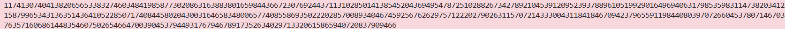

### Given
- Challenge sử dụng giao thức **Diffie-Hellman Key Exchange** với tham số NIST:

    - $g=2$ (generator)
    
    - $p =$ số nguyên tố lớn 2048-bit (cho ở trên)

    - Public key của Alice: $A$

    - Secret key của ta: $b$

    - Public key của ta: $B=g^b \pmod p$

    > **Diffie-Hellman Key Exchange:** Hai bên Alice và Bob trao đổi public key qua kênh không bảo mật, nhưng vẫn tính được cùng một shared secret mà kẻ nghe lén không thể tính được. Bảo mật dựa trên bài toán **Discrete Logarithm** — biết $g, p, A = g^a \pmod p$ nhưng tìm ngược $a$ là cực khó với $p$ đủ lớn.

### Goal
- Kiểm tra $B = g^b \pmod p$ có khớp với giá trị cho sẵn không

- Tính shared secret: $S = A^b \pmod p$

### Soltuion
- **Bước 1 — Hiểu tại sao cả hai ra cùng shared secret:**

    Alice tính: $S = B^a \pmod p = (g^b)^a \pmod p = g^{ab} \pmod p$

    Ta tính: $S = A^b \pmod p = (g^a)^b \pmod p = g^{ab} \pmod p$

    Cả hai đều ra $g^{ab} \pmod p$ — đây là shared secret. Kẻ nghe lén biết $g, p, A, B$ nhưng không thể tính $g^{ab}$ nếu không biết $a$ hoặc $b$.

- **Bước 2 — Verify public key B:**
    ```python
    g = 2
    p = 2410312426921032588552076022197566074856950548502459942654116941958108831682612228890093858261341614673227141477904012196503648957050582631942730706805009223062734745341073406696246014589361659774041027169249453200378729434170325843778659198143763193776859869524088940195577346119843545301547043747207749969763750084308926339295559968882457872412993810129130294592999947926365264059284647209730384947211681434464714438488520940127459844288859336526896320919633919
    A = 70249943217595468278554541264975482909289174351516133994495821400710625291840101960595720462672604202133493023241393916394629829526272643847352371534839862030410331485087487331809285533195024369287293217083414424096866925845838641840923193480821332056735592483730921055532222505605661664236182285229504265881752580410194731633895345823963910901731715743835775619780738974844840425579683385344491015955892106904647602049559477279345982530488299847663103078045601
    b = 12019233252903990344598522535774963020395770409445296724034378433497976840167805970589960962221948290951873387728102115996831454482299243226839490999713763440412177965861508773420532266484619126710566414914227560103715336696193210379850575047730388378348266180934946139100479831339835896583443691529372703954589071507717917136906770122077739814262298488662138085608736103418601750861698417340264213867753834679359191427098195887112064503104510489610448294420720
    B_given = 518386956790041579928056815914221837599234551655144585133414727838977145777213383018096662516814302583841858901021822273505120728451788412967971809038854090670743265187138208169355155411883063541881209288967735684152473260687799664130956969450297407027926009182761627800181901721840557870828019840218548188487260441829333603432714023447029942863076979487889569452186257333512355724725941390498966546682790608125613166744820307691068563387354936732643569654017172

    # Tính lại B để verify
    B_calc = pow(g, b, p)
    assert B_calc == B_given   # phải khớp
    ```

- **Bước 3 — Tính shared secret:**
    ```python
    # Shared secret = A^b mod p
    shared_secret = pow(A, b, p)
    ```

- **Kết quả:**

    

- **Flow minh hoạ:**
    ```text
    Alice có:  a (bí mật)    A = g^a mod p (công khai)
    Ta có:     b (bí mật)    B = g^b mod p (công khai)

    Trao đổi qua mạng:  A ←→ B  (kẻ nghe lén thấy được)

    Alice tính: S = B^a mod p = g^(b·a) mod p  ╗
    Ta tính:    S = A^b mod p = g^(a·b) mod p  ╝ → cùng kết quả

    Kẻ nghe lén biết g, p, A, B nhưng KHÔNG tính được S
    vì Discrete Logarithm (tìm a từ A = g^a mod p) là bài toán cực khó
    ```

    > **Tại sao NIST chọn $p$ 2048-bit?**
    >
    > Với $p$ nhỏ, kẻ tấn công có thể dùng các thuật toán như **Baby-step Giant-step** hoặc **Index Calculus** để giải bài toán Discrete Logarithm. NIST khuyến nghị $p$ tối thiểu **2048-bit** để đảm bảo bảo mật đến năm 2030+. 
    >
    > Ngoài ra, $p$ phải là **safe prime** ($p = 2q + 1$ với $q$ cũng là số nguyên tố) để tránh các cuộc tấn công đặc biệt như **Pohlig-Hellman**.