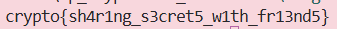

### Given
- Challenge mở rộng từ bài trước: sau khi tính shared secret qua Diffie-Hellman, Alice derive AES key từ shared secret rồi dùng AES-CBC để mã hóa flag.

- Các tham số:
    - $g=2$, $p =$ số nguyên tố NIST 2048-bit

    - Public key Alice: $A$

    - Secret key của ta: $b$, Public key: $B$

    - Ciphertext từ Alice: `{'iv': '7375...', 'encrypted_flag': '39c9...'}`

- File `decrypt.py` cho biết cách derive AES key:

    ```python
    def decrypt_flag(shared_secret: int, iv: str, ciphertext: str):
        # Derive AES key: SHA1(shared_secret) -> lấy 16 byte đầu
        sha1 = hashlib.sha1()
        sha1.update(str(shared_secret).encode('ascii'))
        key = sha1.digest()[:16]

        # Giải mã AES-CBC
        ciphertext = bytes.fromhex(ciphertext)
        iv = bytes.fromhex(iv)
        cipher = AES.new(key, AES.MODE_CBC, iv)
        plaintext = cipher.decrypt(ciphertext)
        ...
    ```

    > **Tại sao không dùng shared secret trực tiếp làm AES key?** Shared secret là số nguyên rất lớn (2048-bit), trong khi AES-128 chỉ cần 16 byte. Dùng SHA1 để hash và rút gọn shared secret xuống 160-bit, lấy 16 byte đầu làm key — đây là dạng đơn giản của **Key Derivation Function (KDF)**.

### Goal
- Tính shared secret: $S=A^b \pmod p$

- Derive AES key từ S theo cách server làm: `SHA1(str(S))[:16]`

- Decrypt AES-CBC để lấy flag

### Solution
- **Bước 1 — Tính shared secret:**

    Giống challenge trước, shared secret là:

    $$S=A^b \pmod p$$

    ```python
    g = 2
    p = 2410312426921032588552076022197566074856950548502459942654116941958108831682612228890093858261341614673227141477904012196503648957050582631942730706805009223062734745341073406696246014589361659774041027169249453200378729434170325843778659198143763193776859869524088940195577346119843545301547043747207749969763750084308926339295559968882457872412993810129130294592999947926365264059284647209730384947211681434464714438488520940127459844288859336526896320919633919
    A = 112218739139542908880564359534373424013016249772931962692237907571990334483528877513809272625610512061159061737608547288558662879685086684299624481742865016924065000555267977830144740364467977206555914781236397216033805882207640219686011643468275165718132888489024688846101943642459655423609111976363316080620471928236879737944217503462265615774774318986375878440978819238346077908864116156831874695817477772477121232820827728424890845769152726027520772901423784
    b = 197395083814907028991785772714920885908249341925650951555219049411298436217190605190824934787336279228785809783531814507661385111220639329358048196339626065676869119737979175531770768861808581110311903548567424039264485661330995221907803300824165469977099494284722831845653985392791480264712091293580274947132480402319812110462641143884577706335859190668240694680261160210609506891842793868297672619625924001403035676872189455767944077542198064499486164431451944

    # Tính shared secret
    shared_secret = pow(A, b, p)
    ```

- **Bước 2 — Derive AES key:**

    Đúng theo logic trong `decrypt.py` — chuyển shared secret sang string ASCII trước khi hash:

    ```py
    import hashlib

    sha1 = hashlib.sha1()
    sha1.update(str(shared_secret).encode('ascii'))  # str(), không phải bytes trực tiếp
    key  = sha1.digest()[:16]                        # lấy 16 byte đầu của SHA1
    ```

- **Bước 3 — Decrypt AES-CBC:**

    ```py
    from Crypto.Cipher import AES
    from Crypto.Util.Padding import unpad

    iv = bytes.fromhex('737561146ff8194f45290f5766ed6aba')
    encrypted_flag = bytes.fromhex('39c99bf2f0c14678d6a5416faef954b5893c316fc3c48622ba1fd6a9fe85f3dc72a29c394cf4bc8aff6a7b21cae8e12c')

    cipher = AES.new(key, AES.MODE_CBC, iv)
    plaintext = unpad(cipher.decrypt(encrypted_flag), 16)
    print(plaintext.decode('ascii'))
    ```

- **Kết quả:**

    

- **FLow minh hoạ:**
    ```text
    [Diffie-Hellman]
    Alice: A = g^a mod p  ──────────────────→  Ta nhận A
    Ta:    B = g^b mod p  ──────────────────→  Alice nhận B

    [Cả hai tính shared secret]
    Ta:    S = A^b mod p = g^(ab) mod p
    Alice: S = B^a mod p = g^(ab) mod p  → cùng S!

    [Derive AES key]
    key = SHA1(str(S))[:16]   ← cả hai dùng cùng công thức

    [Alice encrypt]
    AES-CBC(key, iv, flag) → encrypted_flag → gửi cho ta

    [Ta decrypt]
    AES-CBC(key, iv, encrypted_flag) → flag
    ```
