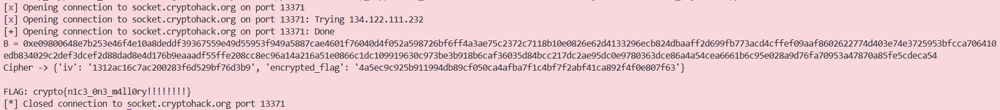

### Given
- Ta ở vị trí **Man-in-the-Middle** giữa Alice và Bob đang thực hiện Diffie-Hellman key exchange qua socket `socket.cryptohack.org:13371`. Protocol flow:

    ```text
    Alice → {p, g, A}          → [Ta]  → Bob
    Alice ← {B}                ← [Ta]  ← Bob
    Alice → {iv, encrypted_flag} → [Ta]
    ```

- Server dùng **SHA1** để derive AES key từ shared secret:

    ```py
    key = SHA1(str(shared_secret))[:16]
    ```

    > **Tại sao DH dễ bị MitM?** DH không có cơ chế **authentication** — Alice không thể xác minh rằng `B` thực sự đến từ Bob. Kẻ tấn công có thể thay thế `A` và `B` bằng giá trị tùy ý mà hai bên không hay biết.

### Goal
- Chỉnh sửa các tin nhắn trao đổi giữa Alice và Bob sao cho cả hai đều tính ra cùng một **shared secret** mà ta đã biết trước, sau đó dùng shared secret đó để derive AES key và decrypt flag.

### Solution
- **Ý tưởng:** Inject A = 1 và B = 1

- **Phân tích:** Tại sao inject A = 1 và B = 1?
    
    Nhắc lại công thức DH:

    $$S_{Bob} = A^b \pmod p$$

    $$S_{Alice} = B^a \pmod p$$

    Ta cần tìm một giá trị inject sao cho shared secret luôn cố định, bất kể `a` và `b` là bao nhiêu.

    **Xét tính chất:**

    $$1^x = 1 \quad \forall x$$

    Vậy nếu ta:

    - Thay `A = 1` trước khi gửi cho Bob $\rightarrow$ Bob tính $S = 1^b \pmod p = 1$
    - Thay `B = 1` trước khi gửi cho Alice $\rightarrow$ Alice tính $S = 1^a \pmod p = 1$

    Cả hai đều ra **shared secret = 1**, với mọi giá trị `a` và `b`. Ta không cần biết private key của ai cả.

    > **Tại sao không inject $g = 1$ hay $A = p$?**
    >
    > * **Đối với $g = 1$:** Cách này thực tế có hoạt động, nhưng khi đó Bob sẽ tính toán và trả về $B = 1$. Cuối cùng chúng ta vẫn phải thực hiện bước gửi $B = 1$ cho Alice, nên về mặt kỹ thuật, kết quả thu được là tương đương nhau.
    > * **Đối với $A = p$:** Phương án này thường bị hệ thống từ chối vì vi phạm quy định về độ dài bản tin (ví dụ: $p$ là số 2048-bit có thể vượt quá giới hạn bytes mà server được cấu hình để tiếp nhận).
    > 
    > $$A = p \implies A \equiv 0 \pmod p$$

- **Bước 1 — Kết nối socket và nhận tin nhắn từ Alice:**

    Kết nối tới server, đọc tin nhắn đầu tiên. Server gửi dạng:

    ```
    Intercepted from Alice: {"p": "0xff...", "g": "0x2", "A": "0xab..."}
    ```

    Vì có prefix text trước JSON, hàm `json_recv` dùng regex để tách phần `{...}` ra:

    ```py
    def json_recv(conn):
        while True:
            line = conn.recvline().strip().decode(errors='replace')
            if not line:
                continue
            match = re.search(r'\{.*\}', line)
            if match:
                return json.loads(match.group())
    ```

- **Bước 2 — Inject A = 1, forward cho Bob:**

    Ta giữ nguyên `p` và `g` gốc từ Alice (không đổi để Bob không nghi ngờ), chỉ thay `A = 1`:

    ```py
    json_send(conn, {"p": hex(p), "g": alice_msg["g"], "A": hex(1)})
    ```

    Bob nhận được `A = 1`, tính shared secret:

    $$S_{Bob} = 1^b \pmod p = 1$$

- **Bước 3 — Nhận B từ Bob, gửi B = 1 cho Alice:**
    
    Bob gửi lại `B` thật của mình (dựa trên `g` và `b`). Ta bỏ qua giá trị này và thay bằng `B = 1` trước khi gửi cho Alice:

    ```py
    bob_msg = json_recv(conn)        # nhận B thật của Bob, bỏ qua
    json_send(conn, {"B": hex(1)})   # gửi B = 1 cho Alice
    ```

    Alice nhận `B = 1`, tính shared secret:

    $$S_{Alice} = 1^a \pmod p = 1$$

- **Bước 4 — Nhận ciphertext từ Alice:**

    Alice dùng shared secret = 1 để derive AES key và encrypt flag, gửi:

    ```
    {"iv": "...", "encrypted_flag": "..."}
    ```

- **Bước 5 — Derive AES key và decrypt:**

    Ta biết shared secret = 1, derive key theo cùng công thức server dùng:

    ```py
    sha1 = hashlib.sha1()
    sha1.update(str(1).encode('ascii'))   # str(1) = "1"
    key = sha1.digest()[:16]
    ```

    Sau đó decrypt AES-CBC. Dùng `is_pkcs7_padded()` thay vì `unpad()` trực tiếp để tránh crash nếu padding không hoàn toàn chuẩn:

    ```py
    def is_pkcs7_padded(message: bytes) -> bool:
        padding = message[-message[-1]:]
        return all(padding[i] == len(padding) for i in range(len(padding)))
    ```

    Nếu padding hợp lệ thì `unpad()` rồi decode, nếu không thì decode thẳng.

- **Kết quả:**

    