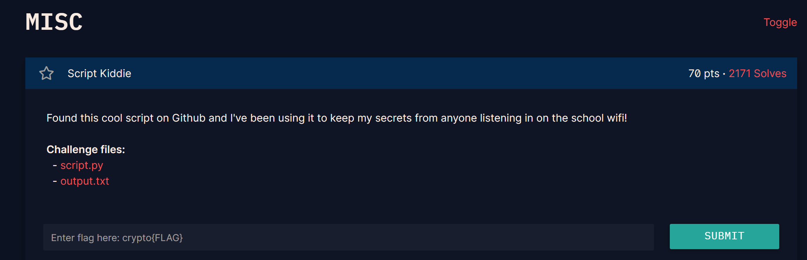

## **Script Kiddie (70 pts)**

### **1. Phân tích (Given)**
* **Giao thức:** Đề bài cung cấp một script thực hiện trao đổi khóa Diffie-Hellman (DH) để tạo khóa AES giải mã Flag.
* **Dữ liệu cung cấp (`output.txt`):** Các tham số $p, g, A, B, iv$ và $ciphertext$.
* **Mã nguồn (`script.py`):** Chứa các hàm tạo số công khai và tính khóa dùng chung (Shared Secret).

### **2. Lỗ hổng (The Flaw)**
Quan sát kỹ hai hàm quan trọng trong `script.py`:
```python
def generate_public_int(g, a, p):
    return g ^ a % p  # SAI: Phải là pow(g, a, p)

def generate_shared_secret(A, b, p):
    return A ^ b % p  # SAI: Phải là pow(A, b, p)
```
Trong Python, toán tử `^` là phép toán **XOR**, không phải phép nâng lũy thừa (**`**`). 
Theo đúng lý thuyết Diffie-Hellman:
* Public Key $B$ phải là $g^b \pmod p$.
* Shared Secret phải là $A^b \pmod p$.

Nhưng ở đây, script lại tính:
1. $B = g \oplus (b \pmod p)$
2. $Shared Secret = A \oplus (b \pmod p)$


### **3. Giải pháp (Solution)**

#### **Bước 1: Tìm số bí mật $b$ của Bob**
Từ công thức sai $B = g \oplus (b \pmod p)$, vì $b < (p-1)/2$ (số nhỏ hơn $p$), ta có thể dễ dàng tìm ngược lại $b$ bằng phép XOR:
$$b = B \oplus g$$

#### **Bước 2: Tính Shared Secret**
Sau khi có $b$, ta tính Shared Secret theo công thức lỗi của script:
$$Shared\_Secret = A \oplus (b \pmod p)$$

#### **Bước 3: Giải mã AES**
Dùng Shared Secret vừa tìm được, thực hiện các bước giống hệt script để tạo khóa AES:
1. `sha1(str(shared_secret))`.
2. Lấy 16 byte đầu làm key.
3. Giải mã `ciphertext` với `iv` (AES-CBC).

### **4. Mã khai thác (Python)**
```python
import hashlib
from Crypto.Cipher import AES

# 1. Các thông số lấy từ file output_92cc8b7f0db768b53291efbf969ca3ca.txt của bạn
p = 2410312426921032588552076022197566074856950548502459942654116941958108831682612228890093858261341614673227141477904012196503648957050582631942730706805009223062734745341073406696246014589361659774041027169249453200378729434170325843778659198143763193776859869524088940195577346119843545301547043747207749969763750084308926339295559968882457872412993810129130294592999947926365264059284647209730384947211681434464714438488520940127459844288859336526896320919633919
g = 2
A = 539556019868756019035615487062583764545019803793635712947528463889304486869497162061335997527971977050049337464152478479265992127749780103259420400564906895897077512359628760656227084039215210033374611483959802841868892445902197049235745933150328311259162433075155095844532813412268773066318780724878693701177217733659861396010057464019948199892231790191103752209797118863201066964703008895947360077614198735382678809731252084194135812256359294228383696551949882
B = 652888676809466256406904653886313023288609075262748718135045355786028783611182379919130347165201199876762400523413029908630805888567578414109983228590188758171259420566830374793540891937904402387134765200478072915215871011267065310188328883039327167068295517693269989835771255162641401501080811953709743259493453369152994501213224841052509818015422338794357540968552645357127943400146625902468838113443484208599332251406190345653880206706388377388164982846343351
iv = 'c044059ae57b61821a9090fbdefc63c5'
encrypted_flag = 'f60522a95bde87a9ff00dc2c3d99177019f625f3364188c1058183004506bf96541cf241dad1c0e92535564e537322d7'

# 2. Khôi phục shared secret dựa trên lỗi XOR
# b = B ^ g (Vì b < p)
b = B ^ g
# S = A ^ b
shared_secret = A ^ b

# 3. Giải mã theo logic của script.py
sha1 = hashlib.sha1()
sha1.update(str(shared_secret).encode('ascii'))
key = sha1.digest()[:16]

cipher = AES.new(key, AES.MODE_CBC, bytes.fromhex(iv))
decrypted = cipher.decrypt(bytes.fromhex(encrypted_flag))

# Hàm gỡ padding PKCS7 tự viết (giống script.py)
def unpad(s):
    return s[:-ord(s[len(s)-1:])]

print(f"Flag recovered: {unpad(decrypted).decode()}")
```


`crypto{b3_c4r3ful_w1th_y0ur_n0tati0n}`