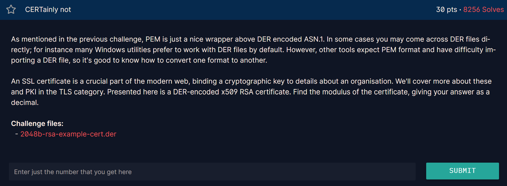

## **CERTainly not (30 pts)**

### **1. Given**
Một file chứng chỉ số RSA định dạng **DER** (`2048b-rsa-example-cert.der`)[cite: 2].
Định dạng DER là một phương pháp mã hóa nhị phân cho các cấu trúc dữ liệu ASN.1, thường được sử dụng trong các tiện ích của Windows hoặc các hệ thống nhúng[cite: 4].
Khác với định dạng PEM (thường thấy dưới dạng Base64 và có tiêu đề `-----BEGIN CERTIFICATE-----`), file DER chứa dữ liệu nhị phân thô không thể đọc trực tiếp bằng mắt thường[cite: 4].

### **2. Goal**
Trích xuất giá trị **Modulus ($n$)** từ chứng chỉ X.509 này và đưa ra câu trả lời dưới dạng số nguyên thập phân[cite: 4].

### **3. Solution**

#### **Phân tích kỹ thuật**
[cite_start]Chứng chỉ X.509 chứa nhiều thông tin như nhà phát hành (Issuer), thời hạn (Validity) và quan trọng nhất là **Public Key** của thực thể được cấp chứng chỉ[cite: 3, 4]. Vì đây là chứng chỉ RSA, Public Key sẽ bao gồm Modulus ($n$) và Public Exponent ($e$).

#### **Các bước thực hiện**
**Đọc file nhị phân:** Sử dụng Python mở file `.der` ở chế độ `rb` (read binary) để lấy toàn bộ dữ liệu thô[cite: 4].
**Import chứng chỉ:** Sử dụng thư viện mật mã (như `PyCryptodome`) thông qua hàm `RSA.importKey()`. [cite_start]Thư viện này đủ thông minh để tự động phân tích cấu trúc ASN.1 phức tạp bên trong chứng chỉ để tách lấy thành phần khóa công khai[cite: 4].
**Lấy giá trị $n$:** Truy xuất thuộc tính `.n` của đối tượng khóa đã import để lấy Modulus[cite: 4].

#### **Mã khai thác (Python)**
```python
from Crypto.PublicKey import RSA

# Đọc dữ liệu nhị phân từ file DER
with open("2048b-rsa-example-cert.der", "rb") as f:
    der_data = f.read()

# Phân tích chứng chỉ để trích xuất Public Key
key = RSA.importKey(der_data)

# Xuất Modulus ở dạng thập phân
print(key.n)
```
[cite_start][cite: 4]

---
`22825373692019530804306212864609512775374171823993708516509897631547513634635856375624003737068034549047677999310941837454378829351398302382629658264078775456838626207507725494030600516872852306191255492926495965536379271875310457319107936020730050476235278671528265817571433919561175665096171189758406136453987966255236963782666066962654678464950075923060327358691356632908606498231755963567382339010985222623205586923466405809217426670333410014429905146941652293366212903733630083016398810887356019977409467374742266276267137547021576874204809506045914964491063393800499167416471949021995447722415959979785959569497`


