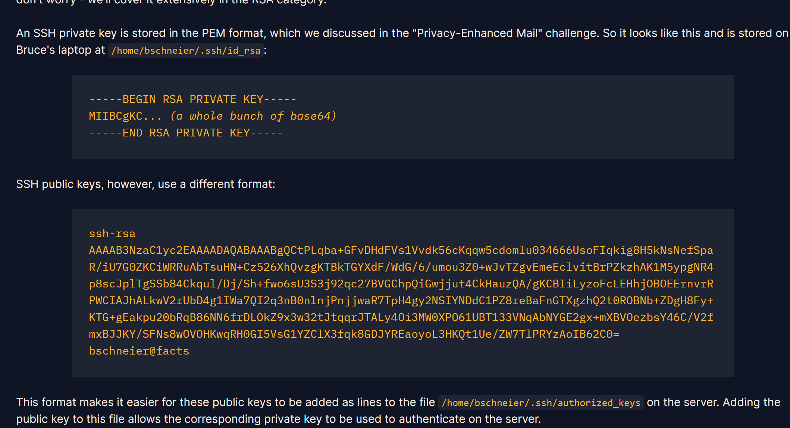

## **SSH Keys (35 pts)**


### **1. Phân tích (Given)**
* **Dữ liệu:** Một file `bruce_rsa.pub` chứa khóa công khai SSH.
* **Định dạng:** Khóa SSH công khai có cấu trúc khác với file PEM truyền thống. Nó bắt đầu bằng loại thuật toán (`ssh-rsa`), theo sau là một chuỗi Base64 và cuối cùng là comment (email/tên máy).
* **Cấu trúc bên trong:** Chuỗi Base46 đó thực chất là các giá trị được mã hóa theo định dạng nhị phân của SSH, bao gồm:
    * Độ dài chuỗi "ssh-rsa" + chuỗi "ssh-rsa"
    * Độ dài số mũ $e$ + giá trị $e$
    * Độ dài Modulus $N$ + giá trị $N$

### **2. Mục tiêu (Goal)**
* Trích xuất giá trị Modulus $N$ từ file khóa này và chuyển nó sang dạng số nguyên thập phân (decimal integer).

### **3. Giải pháp (Solution)**

#### **Sử dụng thư viện Python (PyCryptodome)**
Cách nhanh nhất và chính xác nhất là sử dụng thư viện `Crypto.PublicKey.RSA`. Thư viện này hỗ trợ nạp trực tiếp định dạng khóa SSH.

1. Đọc nội dung file `.pub`.
2. Sử dụng `RSA.importKey()` để parse dữ liệu.
3. Truy cập thuộc tính `.n` của đối tượng khóa để lấy Modulus.

#### **Mã khai thác (Dựa trên Sshkey.py)**
```python
import os
from Crypto.PublicKey import RSA

# Lấy đường dẫn thư mục của chính file script này
dir_path = os.path.dirname(os.path.realpath(__file__))
file_name = "bruce_rsa_6e7ecd53b443a97013397b1a1ea30e14.pub"
full_path = os.path.join(dir_path, file_name)

with open(full_path, "r") as f:
    key = RSA.importKey(f.read())

print("Flag của bạn đây:")
print(key.n)
```

### **4. Kết quả**

> **Flag:** `3931406272922523448436194599820093016241472658151801552845094518579507815990600459669259603645261532927611152984942840889898756532060894857045175300145765800633499005451738872081381267004069865557395638550041114206143085403607234109293286336393552756893984605214352988705258638979454736514997314223669075900783806715398880310695945945147755132919037973889075191785977797861557228678159538882153544717797100401096435062359474129755625453831882490603560134477043235433202708948615234536984715872113343812760102812323180391544496030163653046931414723851374554873036582282389904838597668286543337426581680817796038711228401443244655162199302352017964997866677317161014083116730535875521286631858102768961098851209400973899393964931605067856005410998631842673030901078008408649613538143799959803685041566964514489809211962984534322348394428010908984318940411698961150731204316670646676976361958828528229837610795843145048243492909`

