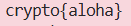
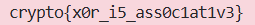
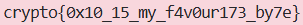
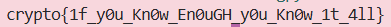
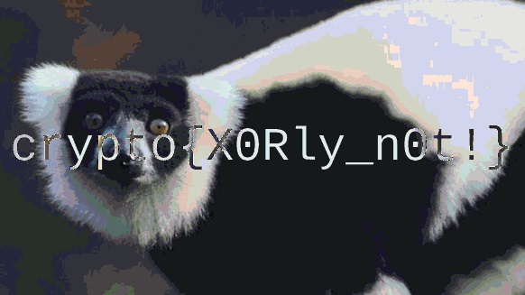

## 6. XOR Starter
### Given
- XOR (^) là phép toán bitwise: trả về 0 nếu hai bit giống nhau, 1 nếu khác nhau.

- Chuỗi đầu vào: `label`

- Mỗi ký tự trong chuỗi sẽ được XOR với số nguyên 13.

### Goal
- XOR từng ký tự của chuỗi `label` với 13, chuyển kết quả ngược lại thành chuỗi, rồi submit flag theo định dạng `crypto{new_string}`.

### Solution
- **Ý tưởng:** Với mỗi ký tự c trong chuỗi, ta thực hiện: ord(c) ^ 13, sau đó dùng `chr()` để chuyển ngược về ký tự.
    ```python
    label = "label"
    result = ''.join(chr(ord(c) ^ 13) for c in label)
    print(f"crypto{{{result}}}")
    ```

- **Trace từng bước:**

<div align="center">

| Ký tự | ord(c) | ord(c) ^ 13 | Kết quả |
| :---: | :---: | :---: | :---: |
| l | 108 | 97 | a |
| a | 97 | 108 | l |
| b | 98 | 111 | o |
| e | 101 | 104 | h |
| l | 108 | 97 | a |

</div>

- **Kết quả:** `label` XOR `13` = "aloha"

- **Flag:**

    

- Nếu dùng `pwntools`, có thể rút gọn thành một dòng:
    ```python
    from pwn import xor
    print(xor(b"label", 13).decode())
    ```


## 7. XOR Properties
### Given
- Bài cung cấp 4 dòng dữ liệu dưới dạng `hex`:
    ```python
    KEY1="a6c8b6733c9b22de7bc0253266a3867df55acde8635e19c73313"
    KEY2^KEY1="37dcb292030faa90d07eec17e3b1c6d8daf94c35d4c9191a5e1e"
    KEY2^KEY3="c1545756687e7573db23aa1c3452a098b71a7fbf0fddddde5fc1"
    FLAG^KEY1^KEY3^KEY2="04ee9855208a2cd59091d04767ae47963170d1660df7f56f5faf"
    ```

- Bốn tính chất của `XOR`:
    ```text
    - Commutative: A ⊕ B = B ⊕ A
    - Associative: A ⊕ (B ⊕ C) = (A ⊕ B) ⊕ C
    - Identity: A ⊕ 0 = A
    - Self-Inverse: A ⊕ A = 0
    ```

### Goal
- Sử dụng các tính chất của XOR để lần ngược lại chuỗi mã hóa, khôi phục FLAG từ biểu thức `FLAG ^ KEY1 ^ KEY3 ^ KEY2`.

### Solution
- **Bước 1 — Tìm KEY2**

    Ta có: `KEY2 ^ KEY1 = 37dcb2...`

    XOR cả hai vế với `KEY1`:
    $$KEY2⊕KEY1⊕KEY1=KEY2⊕0=KEY2$$

- **Bước 2 — Tìm KEY3**

    Ta có: `KEY2 ^ KEY3 = c15457...`

    XOR cả hai vế với `KEY2` vừa tìm được:
    $$KEY2⊕KEY3⊕KEY2=KEY3$$

- **Bước 3 — Tìm FLAG**

    Ta có: `FLAG ^ KEY1 ^ KEY3 ^ KEY2 = 04ee98...`

    XOR cả hai vế với KEY1, KEY3, KEY2:
    $$FLAG⊕KEY1⊕KEY3⊕KEY2⊕KEY1⊕KEY3⊕KEY2=FLAG$$

    ```python
    KEY1 = bytes.fromhex("a6c8b6733c9b22de7bc0253266a3867df55acde8635e19c73313")
    K2xK1 = bytes.fromhex("37dcb292030faa90d07eec17e3b1c6d8daf94c35d4c9191a5e1e")
    K2xK3 = bytes.fromhex("c1545756687e7573db23aa1c3452a098b71a7fbf0fddddde5fc1")
    FxK1xK3xK2 = bytes.fromhex("04ee9855208a2cd59091d04767ae47963170d1660df7f56f5faf")

    KEY2 = bytes(a ^ b for a, b in zip(K2xK1, KEY1))
    KEY3 = bytes(a ^ b for a, b in zip(K2xK3, KEY2))
    FLAG = bytes(a ^ b ^ c ^ d for a, b, c, d in zip(FxK1xK3xK2, KEY1, KEY3, KEY2))

    print(FLAG.decode())
    ```

- **Flag:**

    


## 8. Favourite byte

### Given
- Đề bài cung cấp một chuỗi hex:
    ```
    73626960647f6b206821204f21254f7d694f7624662065622127234f726927756d`
    ```

- Biết rằng dữ liệu đã bị XOR với một `single-byte key`.

### Goal
- Tìm byte bí mật đó và giải mã chuỗi hex để lấy lại flag.

### Solution
- **Ý tưởng:** Brute-force toàn bộ 256 khả năng

- Vì key chỉ là một byte duy nhất nên giá trị của nó nằm trong khoảng `0x00` đến `0xff` *(tức là chỉ có 256 khả năng)*.

- Ta sẽ lần lượt XOR ciphertext với từng giá trị từ 0 đến 255, rồi kiểm tra xem kết quả có bắt đầu bằng `crypto{` không.

    ```python
    ciphertext = bytes.fromhex("73626960647f6b206821204f21254f7d694f7624662065622127234f726927756d")

    for key in range(256):
        plaintext = bytes(b ^ key for b in ciphertext)
        try:
            decoded = plaintext.decode('ascii')
            if decoded.startswith("crypto{"):
                print(decoded)
        except:
            pass
    ```


- **Flag:**

    


## 9. You either know, XOR you don't

### Given
- Chuỗi hex đã được mã hóa:
    ```
    0e0b213f26041e480b26217f27342e175d0e070a3c5b103e2526217f27342e175d0e077e263451150104
    ```

- Flag được mã hóa bằng một `secret key` — không biết độ dài hay nội dung của `key`.

### Goal
- Tìm `secret key` và giải mã ciphertext để lấy flag.

### Solution
- **Ý tưởng:** Known Plaintext Attack với tiền tố `crypto{`

    - Vì ta biết flag luôn bắt đầu bằng `crypto{` *(7 ký tự)*, đây chính là **known plaintext**. Do đó, ta dùng tính chất `Self-Inverse` của XOR
    
    => Khi XOR phần đầu của ciphertext với `crypto{` sẽ cho ra 7 byte đầu tiên của key:
    $$FLAG⊕KEY=CIPHER⟹KEY=CIPHER⊕FLAG$$

    ```python
    # Bước 0: Decode hex sang bytes
    ciphertext = bytes.fromhex("0e0b213f26041e480b26217f27342e175d0e070a3c5b103e2526217f27342e175d0e077e263451150104")
    known = b"crypto{"

    # Bước 1: XOR phần đầu ciphertext với known plaintext để lấy một phần key
    key_partial = bytes(c ^ p for c, p in zip(ciphertext, known))
    ##### → b'myXORke' → suy đoán key đầy đủ là b'myXORkey'

    # Bước 2: Lặp key để phủ toàn bộ độ dài ciphertext
    key = b"myXORkey"
    full_key = (key * ((len(ciphertext) // len(key)) + 1))[:len(ciphertext)]

    # Bước 3: Giải mã bằng cách XOR ciphertext với key đã mở rộng
    plaintext = bytes(c ^ k for c, k in zip(ciphertext, full_key))
    print(plaintext.decode())
    ```

- **Flag:**

    


## 10. Lemur XOR

### Given
- Hai file ảnh bị mã hóa: `flag_[đuôi hash].jpg` và `lemur_[đuôi hash].jpg`. Hiện tại khi nhìn vào, cả hai ảnh chỉ hiển thị nhiễu hạt (noise).

- Hai ảnh này đã được ẩn đi bằng cách XOR với cùng một `secret key`.

- Gợi ý: Thực hiện phép toán XOR trực tiếp giữa các byte màu RGB của hai hình ảnh với nhau.

### Goal
- Khai thác lỗ hổng tái sử dụng khóa (key reuse/many-time pad) để loại bỏ khóa bí mật $K$, từ đó khôi phục lại hình ảnh ban đầu và tìm ra flag.

### Solution
- Sử dụng tính chất toán học của phép XOR:
    - Identity: $$A ⊕ 0 = A$$
    - Self-Inverse: $$A ⊕ A = 0$$

- **Giả sử:**
    - $M_1$ là mảng pixel của `flag_[đuôi hash].jpg`.
    - $M_2$ là mảng pixel của `lemur_[đuôi hash].jpg`.
    - $K$ là Secret Key.

- Theo đề bài, hai ảnh bị nhiễu mà chúng ta đang có chính là các **Ciphertext**:
    $$C_1 = M_1 \oplus K$$
    $$C_2 = M_2 \oplus K$$

- Vì cả hai ảnh đều bị XOR bởi cùng một khóa $K$, ta có thể thực hiện phép toán XOR giữa hai bản mã này với nhau. Điều này sẽ giúp triệt tiêu khóa $K$:
    $$C_1 \oplus C_2 = (M_1 \oplus K) \oplus (M_2 \oplus K)$$
    $$C_1 \oplus C_2 = M_1 \oplus M_2 \oplus (K \oplus K)$$
    $$C_1 \oplus C_2 = M_1 \oplus M_2 \oplus 0$$
    $$C_1 \oplus C_2 = M_1 \oplus M_2$$

    ```python
    from PIL import Image
    import numpy as np

    # Bước 1: Tải hai hình ảnh đã cho
    img_flag = Image.open("flag_7ae18c704272532658c10b5faad06d74.jpg")
    img_lemur = Image.open("lemur_ed66878c338e662d3473f0d98eedbd0d.jpg")

    # Bước 2: Chuyển đổi hình ảnh thành mảng dữ liệu (numpy array) chứa các byte RGB
    arr_flag = np.array(img_flag)
    arr_lemur = np.array(img_lemur)

    # Bước 3: Thực hiện phép toán bitwise XOR giữa 2 mảng ảnh
    result_arr = np.bitwise_xor(arr_flag, arr_lemur)

    # Bước 4: Chuyển mảng kết quả ngược lại thành định dạng hình ảnh
    result_img = Image.fromarray(result_arr)

    # Bước 5: Lưu kết quả và mở lên để xem flag
    result_img.save("decrypted_flag.jpg")
    result_img.show()
    ```

- **Flag:**

    