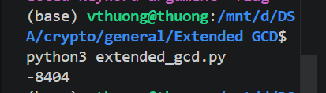
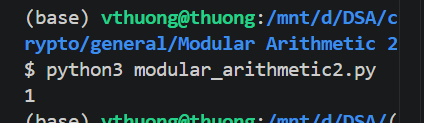
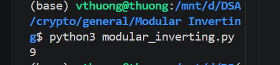

#### General
---
> #### 11. Greatest Commond Divisor

> Given
- Greatest Commond Divisor (GCD) là số nguyên dương lớn nhất có thể chia hết cho cả hai số a và b.
- Coprime (Nguyên tố cùng nhau): Hai số $a$ và $b$ được gọi là nguyên tố cùng nhau nếu `gcd(a, b) = 1`.

> Goal 
- Tìm được flag của cái bài này bằng cách tính ra kết quả ước chung lớn nhất giữa 66528 và 52920 (`gcd(66528,52920)`).

> Solution

Ở bài này mình sử dụng thuật toán Euclid:
$$\gcd(a, b) = \gcd(b, a \bmod b)$$

Mình đã sử dụng vòng lặp for cho tới khi b = 0, trả về a là UCLN

```python
def gcd(a, b):            
    if a < b:             
        a, b = b, a     # luôn cho số a > b;
        
    while b != 0:              
        a, b = b, a % b   # sử dụng thuật toán Euclid
    return a # a chính là UCLN
print(gcd(66528, 52920))
```

Chạy code ra được flag (kết quả của `gcd(66528,52920)`):
`1512`


---
> #### 12 Extended GCD

> Given
- Bài toán giới thiệu Thuật toán Euclid mở rộng (Extended Euclidean Algorithm). Nó không chỉ tìm Ước chung lớn nhất (GCD) như thuật toán thường, mà còn tìm ra hai số nguyên $u, v$ thỏa mãn Đồng nhất thức Bézout:$$a \cdot u + b \cdot v = \gcd(a, b)$$
> Goal
- Euclid mở rộng để tính ra hai hệ số $u$ và $v$ của phương trình: 
    $$26513 \cdot u + 32321 \cdot v = 1$$
- So sánh giá trị của $u$ và $v$, tìm ra con số nhỏ hơn và dùng nó làm Flag để nộp.
> Solution
- Ở bài toán này, chúng ta cần biểu diễn phương trình toán học ở mỗi bước của phương trình.
- Tại mỗi bước ta biểu diễn được hai số `a` và `b` theo 2 số `A` và `B` ban đầu.
- Lưu lại từ bước trước -> bước sau.
```python
def extended_gcd(a, b):
    x0 = 1
    x1 = 0
    y0 = 0
    y1 = 1
    
    while b != 0:
        q = a // b
        a, b = b, a % b
        
        
        x0, x1 = x1, x0 - q * x1 # Cập nhật hệ số x (tương ứng với u)
        
        
        y0, y1 = y1, y0 - q * y1 # Cập nhật hệ số y (tương ứng với v)
        
    return a, x0, y0 # a là gcd(p,q)

#---
p = 26513
q = 32321
gcd_val, u, v = extended_gcd(p, q)

flag = min(u, v)
print(flag)
```
> Kết quả: `-8404`



---

> #### 13. Modular Arithmetic 1

> Given
- Đề bài giới thiệu Số học Module (Modular Arithmetic).
- Định nghĩa: Ký hiệu $a \equiv b \pmod m$ hiểu đơn giản là: khi lấy số $a$ chia cho số $m$, ta được phần dư là $b$.
> Goal
- Tìm số dư $x$ của phép tính $11 \bmod 6$.
- Tìm số dư $y$ của phép tính $8146798528947 \bmod 17$. 
- Flag: Là con số nhỏ hơn giữa $x$ và $y$.

> Solution
```python
x = 11 % 6
y = 8146798528947 % 17
# tính x, y bằng cách lấy phần dư

flag = min(x, y)
```
> Kết quả: `4`

---
> #### 14. Modular Arithmetic 2
> Given
- Đề bài giới thiệu về Trường hữu hạn (Finite Field).
- Chúng ta cần sử dụng định lý nhỏ Fermat để làm bài này.
- Định lý nhỏ Fermat phát biểu rằng: Nếu $p$ là số nguyên tố, thì với mọi số nguyên $a$ (không chia hết cho $p$), ta luôn có:$$a^{p-1} \equiv 1 \pmod p$$
>Goal
- Tính giá trị của phép toán: $$273246787654^{65536} \pmod{65537}$$
> Solution
Đề bài cho
- Số modulo $p = 65537$ (đây là một số nguyên tố nổi tiếng).
- Số mũ là $65536$, chính xác bằng $p - 1$.
- Cơ số $a = 273246787654$ rất lớn.
Áp dụng định lý Fermat nhỏ -> 1.
- Chúng ta có thể sử dụng code python, tính lũy thừa bằng hàm pow(base, exp, mod).
```python
a = 273246787654
p = 65537

# Dùng hàm pow() để tính lũy thừa modulo
result = pow(a, p - 1, p)

print(result)
```
> Ra đúng kết quả là: `1`



---
> #### 15. Modular Inverting
> Given
- Đề bài giới thiệu khái niệm Nghịch đảo nhân (Multiplicative Inverse) trong trường hữu hạn $F_p$.
- Định nghĩa: Phần tử $d$ được gọi là nghịch đảo của $g$ trong modulo $p$ nếu tích của chúng chia cho $p$ dư 1. Ký hiệu toán học: $$g \cdot d \equiv 1 \pmod p$$
(Người ta thường ký hiệu $d$ là $g^{-1}$).
> Goal:
- Tìm giá trị $d = 3^{-1} \pmod{13}$.
- Tức là tìm số nguyên $d$ sao cho: $3 \cdot d \equiv 1 \pmod{13}$.

> Solution
- Phương trình Bézout mà chúng ta đã chứng minh ở bài trước:$$a \cdot x + m \cdot y = \gcd(a, m)$$
- Áp dụng vào bài này với $a = 3$ và $m = 13$ (vì 13 là số nguyên tố nên $\gcd(3, 13) = 1$):$$3 \cdot x + 13 \cdot y = 1$$
- Nếu ta lấy modulo 13 cho cả hai vế (làm cho cụm $13 \cdot y$ bằng 0):$$3 \cdot x \equiv 1 \pmod{13}$$
- Kết luận: Hệ số $x$ được sinh ra từ thuật toán Extended GCD chính là phần tử nghịch đảo $d$ mà chúng ta cần tìm!
```python
def egcd(a, b):
    x0 = 1
    x1 = 0
    y0 = 0
    y1 = 1
    while b != 0:
        q = a // b
        a, b = b, a % b
        x0, x1 = x1, x0 - q * x1
        y0, y1 = y1, y0 - q * y1
    
    # Trả về x0 - hệ số đi kèm với a ban đầu
    return x0
#---
m = 13
x0 = egcd(3, m)
#tính ra hệ số x0

#---
inverse = x0 % m # số x0 cần phải số dương trong khoảng [0, m-1]


print(inverse)
``` 
> Kết quả: `9`




---