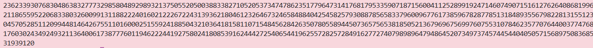

### Given
- Một số nguyên tố 2048-bit: $p$

- Một số nguyên $a$

- Điều kiện: $p ≡ 1 \pmod 4$

- Khi $p ≡ 3 \pmod 4$, số $(p+1)/4$ là số nguyên nên công thức Fermat hoạt động trực tiếp.
  Khi $p ≡ 1 \pmod 4$, $(p+1)/4$ không nguyên, cần một thuật toán tổng quát hơn.

### Goal
Tìm $r^2≡a \pmod p$, dùng thuật toán **Tonelli-Shanks**. Submit căn nhỏ hơn trong hai nghiệm.

### Solution
- **Ý tưởng:** Thuật toán Tonelli-Shanks
  
    Thuật toán hoạt động dựa trên việc phân tích $p - 1 = Q \cdot 2^S$ (tách hết các thừa số 2 ra), sau đó dùng một vòng lặp để tinh chỉnh nghiệm về đúng giá trị.

    > ### **Thuật toán Tonelli-Shanks**
    > Thuật toán gồm 3 bước chính để tìm căn bậc hai modulo $p$:
    > 
    > 1. **Phân tích:** $p - 1 = Q \cdot 2^S$ với $Q$ là số lẻ.
    > 2. **Tìm Non-residue:** Tìm một số $z$ sao cho $\left(\frac{z}{p}\right) = -1$ (số không có căn bậc hai mod $p$).
    > 3. **Vòng lặp hội tụ:** Sử dụng vòng lặp để hội tụ về nghiệm đúng qua từng bước cập nhật các biến phụ trợ.

    ```python
    import os

    # Bước 0: Load dữ liệu từ file output.txt
    current_dir = os.path.dirname(os.path.abspath(__file__))
    file_path = os.path.join(current_dir, "output.txt")

    with open(file_path, "r") as f:
        content = f.read()

    # Parse từng dòng — file Tonelli-Shanks có biến p và a
    for line in content.strip().split("\n"):
        if line.startswith("p ="):
            p = int(line.split("=", 1)[1].strip())
        elif line.startswith("a ="):
            a = int(line.split("=", 1)[1].strip())

    def tonelli_shanks(a, p):
        # Kiểm tra a có phải Quadratic Residue không (Legendre Symbol)
        if pow(a, (p - 1) // 2, p) != 1:
            return None  # Không có căn bậc hai

        # Trường hợp đặc biệt: p ≡ 3 (mod 4) -> dùng công thức đơn giản
        if p % 4 == 3:
            return pow(a, (p + 1) // 4, p)

        # Bước 1: Phân tích p - 1 = Q * 2^S (tách hết thừa số 2)
        Q, S = p - 1, 0
        while Q % 2 == 0:
            Q //= 2
            S += 1

        # Bước 2: Tìm một Quadratic Non-Residue z
        z = 2
        while pow(z, (p - 1) // 2, p) != p - 1:
            z += 1

        # Bước 3: Khởi tạo các biến
        M = S
        c = pow(z, Q, p)       # c là non-residue mũ Q
        t = pow(a, Q, p)       # t sẽ hội tụ về 1
        R = pow(a, (Q + 1) // 2, p)  # R là ứng viên nghiệm

        # Bước 4: Vòng lặp tinh chỉnh nghiệm
        while True:
            if t == 1:
                return R  # Tìm được nghiệm

            # Tìm số mũ i nhỏ nhất sao cho t^(2^i) ≡ 1 (mod p)
            i, tmp = 1, pow(t, 2, p)
            while tmp != 1:
                tmp = pow(tmp, 2, p)
                i += 1

            # Cập nhật các biến
            b = pow(c, pow(2, M - i - 1), p)
            M = i
            c = pow(b, 2, p)
            t = (t * c) % p
            R = (R * b) % p

    # Tính căn bậc hai
    root  = tonelli_shanks(a, p)
    root2 = p - root

    # Kiểm chứng
    assert pow(root,  2, p) == a % p
    assert pow(root2, 2, p) == a % p

    # Submit căn nhỏ hơn
    flag = min(root, root2)
    print(flag)
    ```
- **Flag:**
     => zha tự sửa