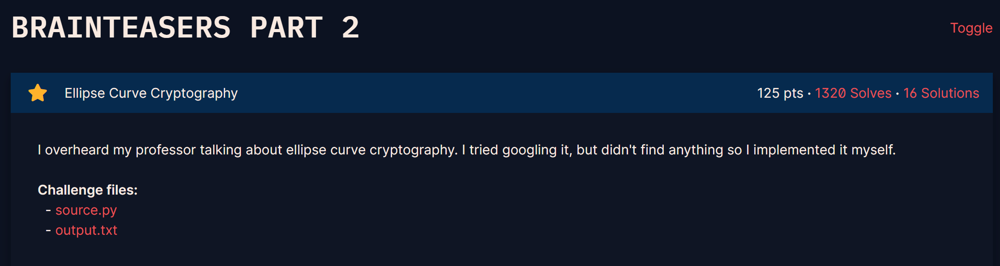
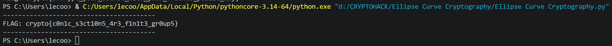

## **Ellipse Curve Cryptography (125 pts)**

### **1. Given**
* File `source.py` mô tả một hệ thống trao đổi khóa Diffie-Hellman nhưng sử dụng một đường cong đặc biệt: **Ellipse** (hình elip) thay vì **Elliptic Curve** (đường cong Elliptic) tiêu chuẩn. 
* Phương trình được sử dụng có dạng: $\frac{x^2}{a^2} + \frac{y^2}{b^2} = 1 \pmod p$.
* File `output.txt` cung cấp:
    * Số nguyên tố $p$, các tham số $a, b$.
    * Điểm cơ sở $G$ và các khóa công khai $Q_A, Q_B$.
    * Giá trị `iv` và `encrypted_flag` được mã hóa bằng AES-CBC.

### **2. Goal**
* Hiểu cách thực hiện phép toán trên đường cong "Ellipse" này để tính toán **Shared Secret** và giải mã Flag.

### **3. Solution**

#### **Phân tích lỗ hổng**
Thử thách này đánh lừa người chơi bằng cách sử dụng "Ellipse" thay vì "Elliptic Curve". 
* Trong **Elliptic Curve** ($y^2 = x^3 + ax + b$), phép cộng điểm rất phức tạp.
* Trong **Ellipse** ($x^2/a^2 + y^2/b^2 = 1$), nếu ta thực hiện đổi biến, đường cong này thực chất tương đương với một nhóm nhân trên trường mở rộng hoặc đơn giản hơn là một phép xoay tọa độ tuyến tính. 
* Lỗ hổng nằm ở chỗ cấu trúc nhóm của Ellipse đơn giản hơn nhiều so với đường cong Elliptic thực thụ, cho phép ta giải bài toán **Logarit rời rạc (DLP)** một cách hiệu quả.

#### **Các bước thực hiện**
1.  **Chuyển đổi về dạng dễ tính toán:** Phương trình $\frac{x^2}{a^2} + \frac{y^2}{b^2} \equiv 1 \pmod p$ có thể được ánh xạ vào một trường số phức giả định hoặc sử dụng tham số hóa lượng giác/hyperbolic. 
2.  **Giải bài toán Logarit rời rạc (DLP):** * Sử dụng thuật toán như **Pohlig-Hellman** hoặc các hàm hỗ trợ trong thư viện như `SageMath` để tìm khóa bí mật $n_A$ từ $Q_A = n_A \cdot G$. 
    * Lưu ý: Phép "cộng điểm" trên Ellipse trong bài thực chất là một phép biến đổi tuyến tính có thể biểu diễn bằng ma trận.
3.  **Tính Shared Secret:** Sau khi có $n_A$, tính điểm chung $S = n_A \cdot Q_B$. Tọa độ $x$ của điểm $S$ chính là `shared_secret`.
4.  [cite_start]**Giải mã AES:** * Dùng `shared_secret` làm nguyên liệu để tạo khóa AES: `key = sha1(str(shared_secret).encode()).digest()[:16]`[cite: 7].
    * [cite_start]Sử dụng `iv` và `key` để giải mã `encrypted_flag` bằng thuật toán AES-CBC[cite: 7].
    * [cite_start]Loại bỏ Padding (PKCS#7) để thu được Flag cuối cùng[cite: 7].

---
``` python 
from hashlib import sha1
from Crypto.Cipher import AES
from Crypto.Util.Padding import unpad

# Shared Secret đã tính được từ SageMath
shared_secret = 83201481069630956436480435779471169630605662777874697301601848920266492

# Dữ liệu từ output.txt
iv_hex = '64bc75c8b38017e1397c46f85d4e332b'
enc_flag_hex = '13e4d200708b786d8f7c3bd2dc5de0201f0d7879192e6603d7c5d6b963e1df2943e3ff75f7fda9c30a92171bbbc5acbf'

# 1. Tạo khóa AES từ shared secret (theo source.py)
key = sha1(str(shared_secret).encode('ascii')).digest()[:16]

# 2. Chuyển dữ liệu hex sang bytes
iv = bytes.fromhex(iv_hex)
ciphertext = bytes.fromhex(enc_flag_hex)

# 3. Giải mã
cipher = AES.new(key, AES.MODE_CBC, iv)
try:
    decrypted = cipher.decrypt(ciphertext)
    # Gỡ padding PKCS#7
    flag = unpad(decrypted, 16)
    print("----------------------------------------")
    print(f"FLAG: {flag.decode()}")
    print("----------------------------------------")
except Exception as e:
    print(f"Lỗi khi giải mã: {e}")
```



`crypto{c0n1c_s3ct10n5_4r3_f1n1t3_gr0up5}`