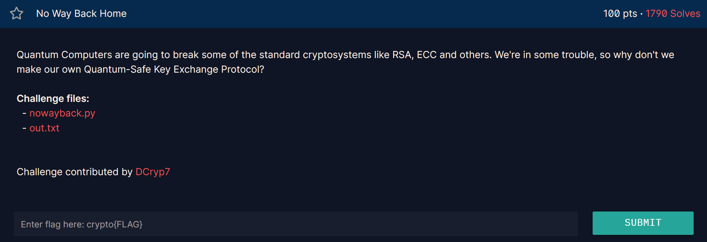

## **No Way Back Home (100 pts)**

### **1. Phân tích (Given)**
* **Giao thức:** Đề bài mô tả một giao thức trao đổi khóa (Key Exchange) dựa trên RSA nhưng có tùy chỉnh. 
* **Alice** chọn một giá trị bí mật $v$ có dạng: $v = (p \cdot r) \pmod n$, với $r$ là số ngẫu nhiên và $p, q$ là các thừa số của $n$.
* Các bước trao đổi bao gồm việc nhân $v$ với các khóa $k_A, k_B$ và chia nghịch đảo (commutative property).
* **Bản mã:** Flag được mã hóa bằng **AES-ECB**, trong đó `key = sha256(long_to_bytes(v))`.
* **Dữ liệu cung cấp:** $p, q, vka, vkakb, c$.

### **2. Mục tiêu (Goal)**
* Tìm lại giá trị bí mật $v$ để tạo khóa AES và giải mã Flag.

### **3. Giải pháp (Solution)**

#### **Lỗ hổng toán học**
Nhìn vào cách Alice tạo $v$:
$$v \equiv p \cdot r \pmod n$$
Vì $v$ là bội số của $p$ trong modulo $n$, ta có tính chất cực kỳ quan trọng:
$$v \equiv 0 \pmod p$$
Theo **Định lý Số dư Trung Hoa (CRT)**, một số $v$ trong modulo $n=pq$ được xác định bởi:
1. $v \equiv v_p \pmod p$
2. $v \equiv v_q \pmod q$

Từ cách khởi tạo, ta đã biết $v_p = 0$. Bây giờ ta cần tìm $v_q = v \pmod q$.

#### **Các bước thực hiện**
1. **Tìm $v \pmod q$:** Quan sát các giá trị công khai:
   $vka = (v \cdot k_A) \pmod n$
   $vkakb = (vka \cdot k_B) \pmod n$
   
   Trong modulo $q$, ta có:
   $vka \equiv v \cdot k_A \pmod q$
   $vkakb \equiv vka \cdot k_B \pmod q$
   
   Từ các dữ liệu trong `out.txt`, ta có thể tính:
   $k_B \equiv vkakb \cdot vka^{-1} \pmod q$
   *(Tuy nhiên, ta không cần tìm $k_A, k_B$. Ta chỉ cần nhận ra rằng $v$ có thể được khôi phục trực tiếp).*

2. **Khôi phục $v$ bằng CRT:**
   Ta có hệ phương trình:
   * $v \equiv 0 \pmod p$
   * $v \equiv vka \cdot (vka/v \text{ là hằng số}) \dots$ thực tế đơn giản hơn:
   Vì $vka = v \cdot k_A \pmod n$, nên $vka$ cũng là bội của $p$ (do $v$ là bội của $p$).
   Giá trị $v$ thực chất có thể được tìm bằng cách lấy:
   $v = vka \cdot (vka^{-1} \pmod q) \cdot (\dots)$ 
   **Cách đơn giản nhất:** Vì $v = p \cdot r$, ta có $vka = p \cdot r \cdot k_A \pmod n$. 
   Giá trị $v$ mà Alice dùng để tạo key chính là $v = vka \cdot k_A^{-1} \pmod n$. Nhưng chúng ta không có $k_A$. 
   
   **Mấu chốt:** $v$ là một giá trị mà $v \equiv 0 \pmod p$. Từ $vka$, ta có thể tính $v$ trong modulo $q$:
   $v \pmod q = vka \cdot (vkakb \cdot vkb^{-1} \dots)$ 
   Thực tế, đề bài cho $vkakb$ và $vka$. Ta có $k_B \equiv vkakb \cdot vka^{-1} \pmod q$.
   Alice gửi $vkb = v \cdot k_B \pmod n$. 
   Vậy $v \equiv vkb \cdot k_B^{-1} \pmod q$.

3. **Giải mã:**
   Có $v$, tính `SHA256(v)` làm key AES để giải mã bản mã $c$ trong `out.txt`.

``` python 
import math
from Crypto.Hash import SHA256
from Crypto.Util.number import long_to_bytes
from Crypto.Cipher import AES
from Crypto.Util.Padding import unpad

# --- Dữ liệu từ đề bài ---
p, q = (10699940648196411028170713430726559470427113689721202803392638457920771439452897032229838317321639599506283870585924807089941510579727013041135771337631951, 11956676387836512151480744979869173960415735990945471431153245263360714040288733895951317727355037104240049869019766679351362643879028085294045007143623763) 

vka = 124641741967121300068241280971408306625050636261192655845274494695382484894973990899018981438824398885984003880665335336872849819983045790478166909381968949910717906136475842568208640203811766079825364974168541198988879036997489130022151352858776555178444457677074095521488219905950926757695656018450299948207 
vkakb = 114778245184091677576134046724609868204771151111446457870524843414356897479473739627212552495413311985409829523700919603502616667323311977056345059189257932050632105761365449853358722065048852091755612586569454771946427631498462394616623706064561443106503673008210435922340001958432623802886222040403262923652 
vkb = 6568897840127713147382345832798645667110237168011335640630440006583923102503659273104899584827637961921428677335180620421654712000512310008036693022785945317428066257236409339677041133038317088022368203160674699948914222030034711433252914821805540365972835274052062305301998463475108156010447054013166491083 
c_hex = 'fef29e5ff72f28160027959474fc462e2a9e0b2d84b1508f7bd0e270bc98fac942e1402aa12db6e6a36fb380e7b53323' 

# --- Hàm Định lý Số dư Trung Hoa (CRT) ---
def chinese_remainder(n, a):
    tong = 0
    tich = math.prod(n)
    for n_i, a_i in zip(n, a):
        p = tich // n_i
        # Tìm nghịch đảo modun của p theo n_i
        tong += a_i * pow(p, -1, n_i) * p
    return tong % tich

# Bước 1: Tính v theo mod q
# Vì v chứa thừa số p nên v không thể nghịch đảo mod N. 
# Ta tính toán trên mod q vì gcd(vkakb, q) = 1.
vq = (vka * vkb * pow(vkakb, -1, q)) % q

# Giải thích: vq ≡ v mod q

# Bước 2: Áp dụng CRT
# Ta biết:
# v ≡ vq (mod q)
# v ≡ 0  (mod p) -> vì v = k * p
v = chinese_remainder([q, p], [vq, 0])

# Bước 3: Giải mã bản tin
# Tạo khóa bằng cách băm SHA256 giá trị v (dạng bytes)
h = SHA256.new()
h.update(long_to_bytes(v))
key = h.digest()

# Thiết lập bộ giải mã AES (chế độ ECB theo đề bài)
cipher = AES.new(key, AES.MODE_ECB)
c_bytes = bytes.fromhex(c_hex)
decrypted_msg = cipher.decrypt(c_bytes)

# Loại bỏ padding và in Flag
try:
    flag = unpad(decrypted_msg, 16)
    print(f"Flag tìm được: {flag.decode()}")
except Exception as e:
    print("Lỗi giải mã hoặc sai padding:", e)
    
``` 


`
112274000169258486390262064441991200608556376127408952701514962644340921899196091557519382763356534106376906489445103255177593594898966250176773605432765983897105047795619470659157057093771407309168345670541418772427807148039207489900810013783673957984006269120652134007689272484517805398390277308001719431273
132760587806365301971479157072031448380135765794466787456948786731168095877956875295282661565488242190731593282663694728914945967253173047324353981530949360031535707374701705328450856944598803228299967009004598984671293494375599408764139743217465012770376728876547958852025425539298410751132782632817947101601`