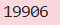

### Given
- Challenge giới thiệu về **modular exponentiation** — phép tính nền tảng của RSA:
    $$base^{exponent} \pmod {modulus}$$

- Ví dụ: $2^{10} \pmod{17} = 1024 \pmod{17} = 4$

### Goal
- Tính kết quả của $101^{17} \pmod{22663}$

### Solution
- Dùng hàm `pow()` built-in của Python.

    Nhận 3 tham số `pow(base, exponent, modulus)` và tính modular exponentiation hiệu quả bằng thuật toán **fast exponentiation (square-and-multiply)** thay vì tính $101^{17}$ rồi mới mod (số sẽ rất lớn):

    ```python
    result = pow(101, 17, 22663)
    print(result)
    ```

    > Thuật toán square-and-multiply giữ số luôn nhỏ hơn n trong suốt quá trình tính, tránh overflow và chạy trong $O(log e)$ phép nhân thay vì $O(e)$.

- **Kết quả:**

    