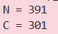

### Given
- RSA encryption hoạt động như sau:

    $$C = M^e \pmod N \quad \text{với} \quad N = p \cdot q$$

- Các tham số cho trước:
    - Plaintext: $M = 12$

    - Exponent: $e = 65537$

    - Primes: $p = 17, q = 23$

    > **Public Key & Private Key trong RSA**
    >
    > * **Public key** gồm cặp $(N, e)$ — ai cũng biết.
    > * **Private key** là $d$ (modular inverse của $e \pmod{\phi(N)}$) — chỉ chủ sở hữu biết.
    > 
    > Việc tính $d$ từ $N$ mà không biết $p, q$ chính là bài toán **phân tích thừa số nguyên (integer factorization)** — một bài toán cực khó giúp tạo nên sự bảo mật của RSA.

### Goal
- Tính $12^{65537} \pmod {(17×23)}$

### Solution
- **Bước 1 - Tính modulus:**

    $$N = p × q$$

- **Bước 2: Mã hóa RSA:**

    $$C = M^e \pmod N$$

    ```python
    M = 12
    e = 65537
    p = 17
    q = 23

    # Bước 1: Tính modulus N = p × q
    N = p * q

    # Bước 2: Mã hóa RSA — C = M^e mod N
    C = pow(M, e, N)
    print(f"N = {N}")
    print(f"C = {C}")
    print(f"crypto{{{C}}}")
    ```

- **Kết quả:**

    

    > **Lưu ý về độ an toàn của RSA**
    >
    > RSA với $N = 391$ cực kỳ yếu — chỉ cần thử chia $391$ cho các số nguyên tố nhỏ là tìm được $p, q$ ngay ($391 = 17 \times 23$). 
    >
    > Trong thực tế, RSA thường sử dụng $N$ có kích thước **2048-bit** hoặc **4096-bit** để việc phân tích thừa số trở nên bất khả thi đối với cả những siêu máy tính mạnh nhất hiện nay.