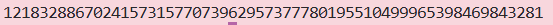

### Given
- Cho hai số nguyên tố và exponent public:
    $$p = 857504083339712752489993810777$$
    $$q = 1029224947942998075080348647219$$
    $$e = 65537$$

- Private key $d$ là **modular multiplicative inverse** của $e$ modulo $\phi(N)$:
    $$d \equiv e^{-1} \pmod{\phi(N)}$$

- Tức là $d$ thỏa mãn phương trình đồng dư:
    $$e \cdot d \equiv 1 \pmod{\phi(N)}$$

    > **Modular Multiplicative Inverse:** $d$ là số mà khi nhân với $e$ cho ra phần dư $1$ khi chia cho $\phi(N)$. Giá trị $d$ tồn tại khi và chỉ khi $\gcd(e, \phi(N)) = 1$. Trong giao thức RSA, điều này luôn được đảm bảo vì $e$ được chọn sao cho nguyên tố cùng nhau với $\phi(N)$. Ta có thể tìm $d$ hiệu quả bằng cách sử dụng **Thuật toán Euclid mở rộng (Extended Euclidean Algorithm**).

### Goal
- Tính $d \equiv e^{-1} \pmod{\phi(N)}$

### Solution
- **Bước 1 - Tính $\phi(N) = (p-1)(q-1)$:**

    ```python
    phi = (p - 1) * (q - 1)
    ```

- **Bước 2: Tính private key $d \equiv e^{-1} \pmod{\phi(N)}$:**

    ```python
    d = pow(e, -1, phi)
    ```

- **Kết quả:**

    

    > #### **Tóm tắt RSA Keypair**
    >
    > * **Public key:** $(N, e)$ — dùng để **encrypt** (mã hóa).
    > * **Private key:** $d$ — dùng để **decrypt** (giải mã) theo công thức:
    >   $$M = C^d \pmod N$$
    >
    > **Điểm mấu chốt:** Nếu kẻ tấn công biết được $p$ và $q$, chúng có thể dễ dàng tính lại $\phi(N)$ rồi từ đó tìm ra $d$. Đây chính là lý do vì sao việc ngăn chặn **phân tích thừa số nguyên $N$** được coi là "trái tim" của toàn bộ hệ thống bảo mật RSA.