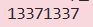

### Given
- Các tham số RSA:
    - $N = 882564595536224140639625987659416029426239230804614613279163$

    - $e = 65537$

    - Ciphertext: $c = 77578995801157823671636298847186723593814843845525223303932$

- Private key $d$ đã tính ở challenge trước:
    $$d = 121832886702415731577073962957377780195510499965398469843281$$

### Goal
- Giải mã ciphertext $c$ bằng private key $d$ theo công thức RSA decrypt:
    $$M = c^d \pmod N$$

### Solution
- Vì RSA decrypt là phép tính đối xứng với encrypt nên thay vì dùng $e$, ta dùng $d$:

    $$ \text{Encrypt: } C = M^e \pmod N $$

    $$ \text{Decrypt: } M = C^d \pmod N $$

- Điều này đúng vì $e \cdot d \equiv 1 \pmod{\phi(N)}$, nên:

    $$ C^d = (M^e)^d = M^{e \cdot d} \equiv M^1 = M \pmod N $$

- **Code Python:**

    ```python
    # Các tham số RSA
    N = 882564595536224140639625987659416029426239230804614613279163
    e = 65537
    c = 77578995801157823671636298847186723593814843845525223303932

    # Private key từ challenge trước
    p = 857504083339712752489993810777
    q = 1029224947942998075080348647219
    phi = (p - 1) * (q - 1)
    d = pow(e, -1, phi)

    # Giải mã: M = c^d mod N
    M = pow(c, d, N)
    print(M)
    ```
- **Kết quả:**

    