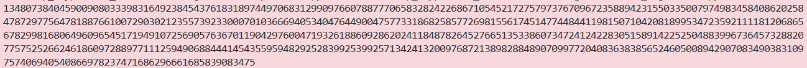

### Given
- Challenge cung cấp file `private.key` chứa RSA private key, và yêu cầu *ký số* (digital signature) lên `message = "crypto{Immut4ble_m3ssag1ng}"`.

- Công thức ký số RSA:
    $$S=H(m)^d \pmod N$$

    Trong đó:

    - $H(m)$ = SHA256 hash của message, chuyển sang số nguyên

    - $d,N$ = private key lấy từ file `private.key`

    > **Digital Signature:** Thay vì encrypt bằng public key của người nhận, ta "encrypt" hash của message bằng private key của chính mình. Bất kỳ ai có public key của ta đều có thể verify bằng cách decrypt chữ ký và so sánh với hash của message. Nếu khớp -> message chưa bị chỉnh sửa và chắc chắn do ta gửi.

### Goal
- Đọc private key từ file `private.key`

- Tính SHA256 hash của message, chuyển sang số nguyên

- Ký số: $S=H(m)^d \pmod N$

### Solution
- **Bước 1 — Đọc private key từ file:**

    File `private.key` ở challenge này không phải PEM chuẩn mà là định dạng text thuần túy dạng `tên = giá trị` nên ta parse thủ công từng dòng:

    ```python
    import os

    current_dir = os.path.dirname(os.path.abspath(__file__))
    key_path    = os.path.join(current_dir, "private.key")

    with open(key_path, "rb") as f:
        key_text = f.read().decode("utf-8")

    # Đọc từng dòng, split theo "=" để lấy tên và giá trị
    values = {}
    for line in key_text.splitlines():
        name, value = line.split("=", 1)
        values[name.strip()] = int(value.strip())

    N = values["N"]
    d = values["d"]
    ```

- **Bước 2 — Tính SHA256 hash và chuyển sang số nguyên:**

    ```python
    from hashlib import sha256
    from Crypto.Util.number import bytes_to_long

    message = b"crypto{Immut4ble_m3ssag1ng}"

    # SHA256 → 32 bytes → số nguyên (big-endian)
    H = bytes_to_long(sha256(message).digest())
    ```

- **Bước 3 — Ký số và in kết quả:**

    ```python
    # S = H(m)^d mod N
    S = pow(H, d, N)
    print(S)
    ```

- **Kết quả:**

    

    > **Tại sao ký lên hash thay vì ký trực tiếp lên message?** Vì $m$ có thể dài tùy ý, trong khi RSA chỉ hoạt động trên số nguyên nhỏ hơn $N$. SHA256 luôn cho ra output 256-bit cố định, phù hợp để đưa vào phép tính RSA. Ngoài ra, hash còn đảm bảo tính **collision resistance** — kẻ tấn công không thể tạo message khác có cùng hash.