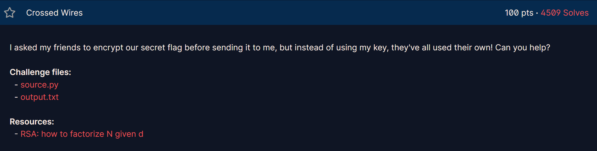
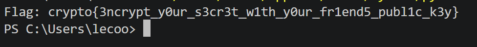

## **Crossed Wires (100 pts)**

### **1. Given**
* Một file `source.py` mô tả quy trình mã hóa: Flag được mã hóa liên tiếp qua nhiều người bạn, mỗi người sử dụng một số mũ công khai $e_i$ khác nhau nhưng dùng chung một Modulus $N$.
* File `output.txt` cung cấp:
    * Modulus $N$.
    * Một cặp $(e, d)$ đóng vai trò là "chìa khóa" phụ.
    * Danh sách các số mũ công khai của bạn bè: `friend_es = [106979, 108533, 69557, 97117, 103231]`.
    * Bản mã cuối cùng `cipher`.

### **2. Goal**
* Khôi phục lại Flag ban đầu từ bản mã đã bị mã hóa chồng chéo qua nhiều lớp số mũ.

### **3. Solution**

#### **Phân tích lỗ hổng**
1.  **Tính chất mã hóa RSA liên tiếp:** Khi một bản tin $m$ được mã hóa liên tiếp qua các số mũ $e_1, e_2, ..., e_n$ với cùng một $N$, bản mã cuối cùng sẽ là:
    $$C = m^{e_1 \cdot e_2 \cdot ... \cdot e_n} \pmod N$$
    Để giải mã, ta cần tìm số mũ giải mã tổng hợp $D$ sao cho $D \equiv (e_1 \cdot e_2 \cdot ... \cdot e_n)^{-1} \pmod{\phi(N)}$.
2.  **Khôi phục $\phi(N)$:** Ta không có $p, q$ để tính $\phi(N)$, nhưng đề bài cho một cặp $(e, d)$ hợp lệ. Theo lý thuyết RSA, nếu biết $N, e, d$, ta có thể phân tích thừa số $N$ thành $p$ và $q$ bằng thuật toán xác suất dựa trên việc tìm căn bậc hai của 1 modulo $N$.

#### **Các bước thực hiện**
1.  [cite_start]**Phân tích $N$:** Sử dụng cặp $(e, d)$ đã cho để tìm lại hai số nguyên tố $p$ và $q$. [cite: 1]
2.  [cite_start]**Tính toán $\phi(N)$:** Sau khi có $p$ và $q$, tính $\phi(N) = (p-1)(q-1)$. [cite: 1]
3.  **Tính số mũ mã hóa tổng hợp:** Nhân tất cả các số mũ trong `friend_es` lại với nhau theo modulo $\phi(N)$:
    $$E_{total} = \prod (friend\_es) \pmod{\phi(N)}$$
4.  [cite_start]**Tìm số mũ giải mã:** Tính số nghịch đảo modulo: $D_{total} = E_{total}^{-1} \pmod{\phi(N)}$. [cite: 1]
5.  [cite_start]**Giải mã:** Tính $Flag = cipher^{D_{total}} \pmod N$ và chuyển đổi kết quả từ số nguyên sang dạng bytes. [cite: 1]

---
``` python 
from Crypto.Util.number import long_to_bytes, inverse
import math
import random

# Dữ liệu từ output.txt 
N = 21711308225346315542706844618441565741046498277716979943478360598053144971379956916575370343448988601905854572029635846626259487297950305231661109855854947494209135205589258643517961521594924368498672064293208230802441077390193682958095111922082677813175804775628884377724377647428385841831277059274172982280545237765559969228707506857561215268491024097063920337721783673060530181637161577401589126558556182546896783307370517275046522704047385786111489447064794210010802761708615907245523492585896286374996088089317826162798278528296206977900274431829829206103227171839270887476436899494428371323874689055690729986771
d = 2734411677251148030723138005716109733838866545375527602018255159319631026653190783670493107936401603981429171880504360560494771017246468702902647370954220312452541342858747590576273775107870450853533717116684326976263006435733382045807971890762018747729574021057430331778033982359184838159747331236538501849965329264774927607570410347019418407451937875684373454982306923178403161216817237890962651214718831954215200637651103907209347900857824722653217179548148145687181377220544864521808230122730967452981435355334932104265488075777638608041325256776275200067541533022527964743478554948792578057708522350812154888097
e = 65537
cipher = 20304610279578186738172766224224793119885071262464464448863461184092225736054747976985179673905441502689126216282897704508745403799054734121583968853999791604281615154100736259131453424385364324630229671185343778172807262640709301838274824603101692485662726226902121105591137437331463201881264245562214012160875177167442010952439360623396658974413900469093836794752270399520074596329058725874834082188697377597949405779039139194196065364426213208345461407030771089787529200057105746584493554722790592530472869581310117300343461207750821737840042745530876391793484035024644475535353227851321505537398888106855012746117
friend_es = [106979, 108533, 69557, 97117, 103231] # 

# Bước 1: Phân tích N thành p, q dựa trên e, d
def get_factors(n, e, d):
    k = e * d - 1
    g = random.randint(2, n - 1)
    t = k
    while t % 2 == 0:
        t //= 2
        x = pow(g, t, n)
        if x > 1:
            y = math.gcd(x - 1, n)
            if y > 1:
                return y, n // y
    return None

p, q = get_factors(N, e, d)
phi = (p - 1) * (q - 1)

# Bước 2: Tính số mũ mã hóa tổng hợp (Product of all friends' e)
total_e = 1
for fe in friend_es:
    total_e = (total_e * fe) % phi

# Bước 3: Giải mã
total_d = inverse(total_e, phi)
flag_int = pow(cipher, total_d, N)

print(f"Flag: {long_to_bytes(flag_int).decode()}")

```
`crypto{3ncrypt_y0ur_s3cr3t_w1th_y0ur_fr1end5_publ1c_k3y}`

