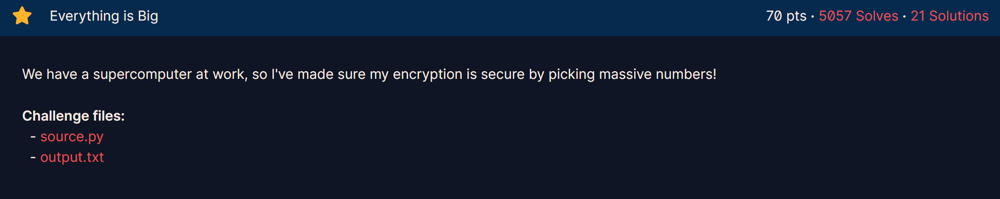

## **Everything is Big (70 pts)**

### **1. Given**
* [cite_start]Một hệ thống mã hóa RSA với các tham số $N$, $e$, và ciphertext $c$ có kích thước rất lớn (khoảng 2048 bits)[cite: 8].
* [cite_start]File `Everything is Big.py` cho thấy số mũ công khai $e$ cũng rất lớn, gần tương đương với kích thước của $N$[cite: 8].
* [cite_start]Thông thường trong RSA, người ta chọn $e$ nhỏ (như 65537) để tối ưu tốc độ mã hóa, nhưng ở đây $e$ được chọn "massive" (khổng lồ)[cite: 8].

### **2. Goal**
* Khai thác việc sử dụng số mũ công khai $e$ quá lớn để tìm ra số mũ bí mật $d$ và giải mã Flag.

### **3. Solution**

#### **Phân tích lỗ hổng**
Trong RSA, nếu số mũ công khai $e$ rất lớn và gần bằng $N$, điều đó thường có nghĩa là số mũ bí mật $d$ sẽ rất nhỏ. Theo **Định lý Wiener (Wiener's Attack)**, nếu số mũ bí mật $d$ thỏa mãn điều kiện:
$$d < \frac{1}{3} N^{1/4}$$
thì ta có thể tìm ra $d$ một cách hiệu quả thông qua việc tính toán các liên phân số (continued fractions) của tỷ số $\frac{e}{N}$. Các giá trị xấp xỉ (convergents) của $\frac{e}{N}$ sẽ chứa giá trị $\frac{k}{d}$, từ đó giúp ta khôi phục được $d$.

#### **Các bước thực hiện**
1.  [cite_start]**Tính liên phân số:** Tính toán dãy liên phân số cho giá trị $\frac{e}{N}$[cite: 8].
2.  **Tìm Convergents:** Với mỗi giá trị xấp xỉ $\frac{k}{d}$ trong dãy:
    * Giả định mẫu số chính là số mũ bí mật $d$.
    * Kiểm tra xem $d$ có hợp lệ không bằng cách thử giải mã một phần bản tin hoặc kiểm tra tính chất $a^{ed} \equiv a \pmod N$.
3.  [cite_start]**Giải mã:** Sau khi tìm được $d$ chính xác, thực hiện phép tính $m = c^d \pmod N$[cite: 8].
4.  [cite_start]**Lấy Flag:** Chuyển đổi số nguyên $m$ thu được sang định dạng bytes bằng hàm `long_to_bytes` để đọc nội dung Flag[cite: 8].
``` python 
from Crypto.Util.number import long_to_bytes

# Dữ liệu từ output.txt
N = 0xb8af3d3afb893a602de4afe2a29d7615075d1e570f8bad8ebbe9b5b9076594cf06b6e7b30905b6420e950043380ea746f0a14dae34469aa723e946e484a58bcd92d1039105871ffd63ffe64534b7d7f8d84b4a569723f7a833e6daf5e182d658655f739a4e37bd9f4a44aff6ca0255cda5313c3048f56eed5b21dc8d88bf5a8f8379eac83d8523e484fa6ae8dbcb239e65d3777829a6903d779cd2498b255fcf275e5f49471f35992435ee7cade98c8e82a8beb5ce1749349caa16759afc4e799edb12d299374d748a9e3c82e1cc983cdf9daec0a2739dadcc0982c1e7e492139cbff18c5d44529407edfd8e75743d2f51ce2b58573fea6fbd4fe25154b9964d
e = 0x9ab58dbc8049b574c361573955f08ea69f97ecf37400f9626d8f5ac55ca087165ce5e1f459ef6fa5f158cc8e75cb400a7473e89dd38922ead221b33bc33d6d716fb0e4e127b0fc18a197daf856a7062b49fba7a86e3a138956af04f481b7a7d481994aeebc2672e500f3f6d8c581268c2cfad4845158f79c2ef28f242f4fa8f6e573b8723a752d96169c9d885ada59cdeb6dbe932de86a019a7e8fc8aeb07748cfb272bd36d94fe83351252187c2e0bc58bb7a0a0af154b63397e6c68af4314601e29b07caed301b6831cf34caa579eb42a8c8bf69898d04b495174b5d7de0f20cf2b8fc55ed35c6ad157d3e7009f16d6b61786ee40583850e67af13e9d25be3
c = 0x3f984ff5244f1836ed69361f29905ca1ae6b3dcf249133c398d7762f5e277919174694293989144c9d25e940d2f66058b2289c75d1b8d0729f9a7c4564404a5fd4313675f85f31b47156068878e236c5635156b0fa21e24346c2041ae42423078577a1413f41375a4d49296ab17910ae214b45155c4570f95ca874ccae9fa80433a1ab453cbb28d780c2f1f4dc7071c93aff3924d76c5b4068a0371dff82531313f281a8acadaa2bd5078d3ddcefcb981f37ff9b8b14c7d9bf1accffe7857160982a2c7d9ee01d3e82265eec9c7401ecc7f02581fd0d912684f42d1b71df87a1ca51515aab4e58fab4da96e154ea6cdfb573a71d81b2ea4a080a1066e1bc3474

def wiener_attack(e, n):
    # Triển khai thuật toán liên phân số để tìm d
    def continued_fraction(n, d):
        while d:
            yield n // d
            n, d = d, n % d

    def convergents(cf):
        n0, d0 = 0, 1
        n1, d1 = 1, 0
        for q in cf:
            n2, d2 = q * n1 + n0, q * d1 + d0
            yield n2, d2
            n0, d0, n1, d1 = n1, d1, n2, d2

    for k, d in convergents(continued_fraction(e, n)):
        if k == 0: continue
        if (e * d - 1) % k == 0:
            phi = (e * d - 1) // k
            # Kiểm tra xem phi có hợp lệ không (giải phương trình bậc 2 tìm p, q)
            # Hoặc đơn giản là thử giải mã c
            m = pow(c, d, n)
            flag = long_to_bytes(m)
            if b'crypto' in flag:
                return flag

print(wiener_attack(e, N))

```


`crypto{s0m3th1ng5_c4n_b3_t00_b1g}`