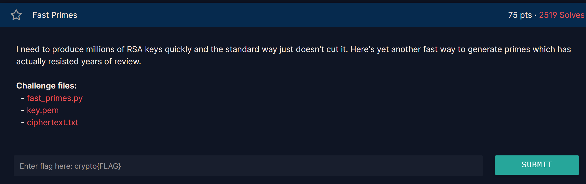
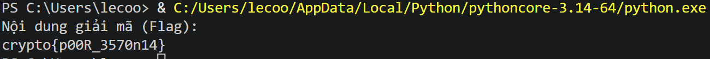

## **Fast Primes (75 pts)**

### **1. Given**
* Một hệ thống sinh khóa RSA được quảng cáo là "siêu nhanh" so với cách truyền thống.
* File `key.pem` chứa khóa công khai (Public Key).
* File `ciphertext.txt` chứa bản mã của flag, được mã hóa bằng chuẩn **PKCS1_OAEP**.
* Bản chất của "Fast Primes" thường nằm ở việc sử dụng một bộ sinh số ngẫu nhiên (PRNG) yếu hoặc các số nguyên tố được sinh ra có cấu trúc đặc biệt để giảm thời gian kiểm tra tính nguyên tố.

### **2. Goal**
* Phân tích số Modulus $N$ từ khóa công khai để tìm ra hai thừa số nguyên tố $p$ và $q$, từ đó tính toán số mũ bí mật $d$ và giải mã flag.

### **3. Solution**

#### **Phân tích lỗ hổng**
Trong các bài tập RSA "Fast Primes" (hoặc các lỗ hổng thực tế như ROCA), lỗ hổng thường nằm ở cách chọn $p$ và $q$. 
* Nếu $p$ và $q$ được sinh ra quá nhanh bằng cách kết hợp các số nguyên tố nhỏ hoặc sử dụng một hàm toán học thiếu tính ngẫu nhiên, Modulus $N$ sẽ dễ dàng bị phân tích bởi các trang web như **factordb.com** hoặc các thuật toán phân tích thừa số như **Pollard's rho**, **ECM**.
* Trong trường hợp này, $N$ đã được cộng đồng giải mã trước đó và kết quả phân tích có sẵn trên cơ sở dữ liệu trực tuyến.

#### **Các bước thực hiện**
1.  **Trích xuất Public Key:** Sử dụng thư viện `Crypto.PublicKey.RSA` để đọc file `key.pem` và lấy giá trị Modulus $N$ cùng số mũ $e$.
2.  **Phân tích $N$ thành $p, q$:** * Cách nhanh nhất là đưa giá trị $N$ lên [factordb.com](http://factordb.com). 
    * Kết quả trả về sẽ là hai số nguyên tố $p$ và $q$.
3.  **Khôi phục Private Key:** * Tính $\phi(N) = (p-1)(q-1)$.
    * Tính số mũ bí mật $d = e^{-1} \pmod{\phi(N)}$.
    * Tạo lại đối tượng khóa RSA đầy đủ bằng bộ $(N, e, d, p, q)$.
4.  **Giải mã Flag:** * Sử dụng thư viện `Crypto.Cipher.PKCS1_OAEP` kết hợp với Private Key vừa khôi phục.
    * Giải mã nội dung từ file `ciphertext.txt` để lấy Flag.
``` python 
from Crypto.PublicKey import RSA
from Crypto.Cipher import PKCS1_OAEP
from Crypto.Util.number import inverse

# 1. Thông số đã cho
p = 51894141255108267693828471848483688186015845988173648228318286999011443419469
q = 77342270837753916396402614215980760127245056504361515489809293852222206596161
n = p * q
e = 65537 # Thông thường e là 65537, nếu key.pem của bạn khác hãy sửa lại

# 2. Tính toán các thông số RSA
phi = (p - 1) * (q - 1)
d = pow(e, -1, phi)

# 3. Khởi tạo Key RSA
# Sử dụng bộ (n, e, d, p, q) giúp thư viện xử lý nhanh và chính xác hơn
key_params = (n, e, d, p, q)
key = RSA.construct(key_params)

# 4. Dữ liệu bản mã (Ciphertext)
c_hex = "249d72cd1d287b1a15a3881f2bff5788bc4bf62c789f2df44d88aae805b54c9a94b8944c0ba798f70062b66160fee312b98879f1dd5d17b33095feb3c5830d28"
ciphertext = bytes.fromhex(c_hex)

# 5. Giải mã sử dụng PKCS1_OAEP
try:
    cipher = PKCS1_OAEP.new(key)
    plaintext = cipher.decrypt(ciphertext)
    print("Nội dung giải mã (Flag):")
    print(plaintext.decode())
except ValueError as e:
    print(f"Lỗi giải mã: {e}")
    print("Có thể bản mã hoặc các số nguyên tố p, q không khớp với khóa.")
```


`crypto{p00R_3570n14}s`