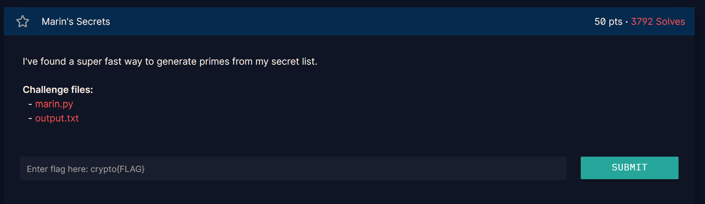
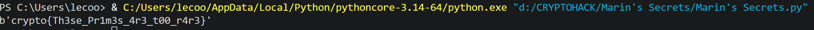

## **Marin's Secrets (50 pts)**

### **1. Given**
* File `marin.py` mô tả cách sinh hai số nguyên tố $p$ và $q$ từ một danh sách bí mật.
* Hàm `get_prime(secret)` thực hiện phép tính: `(1 << secret) - 1`. Đây chính là công thức của **Số nguyên tố Mersenne**: $M_n = 2^n - 1$.
* File `output.txt` cung cấp:
    * Modulus $n$ (tích của hai số nguyên tố Mersenne).
    * Số mũ công khai $e = 65537$.
    * Ciphertext $c$.

### **2. Goal**
* Phân tích $n$ thành hai thừa số $p$ và $q$. Vì $p, q$ có dạng đặc biệt $2^x - 1$, việc tìm ra chúng dễ dàng hơn nhiều so với phân tích số nguyên thông thường.

### **3. Solution**

#### **Phân tích lỗ hổng**
Tên thử thách "Marin" ám chỉ nhà toán học **Marin Mersenne**. Các số nguyên tố Mersenne rất hiếm và đã được lập danh sách cụ thể. 

Thay vì dùng các thuật toán phân tích thừa số vạn năng như GNFS, ta chỉ cần thử chia $n$ cho các số trong danh sách số nguyên tố Mersenne đã biết. Nếu $n$ chia hết cho một số $M_p$, ta tìm được thừa số thứ nhất, từ đó suy ra thừa số còn lại.

#### **Các bước thực hiện**
1.  **Liệt kê số Mersenne:** Sử dụng danh sách các số mũ $s$ sao cho $2^s - 1$ là số nguyên tố (ví dụ: 2, 3, 5, 7, 13, 17, 19, 31, 61, 89, 107, 127, 521, 607, 1279, 2203, 2281...).
2.  **Tìm $p$ và $q$:** * Thử lần lượt các số $p = 2^s - 1$.
    * Kiểm tra nếu $n \pmod p == 0$. 
    * Trong bài này, qua tính toán ta tìm được $p = 2^{2203} - 1$ và $q = 2^{2281} - 1$.
3.  **Giải mã RSA:**
    * Tính $\phi(n) = (p-1)(q-1)$.
    * Tính số mũ giải mã $d = e^{-1} \pmod{\phi(n)}$.
    * Tính bản rõ $m = c^d \pmod n$.
4.  **Lấy Flag:** Chuyển số nguyên $m$ sang định dạng bytes để thu được chuỗi flag.

`crypto{Th3se_Pr1m3s_4r3_t00_r4r3}`

