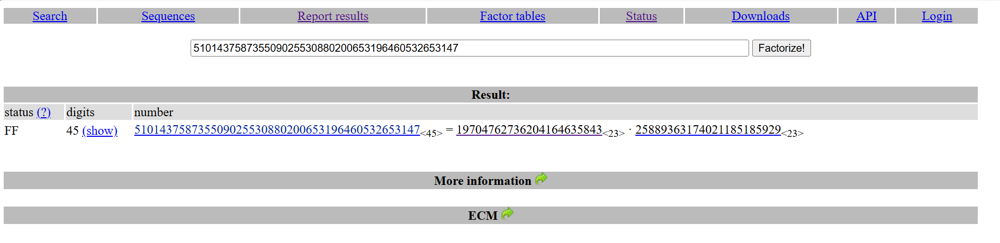

### RSA
---
> #### 7. Factoring

> Given
- Hệ mật mã RSA hoạt động dựa trên một module $N$ được tạo ra bằng cách nhân hai số nguyên tố bí mật $p$ và $q$ ($N = p \cdot q$). Tính bảo mật của RSA phụ thuộc hoàn toàn vào việc máy tính rất khó để phân tích $N$ ngược lại thành $p$ và $q$ nếu module đó đủ lớn.
- Hệ thống cung cấp một module $N$ có kích thước khá nhỏ (150-bit):
$N = 510143758735509025530880200653196460532653147$

> Goal

Phân tích module $N$ thành hai thừa số nguyên tố $p$ và $q$. Cờ (Flag) chính là số nguyên tố có giá trị nhỏ hơn.

> Solution

Sử dụng các công cụ trực tuyến để phân tích, ở bài này mình sử dụng `FactorDB.com` để tìm ra được só o nguyên tố.

> Và kết quả được mình lấy từ trang web: 
`19704762736204164635843`
 
---
> #### 8. Inferius Prime

> Given
- Cơ sở: Độ an toàn của hệ mật mã công khai RSA phụ thuộc hoàn toàn vào độ phức tạp tính toán của bài toán phân tích nhân tử số nguyên lớn (Integer Factorization Problem - IFP). Theo các tiêu chuẩn an toàn thông tin hiện hành, module $N$ đòi hỏi kích thước tối thiểu từ 2048-bit để chống lại các kỹ thuật phân tích hiện đại.
- Hệ thống cung cấp cấu hình khóa công khai bao gồm số mũ $e = 65537$, bản mã $ct$ và module $N$. Phân tích thực nghiệm cho thấy module $N$ chỉ sở hữu xấp xỉ 60 chữ số thập phân (tương đương với không gian khoảng 200-bit). Sự sai lệch tham số này là một điểm yếu nghiêm trọng trong khâu khởi tạo, làm suy giảm hoàn toàn tính an toàn của hệ mật mã.

>Goal

Phân tích module $N$ thành 2 số nguyên tố $p$ và $q$. Sau đó, sử dụng $p$ và $q$ để tính khóa bí mật $d$ và giải mã ciphertext $ct$ về dạng văn bản (Flag).

> Solution

1. Sử dụng `FactorDB.com` phân tích thành 2 số p và q.
2. Tính số Euler Totient: $\phi = (p-1) \cdot (q-1)$.
3. Tính khóa bí mật $d$ bằng nghịch đảo modulo: $d \equiv e^{-1} \pmod \phi$.
4. Giải mã: $m = ct^d \pmod N$.
5. Dùng hàm `long_to_bytes` để chuyển số nguyên $m$ thành chuỗi Flag có thể đọc được.


```python
from Crypto.Util.number import long_to_bytes
n = 742449129124467073921545687640895127535705902454369756401331
e = 3 
ct = 39207274348578481322317340648475596807303160111338236677373
p =  752708788837165590355094155871
q =  986369682585281993933185289261
phi = (p-1)*(q-1)
d = pow(e,-1,phi) #decryption key 

decrypt = pow(ct,d,n)

print(long_to_bytes(decrypt))

```


> Kết quả: 
`b'crypto{N33d_b1g_pR1m35}'`


--- 
> #### 9. Monoprime

> Given

- Trong hệ mật mã RSA tiêu chuẩn, module $N$ được thiết lập từ tích của hai số nguyên tố phân biệt ($N = p \cdot q$). Dựa trên đặc tính này, phi hàm Euler (Euler's Totient function) được tính bằng công thức $\phi(N) = (p-1)(q-1)$.
- Tuy nhiên, hệ thống "Monoprime" này mắc một lỗi thiết kế kiến trúc cơ bản: module $N$ được cấu tạo từ một số nguyên tố duy nhất ($N = p$). Sự biến đổi này phá vỡ hoàn toàn bài toán phân tích nhân tử, vốn là nền tảng bảo mật của RSA.
- Bài toán cung cấp bộ tham số khóa công khai gồm số mũ $e = 65537$, bản mã $ct$ và một module $N$ siêu lớn nhưng bản thân nó đã là một số nguyên tố.
> Goal

- Khai thác lỗ hổng cấu trúc của module $N$ để tính toán trực tiếp phi hàm Euler $\phi(N)$, qua đó suy xuất khóa giải mã bí mật $d$ và khôi phục bản mã $ct$ về định dạng văn bản (Flag).

> Solution

- Khi module $N$ là một số nguyên tố, ta không cần phải dùng bất kỳ công cụ nào để phân tích (factorize) nó nữa. 
- Dựa theo định nghĩa toán học của phi hàm Euler, số lượng các số nguyên tố cùng nhau với một số nguyên tố $N$ chính là $N - 1$.Do đó, công thức tính $\phi$ được đơn giản hóa tối đa:$$\phi(N) = N - 1$$

```python
from Crypto.Util.number import long_to_bytes
n = 171731371218065444125482536302245915415603318380280392385291836472299752747934607246477508507827284075763910264995326010251268493630501989810855418416643352631102434317900028697993224868629935657273062472544675693365930943308086634291936846505861203914449338007760990051788980485462592823446469606824421932591
e = 65537 
ct = 161367550346730604451454756189028938964941280347662098798775466019463375610700074840105776873791605070092554650190486030367121011578171525759600774739890458414593857709994072516290998135846956596662071379067305011746842247628316996977338024343628757374524136260758515864509435302781735938531030576289086798942

p = 1 
q = n
phi = (q-1)
d = pow(e,-1,phi)
decrypt = pow(ct,d,n)
print(long_to_bytes(decrypt))
```


> Ra được kết quả: 
`b'crypto{0n3_pr1m3_41n7_pr1m3_l0l}'`


--- 
> #### 10. Square Eyes

> Given
- Trong quá trình sinh khóa RSA tiêu chuẩn, module $N$ bắt buộc phải là tích của hai số nguyên tố phân biệt ($N = p \cdot q$). 
- Dựa trên định lý cơ bản của số học, phi hàm Euler cho cấu trúc này là $\phi(N) = (p-1)(q-1)$. 
- Tuy nhiên, ở bài toán này, kiến trúc hệ thống đã bị thay đổi: module $N$ được thiết lập bằng bình phương của một số nguyên tố duy nhất ($N = p^2$). Khi cấu trúc vi phạm quy tắc này, công thức tính phi hàm Euler thay đổi. 
- Theo định lý toán học đối với lũy thừa của một số nguyên tố $p^k$, ta có $\phi(p^k) = p^k - p^{k-1}$. Do đó, với $k=2$, phi hàm được xác định bằng: $\phi(N) = p^2 - p = p(p-1)$.
- Hệ thống cung cấp bản mã $ct$, số mũ $e = 65537$ và một module $N$ khổng lồ (khoảng 4096-bit). Tác giả xác nhận rằng $N$ được tạo ra bằng cách lấy một số nguyên tố 2048-bit và "nhân nó với chính nó" (dùng hai lần).

> Goal

- Khai thác điểm yếu cấu trúc của module $N = p^2$ bằng thuật toán khai căn bậc hai số nguyên (Integer Square Root) để tìm lại tham số $p$. 
- Sau đó, áp dụng đúng định lý phi hàm Euler cho lũy thừa số nguyên tố để tính toán khóa giải mã $d$ và khôi phục văn bản gốc.

> Solution

- Dựa trên gợi ý của đề bài về phi hàm Euler, ta xác định được module $N$ là một số chính phương ($N = p^2$, đồng nghĩa $p = q$). 
- Do đó, ta có thể dễ dàng tìm $p$ bằng phép khai căn bậc hai ($p = \sqrt{N}$) và tính phi hàm theo công thức: $\phi(N) = p \cdot (p-1)$.

```python
from Crypto.Util.number import long_to_bytes, inverse

n = 535860808044009550029177135708168016201451343147313565371014459027743491739422885443084705720731409713775527993719682583669164873806842043288439828071789970694759080842162253955259590552283047728782812946845160334801782088068154453021936721710269050985805054692096738777321796153384024897615594493453068138341203673749514094546000253631902991617197847584519694152122765406982133526594928685232381934742152195861380221224370858128736975959176861651044370378539093990198336298572944512738570839396588590096813217791191895941380464803377602779240663133834952329316862399581950590588006371221334128215409197603236942597674756728212232134056562716399155080108881105952768189193728827484667349378091100068224404684701674782399200373192433062767622841264055426035349769018117299620554803902490432339600566432246795818167460916180647394169157647245603555692735630862148715428791242764799469896924753470539857080767170052783918273180304835318388177089674231640910337743789750979216202573226794240332797892868276309400253925932223895530714169648116569013581643192341931800785254715083294526325980247219218364118877864892068185905587410977152737936310734712276956663192182487672474651103240004173381041237906849437490609652395748868434296753449
e = 65537
ct = 222502885974182429500948389840563415291534726891354573907329512556439632810921927905220486727807436668035929302442754225952786602492250448020341217733646472982286222338860566076161977786095675944552232391481278782019346283900959677167026636830252067048759720251671811058647569724495547940966885025629807079171218371644528053562232396674283745310132242492367274184667845174514466834132589971388067076980563188513333661165819462428837210575342101036356974189393390097403614434491507672459254969638032776897417674577487775755539964915035731988499983726435005007850876000232292458554577437739427313453671492956668188219600633325930981748162455965093222648173134777571527681591366164711307355510889316052064146089646772869610726671696699221157985834325663661400034831442431209123478778078255846830522226390964119818784903330200488705212765569163495571851459355520398928214206285080883954881888668509262455490889283862560453598662919522224935145694435885396500780651530829377030371611921181207362217397805303962112100190783763061909945889717878397740711340114311597934724670601992737526668932871436226135393872881664511222789565256059138002651403875484920711316522536260604255269532161594824301047729082877262812899724246757871448545439896

p = q = 23148667521998097720857168827790771337662483716348435477360567409355026169165934446949809664595523770853897203103759106983985113264049057416908191166720008503275951625738975666019029172377653170602440373579593292576530667773951407647222757756437867216095193174201323278896027294517792607881861855264600525772460745259440301156930943255240915685718552334192230264780355799179037816026330705422484000086542362084006958158550346395941862383925942033730030004606360308379776255436206440529441711859246811586652746028418496020145441513037535475380962562108920699929022900677901988508936509354385660735694568216631382653107
# print(p)
phi = (p-1)*(q)
d = pow(e,-1,phi)

decrypt = pow(ct,d,n)
print(long_to_bytes(decrypt))
```

> Kết quả:
`b'crypto{squar3_r00t_i5_f4st3r_th4n_f4ct0r1ng!}`


---
> #### 25. Signing Server

> Given

- Trong hệ mật mã RSA nguyên thủy (Textbook RSA), phép toán tạo chữ ký điện tử (Digital Signature) và phép toán giải mã (Decryption) là hoàn toàn đồng nhất về mặt toán học. 
- Cụ thể, để ký một thông điệp $m$, hệ thống tính toán $s \equiv m^d \pmod N$. 
- Tương tự, để giải mã một bản mã $c$, hệ thống tính $m \equiv c^d \pmod N$. 
- Do đó, một hệ thống tự động ký các thông điệp bất kỳ bằng khóa bí mật $d$ (Signing Oracle) có thể bị lợi dụng như một hệ thống giải mã (Decryption Oracle).

Dữ kiện bài toán: Phân tích mã nguồn (13374.py) cho thấy máy chủ cung cấp giao diện tương tác JSON với 3 chức năng chính:
+ get_pubkey: Cung cấp tham số khóa công khai gồm module $N$ và số mũ $e$.
+ get_secret: Mã hóa cờ bí mật bằng khóa công khai và trả về bản mã $c \equiv secret^e \pmod N$.
+ sign: Nhận một thông điệp đầu vào dạng hex, thực thi phép ký bằng khóa bí mật và trả về kết quả $s \equiv msg^d \pmod N$.
> Goal

- Khai thác điểm yếu cấu trúc của hàm sign, sử dụng nó như một công cụ giải mã (Decryption Oracle) để khôi phục bản mã nhận được từ hàm get_secret về định dạng văn bản gốc (Flag).

> Solution

Lỗ hổng cốt lõi của máy chủ này là việc thực thi phép ký trực tiếp lên dữ liệu đầu vào mà không qua bước băm (hashing) hay đệm (padding) định dạng an toàn.

```python
from pwn import * # pip install pwntools
import json
from Crypto.Util.number import bytes_to_long, long_to_bytes
import codecs
import base64

r = remote('socket.cryptohack.org', 13374, level = 'debug')

def json_recv():
    line = r.recvline()
    return json.loads(line.decode())

def json_send(hsh):
    request = json.dumps(hsh).encode()
    r.sendline(request)

r.recvline()
json_send({"option": "get_secret"})
se = json_recv()
print(se)
json_send({"option": "sign", "msg": se["secret"]})
received = json_recv()
print(bytes.fromhex(received["signature"][2:]))
```
Kết quả: `crypto{d0n7_516n_ju57_4ny7h1n6}`

---

> #### 26. Let's Decrypt

> Given

Hệ thống yêu cầu xác thực quyền sở hữu domain bằng chữ ký số RSA. Phân tích mã nguồn cho thấy hai điểm quan trọng:
+ Hệ thống cung cấp sẵn một chữ ký điện tử ($signature$) hợp lệ thông qua hàm get_signature.
+ Hàm verify mắc lỗi thiết kế nghiêm trọng: Cho phép người dùng tự định nghĩa khóa công khai (nhập tùy ý tham số module $N$ và số mũ $e$) để xác thực thông điệp.


>Goal

Tạo ra một thông điệp ($msg$) theo yêu cầu (chứa chuỗi I am Mallory...) và đánh lừa hệ thống chấp nhận $signature$ cũ là chữ ký hợp lệ cho $msg$ này bằng cách thao túng $N$ và $e$.

> Solution

Cơ chế kiểm tra chữ ký của máy chủ dựa trên phương trình:
$$signature^e \equiv digest \pmod N$$(Trong đó $digest$ là giá trị băm PKCS#1 v1.5 của thông điệp $msg$ ta gửi lên).
Vì ta hoàn toàn kiểm soát $N$ và $e$, ta có thể vô hiệu hóa độ khó của RSA bằng cách đặt số mũ $e = 1$. Phương trình được đơn giản hóa thành:$$signature \equiv digest \pmod N$$Theo tính chất của phép chia lấy dư, để $signature$ chia cho $N$ dư $digest$, ta chỉ cần thiết lập module $N = signature - digest$. Mọi thứ sẽ tự động khớp hoàn hảo mà không cần phải giải mã hay bẻ khóa hệ thống.

```python
from pwn import *
import json
from Crypto.Util.number import bytes_to_long
from pkcs1 import emsa_pkcs1_v15

io = remote("socket.cryptohack.org", 13391, level='error')

def json_send(hsh):
    io.sendline(json.dumps(hsh).encode())

def json_recv():
    return json.loads(io.recvline().decode())

io.recvline()

json_send({"option": "get_signature"})
data = json_recv()
sig = int(data["signature"], 16)

msg = "I am Mallory own CryptoHack.org"
digest = emsa_pkcs1_v15.encode(msg.encode(), 256)
digest_int = bytes_to_long(digest)

e = 1
n = sig - digest_int

json_send({
    "option": "verify",
    "msg": msg,
    "N": hex(n),
    "e": hex(e)
})

print(f"{json_recv()}")
```


> Kết quả:
`crypto{dupl1c4t3_s1gn4tur3_k3y_s3l3ct10n}`

--- 

> #### 27. Blinding Light

> Given
  
  - Hệ thống cho phép ký (sign) mọi thông điệp, ngoại trừ thông điệp chứa chuỗi admin=True. 
  - Để lấy Flag, ta cần cung cấp chữ ký hợp lệ cho chính chuỗi admin=True này trong hàm verify.

> Goal

Lợi dụng tính chất "đồng cấu nhân" (multiplicative homomorphic) của RSA để tạo ra chữ ký cho thông điệp admin=True mà không cần gửi trực tiếp thông điệp này cho hệ thống ký.

> Solution

RSA bảo toàn phép nhân: $(m_1 \cdot m_2)^d \equiv m_1^d \cdot m_2^d \pmod N$.
Nghĩa là, chữ ký của một tích bằng tích của các chữ ký. Ta thực hiện các bước sau:
- Chuyển chuỗi admin=True thành số nguyên $m = 459922107199558918501733$.
- Phân tích $m$ thành 2 thừa số nguyên tố nhỏ (có thể dùng sympy hoặc tra FactorDB):$p_1 = 211578328037$$p_2 = 2173767566209$ (Lúc này $m = p_1 \cdot p_2$, và cả $p_1, p_2$ đều không chứa chuỗi admin=True).
- Yêu cầu server ký riêng lẻ $p_1$ (được $S_1$) và $p_2$ (được $S_2$).
- Chữ ký hợp lệ cho admin=True chính là $S = S_1 \cdot S_2 \pmod N$.

```python
from pwn import *
import json
from Crypto.Util.number import bytes_to_long, long_to_bytes

io = remote('socket.cryptohack.org', 13376, level='error')

def json_send(hsh):
    io.sendline(json.dumps(hsh).encode())

def json_recv():
    return json.loads(io.recvline())

io.recvline()

json_send({"option": "get_pubkey"})
N = int(json_recv()['N'], 16)

p1 = 211578328037
p2 = 2173767566209

json_send({"option": "sign", "msg": long_to_bytes(p1).hex()})
s1 = int(json_recv()['signature'], 16)

json_send({"option": "sign", "msg": long_to_bytes(p2).hex()})
s2 = int(json_recv()['signature'], 16)

admin_signature = (s1 * s2) % N

json_send({
    "option": "verify",
    "msg": b"admin=True".hex(),

    "signature": hex(admin_signature)
})

print(f"{json_recv()['response']}")
```

> Kết quả: 
`crypto{m4ll34b1l17y_c4n_b3_d4n63r0u5}`


---

> #### 28. Vote for Pedro

> Given

- Hệ thống yêu cầu xác thực 3 thông điệp khác nhau để thu thập 3 mảnh ghép (shares). Các mảnh này khi XOR lại với nhau sẽ tạo thành Flag.
- Ta vẫn được quyền tự set khóa công khai $N$ (với điều kiện không được là số nguyên tố), nhưng có một rào cản lớn: Ta phải gửi $N$ trước. Sau khi chốt $N$, server mới trả về một chuỗi suffix ngẫu nhiên và bắt buộc mọi thông điệp phải kết thúc bằng chuỗi này.
- Vì suffix làm thay đổi hoàn toàn giá trị băm (digest $D$) của thông điệp sau khi đã chốt $N$, trick "ăn gian" $N = S - D$ ở bài trước đã bị vô hiệu hóa.2. Goal
> Goal

Tìm ra một module $N$ có cấu trúc đặc biệt sao cho: Dù giá trị băm $D$ có sinh ra là số nào đi chăng nữa, ta vẫn có thể giải bài toán Logarit Rời Rạc (Discrete Logarithm Problem): $S^e \equiv D \pmod N$ một cách nhanh chóng để tìm ra số mũ $e$.

> Solution

Quy trình khai thác:
1. Lấy chữ ký $S$ từ server. Tìm một số nguyên tố nhỏ $p$ (ví dụ $p=3$) mà $S$ không chia hết cho $p$.
2. Đặt $N = p^{1000}$ (một con số khổng lồ nhưng vô dụng về mặt bảo mật) gửi lên server để nhận suffix.
3. Tạo thông điệp ghép với suffix. Nếu cần thiết, thêm bớt một vài khoảng trắng (space) vào thông điệp cho đến khi giá trị băm $D$ thỏa mãn điều kiện toán học.
4. Dùng SageMath (chuyên gia xử lý toán học) để tính trực tiếp số mũ $e$.
5. Lấy 3 mảnh ghép và XOR ra Flag.

```python
bytes2long = lambda x: int.from_bytes(x, 'big')

x = mod(bytes2long(b"VOTE FOR PEDRO"), 2**120).nth_root(3)

print('{' + f'"option":"vote","vote":"{hex(x)[2:]}"' + '}')
```
Sau khi chạy đoạn code trên ta có được: `{"option":"vote","vote":"a4c46bfb65e7eccc4e76a1ce2afc6f"}`

-> Kết nối tới Server và gửi cho nó
> Kết quả:
`crypto{y0ur_v0t3_i5_my_v0t3}`
---

> #### 29. Let's Decrypt Again

> Given

- Hệ thống yêu cầu xác thực 3 thông điệp khác nhau để nhận 3 mảnh bí mật (shares), XOR 3 mảnh này sẽ ra Flag.
- Máy chủ bắt buộc ta gửi module $N$ trước. Sau đó, máy chủ sinh ra một chuỗi suffix ngẫu nhiên và bắt buộc nối vào đuôi mọi thông điệp. Điều này vô hiệu hóa việc tính toán trước giá trị băm $D$ để gài $N$.

> Goal

- Lựa chọn một module $N$ có cấu trúc toán học đặc biệt yếu để biến bài toán Logarit Rời Rạc (Discrete Logarithm Problem - DLP) từ "không thể giải" thành "giải trong tích tắc". 
- Từ đó, với bất kỳ giá trị băm $D$ nào sinh ra từ suffix, ta đều tính ngược được số mũ $e$.

> Solution

- Điểm yếu cốt lõi là máy chủ chỉ kiểm tra $N$ không phải là số nguyên tố, nhưng không cấm $N$ là lũy thừa của một số nguyên tố ($N = p^k$).
- Khi chọn $p$ là một số nguyên tố (ví dụ $p = 2010103$) và $k$ đủ lớn ($k = 50$), cấu trúc của nhóm nhân modulo $N$ trở nên cực kỳ yếu. 
- Ta có thể sử dụng hàm discrete_log của SageMath để giải phương trình $S^e \equiv D \pmod N$ một cách trực tiếp.

```python
from pwn import *
from json import dumps, loads
from Crypto.Util.number import bytes_to_long
from pkcs1 import emsa_pkcs1_v15
from sage.all import Mod, discrete_log

r = remote('socket.cryptohack.org', 13394)
r.recvline()

r.sendline(dumps({'option': 'get_signature'}).encode())
s = int(loads(r.recvline())['signature'], 16)

p, k = 2010103, 50
n = p**k
r.sendline(dumps({'option': 'set_pubkey', 'pubkey': hex(n)}).encode())
suffix = loads(r.recvline())['suffix']

m1 = 'This is a test for a fake signature.' + suffix
m2 = 'My name is Zupp and I own CryptoHack.org' + suffix
m3 = 'Please send all my money to 3EovkHLK5kkAbE8Kpe53mkEbyQGjyf8ECw' + suffix

def cvt(msg):
    return bytes_to_long(emsa_pkcs1_v15.encode(msg.encode(), 768 // 8))

msg1, msg2, msg3 = cvt(m1), cvt(m2), cvt(m3)

s_mod = Mod(s, n)
e1 = discrete_log(Mod(msg1, n), s_mod)
e2 = discrete_log(Mod(msg2, n), s_mod)
e3 = discrete_log(Mod(msg3, n), s_mod)

def claim(msg, idx, e_val):
    r.sendline(dumps({'option': 'claim', 'msg': msg, 'index': idx, 'e': hex(e_val)}).encode())
    return bytes.fromhex(loads(r.recvline())['secret'])

sec1 = claim(m1, 0, e1)
sec2 = claim(m2, 1, e2)
sec3 = claim(m3, 2, e3)

flag = xor(sec1, sec2, sec3).decode()
print(f"{flag}")
```
> Kết quả: 
`crypto{let's_decrypt_w4s_t0o_ez_do_1t_ag41n}`