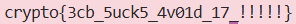

### Given
- Server cung cấp 2 **API endpoint**:
    ```python
    # Mã hóa flag bằng AES-CBC với IV (Initialization Vector - 16 byte đầu tiên) ngẫu nhiên
    # Trả về: iv (16 bytes) + ciphertext (hex)
    GET /ecbcbcwtf/encrypt_flag/

    # Nhận vào: ciphertext hex bất kỳ
    # Giải mã bằng AES-ECB
    GET /ecbcbcwtf/decrypt/<ciphertext>/
    ```

- **Source code server:**
    ```python
    @chal.route('/ecbcbcwtf/decrypt/<ciphertext>/')
    def decrypt(ciphertext):
        ciphertext = bytes.fromhex(ciphertext)
        cipher = AES.new(KEY, AES.MODE_ECB)   # Giải mã bằng ECB
        decrypted = cipher.decrypt(ciphertext)
        return {"plaintext": decrypted.hex()}

    @chal.route('/ecbcbcwtf/encrypt_flag/')
    def encrypt_flag():
        iv = os.urandom(16)
        cipher = AES.new(KEY, AES.MODE_CBC, iv)  # Mã hóa bằng CBC
        encrypted = cipher.encrypt(FLAG.encode())
        ciphertext = iv.hex() + encrypted.hex()  # Trả về IV + ciphertext
        return {"ciphertext": ciphertext}
    ```

### Goal
- Khai thác sự không khớp giữa **mã hóa CBC** và **giải mã ECB** để khôi phục flag gốc.

### Solution
- **Ý tưởng:** Mổ xẻ CBC bằng ECB oracle.

    Trước tiên, ta cần hiểu cách CBC decryption hoạt động:
    > **CBC Decryption:** Mỗi block plaintext được tính bằng: $P_i = \text{ECB\_Decrypt}(C_i) \oplus C_{i-1}$
    > 
    > Với block đầu tiên: $P_1 = \text{ECB\_Decrypt}(C_1) \oplus IV$

    Vì server cho phép gọi `ECB_Decrypt(C_i)` trực tiếp trên từng block ciphertext, ta có thể thực hiện bước XOR để khôi phục plaintext.

- **Bước 1 — Lấy ciphertext từ server:**
    ```python
    GET /ecbcbcwtf/encrypt_flag/
    -> {"ciphertext": "IV(32 hex) + C1(32 hex) + C2(32 hex)"}
    ```

    Tách ciphertext thành:
$$ciphertext\_hex = IV || C1 || C2$$

- **Bước 2 — Giải mã từng block bằng ECB oracle:**

    Gửi từng block `C1`, `C2` qua endpoint `/decrypt/`:
    ```python
    ECB_Decrypt(C1) -> D1  (đây là P1 ⊕ IV chưa XOR)
    ECB_Decrypt(C2) -> D2  (đây là P2 ⊕ C1 chưa XOR)
    ```

- **Bước 3 — XOR để khôi phục plaintext:**

    $P1 = D1 ⊕ IV$       (block đầu XOR với IV)

    $P2 = D2 ⊕ C1$       (block sau XOR với block cipher trước)

    $FLAG = P1 + P2$

    ```python
    import requests
    from pwn import xor

    BASE = "https://aes.cryptohack.org"

    def encrypt_flag():
        # Lấy IV + ciphertext CBC của flag từ server.
        r = requests.get(f"{BASE}/ecbcbcwtf/encrypt_flag/")
        return r.json()["ciphertext"]

    def ecb_decrypt(block_hex):
        # Giải mã một block bằng AES-ECB (raw, chưa XOR).
        r = requests.get(f"{BASE}/ecbcbcwtf/decrypt/{block_hex}/")
        return bytes.fromhex(r.json()["plaintext"])

    # Bước 1: Lấy ciphertext và tách thành IV, C1, C2
    ciphertext_hex = encrypt_flag()
    iv = bytes.fromhex(ciphertext_hex[:32])    # 16 bytes đầu là IV
    c1 = bytes.fromhex(ciphertext_hex[32:64]) # block ciphertext 1
    c2 = bytes.fromhex(ciphertext_hex[64:])   # block ciphertext 2

    # Bước 2: Giải mã từng block bằng ECB oracle
    d1 = ecb_decrypt(ciphertext_hex[32:64])   # ECB_Decrypt(C1)
    d2 = ecb_decrypt(ciphertext_hex[64:])     # ECB_Decrypt(C2)

    # Bước 3: XOR để ra plaintext (mô phỏng lại CBC decryption thủ công)
    p1 = xor(d1, iv)  # P1 = ECB_Decrypt(C1) ⊕ IV
    p2 = xor(d2, c1)  # P2 = ECB_Decrypt(C2) ⊕ C1

    # Flag
    print((p1 + p2).decode())
    ```

- **Flag:**

    

- **Tại sao attack này hoạt động?**

    Bình thường, CBC decryption là một black-box — server dùng cùng một key cho cả hai bước `ECB decrypt` và `XOR`. Nhưng ở đây server đã expose bước ECB decrypt ra ngoài, cho phép ta tự XOR thủ công:

    ```text
    CBC Decrypt = ECB_Decrypt(Cᵢ)  ⊕  Cᵢ₋₁
                ↑ server làm giúp    ↑ ta tự XOR
    ```