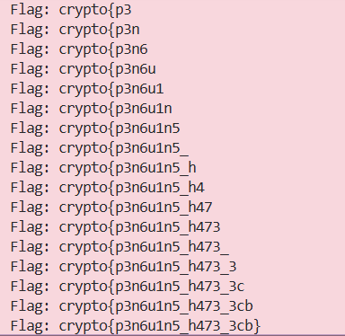

### Given
- Server cung cấp 1 endpoint duy nhất:
    ```python
    @chal.route('/ecb_oracle/encrypt/<plaintext>/')
    def encrypt(plaintext):
        plaintext = bytes.fromhex(plaintext)
        plaintext = plaintext + FLAG.encode()  # input ghép trước flag
        padded = pad(plaintext)
        cipher = AES.new(KEY, AES.MODE_ECB)
        ciphertext = cipher.encrypt(padded)
        return {"ciphertext": ciphertext.hex()}
    ```

- Có 3 điều quan trọng cần chú ý:

    - Ta kiểm soát **prefix**, flag nằm phía sau
    
    - Key là **cố định** — cùng plaintext block luôn cho cùng ciphertext block

    - Chỉ có encrypt, không có decrypt

    > **AES-ECB (Electronic Codebook)**: Mỗi block 16 byte plaintext được mã hóa độc lập bằng cùng một key. Không có XOR với block trước như CBC. Hệ quả: hai block plaintext giống nhau -> hai block ciphertext giống hệt nhau — đây là điểm yếu bị khai thác.

    > 💡 **Oracle** là một "hộp đen" mà ta gửi input vào và nhận output ra, nhưng không thấy bên trong (không biết key). Ở challenge này, oracle chính là `server endpoint` — ta không có key nhưng có thể nhờ server mã hóa bất kỳ plaintext nào. Chỉ cần hỏi oracle đủ nhiều lần với input được chọn khéo léo, ta có thể khôi phục thông tin bí mật mà không cần biết key.

### Goal
- Khôi phục toàn bộ flag từng ký tự một, không cần biết key, chỉ dùng oracle encrypt.

### Solution
- **Ý tưởng:** Byte-at-a-time ECB Decryption

    - Vì ta kiểm soát prefix và ECB mã hóa từng block độc lập, ta có thể đẩy từng byte chưa biết của flag vào đúng **vị trí cuối của một block**, sau đó brute-force 256 khả năng để tìm byte đó.

    - Nguyên lý hoạt động đơn giản: nếu block `[A A A A A A A A A A A A A A A ?]` cho ra ciphertext block `X`, thì ta chỉ cần thử tất cả `?` từ 0–255 cho đến khi encrypt của `[A×15 + ?]` cũng cho ra block `X`.

- **Bước 1 — Hiểu cách bố trí block:**

    `BLOCK_SIZE = 16 byte`. Mỗi block hex = 32 ký tự. Oracle mã hóa:

    ```
    ECB( input || FLAG )
    ```

    Với byte thứ `i` của flag (đánh số từ 1), ta tính số byte padding cần gửi để byte đó rơi vào cuối block:

    ```
    pad_length = (BLOCK_SIZE - (i % BLOCK_SIZE)) % BLOCK_SIZE
    ```

    Minh họa cụ thể:

    ```
    i=1:  pad="A"×15 → block0 = [A A A A A A A A A A A A A A A | F₁]
    i=2:  pad="A"×14 → block0 = [A A A A A A A A A A A A A A | F₁ F₂]
    i=3:  pad="A"×13 → block0 = [A A A A A A A A A A A A A | F₁ F₂ F₃]
    ...
    i=15: pad="A"×1  → block0 = [A | F₁ F₂ F₃ F₄ F₅ F₆ F₇ F₈ F₉ F₁₀ F₁₁ F₁₂ F₁₃ F₁₄ F₁₅]
    i=16: pad_length = (16 - 16%16) % 16 = 0 -> URL rỗng!
    ```

    Khi `pad_length == 0`, URL thành `.../encrypt//` -> server trả 404. Xử lý bằng cách thêm 1 block đệm `("A" × 16)` và dịch `target_block_index` sang phải 1:

    ```python
    if pad_length == 0:
        padding = "A" * BLOCK_SIZE    # thêm 1 block để URL hợp lệ
        target_block_index += 1       # byte cần tìm dịch sang block tiếp theo
    ```

    Sau khi fix, vòng lặp tiếp tục hoàn toàn tự nhiên sang block 1, block 2, ...

- **Bước 2 — Lấy block ciphertext tham chiếu:**

    Gửi `padding` (không có flag đã biết) lên oracle. Cắt đúng block chứa byte cần tìm:

    ```python
    target_ciphertext = encrypt(padding)
    start_idx  = target_block_index * 32   # mỗi block = 32 hex chars
    end_idx    = start_idx + 32
    target_block = target_ciphertext[start_idx:end_idx]
    ```

    Lúc này `target_block` là mã hóa của `[padding + flag_đã_biết + byte_cần_tìm]` — ta chưa biết byte cuối cùng.

- **Bước 3 — Brute-force byte tiếp theo:**

    Với mỗi ký tự `c` trong `string.printable` (95 ký tự in được), xây dựng chuỗi:

    ```
    guess = padding + known_flag + c
    ```

    Gửi lên oracle, cắt cùng block index, so sánh với `target_block`:

    ```
    Nếu encrypt(guess)[start:end] == target_block → c chính là byte tiếp theo của flag!
    ```

    Vì sao đúng? Vì:

    ```
    target_block  = ECB_encrypt( padding + F₁F₂...Fₙ + F(n+1) )
    guess_block   = ECB_encrypt( padding + F₁F₂...Fₙ + c      )
    → Khi c == F(n+1): hai block plaintext giống nhau -> ciphertext giống nhau
    ```

    **Tối ưu:** gửi song song 95 request cùng lúc thay vì tuần tự, cancel ngay khi tìm ra đáp án:

    ```python
    def _find_next_char(executor, padding, known_flag, start_idx, end_idx, target_block):
        # Gửi tất cả 95 request song song
        futures = {
            executor.submit(encrypt, padding + known_flag + char): char
            for char in alphabet
        }
        found_char = None
        try:
            for future in as_completed(futures):  # xử lý future nào về trước
                char = futures[future]
                guess_block = future.result()[start_idx:end_idx]
                if guess_block == target_block:
                    found_char = char
                    break  # tìm thấy -> thoát ngay
        finally:
            for future in futures:
                future.cancel()  # hủy các request chưa gửi
        return found_char
    ```

- **Bước 4 — Lặp cho đến khi tìm hết flag:**

    ```python
    flag = ""
    with ThreadPoolExecutor(max_workers=MAX_WORKERS) as executor:
        for i in range(1, MAX_FLAG_LEN + 1):
            # Tính padding và target block (như bước 1)
            ...
            # Brute-force ký tự tiếp theo (như bước 3)
            next_char = _find_next_char(...)
            flag += next_char
            print(f"Flag: {flag}")
            if flag.endswith("}"):  # flag kết thúc bằng "}"
                break
    ```

- **Kết quả:**

    