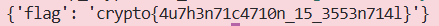

### Given
- Server có 2 endpoint:

    ```python
    @chal.route('/flipping_cookie/get_cookie/')
    def get_cookie():
        expires_at = (datetime.today() + timedelta(days=1)).strftime("%s")
        cookie = f"admin=False;expiry={expires_at}".encode()
        iv = os.urandom(16)                          # IV ngẫu nhiên mỗi lần
        padded = pad(cookie, 16)
        cipher = AES.new(KEY, AES.MODE_CBC, iv)
        encrypted = cipher.encrypt(padded)
        ciphertext = iv.hex() + encrypted.hex()      # Trả về IV + ciphertext
        return {"cookie": ciphertext}

    @chal.route('/flipping_cookie/check_admin/<cookie>/<iv>/')
    def check_admin(cookie, iv):
        cookie = bytes.fromhex(cookie)
        iv = bytes.fromhex(iv)
        cipher = AES.new(KEY, AES.MODE_CBC, iv)
        decrypted = unpad(cipher.decrypt(cookie))
        if b"admin=True" in decrypted.split(b";"):   # Kiểm tra admin=True
            return {"flag": FLAG}
        return {"error": "Only admin can read the flag"}
    ```

- Có hai điểm quan trọng cần lưu ý:

    - Cookie plaintext luôn là `admin=False;expiry=...`

    - Endpoint `check_admin` nhận **cookie và IV riêng biệt**, do đó ta kiểm soát được IV.

### Goal
- Thay đổi cookie sao cho server giải mã ra chuỗi chứa `admin=True` thay vì `admin=False` để lấy flag mà không cần biết key.

### Solution
- **Ý tưởng:** CBC Bit-Flipping Attack

    Trước tiên, ta cần hiểu cách **CBC decryption** hoạt động:
    $$P_i = \text{AES\_Decrypt}(C_i) \oplus C_{i-1}$$

    Với block đầu tiên (i=0), không có block trước nên dùng IV:

    $$P_0 = \text{AES\_Decrypt}(C_0) \oplus IV$$

    > **CBC Bit-Flipping Attack:** Vì plaintext block 0 được XOR trực tiếp với IV trong quá trình decrypt, nếu ta thay đổi IV thì plaintext block 0 thay đổi theo, mà ciphertext block 0 vẫn giữ nguyên. Server cho phép ta gửi IV tùy ý, nên ta có thể kiểm soát hoàn toàn plaintext block 0 sau khi decrypt.

- **Bước 1 — Lấy cookie từ server:**

    ```
    GET /flipping_cookie/get_cookie/
    → {"cookie": "IV(32 hex chars) + C0(32 hex) + C1(32 hex)..."}
    ```

    Tách ra ta được:

    ```python
    iv = bytes.fromhex(cookie_hex[:32])   # 16 bytes đầu
    ct = cookie_hex[32:]                  # phần ciphertext
    ```

    Plaintext gốc của block 0 là:

    ```
    P0 = "admin=False;expi"   (16 byte đầu)
    ```

- **Bước 2 — Tính IV mới để flip bit:**

    Ta muốn sau khi decrypt, block 0 có dạng `"admin=True;\x00\x00\x00\x00\x00"` (hoặc bất kỳ thứ gì chứa `admin=True`).

    Từ công thức CBC decrypt:
    $$P_0 = \text{AES\_Decrypt}(C_0) \oplus IV$$

    Đặt `D0 = AES_Decrypt(C0)`, ta có `P0 = D0 ⊕ IV`. Suy ra:
    $$D_0 = P_0 \oplus IV$$

    Ta muốn plaintext mới `P'0` sau khi decrypt với `IV'` mới:
    $$P'_0 = D_0 \oplus IV' \implies IV' = D_0 \oplus P'_0$$

    Thay `D0 = P0 ⊕ IV` vào:
    $$IV' = (P_0 \oplus IV) \oplus P'_0 = IV \oplus P_0 \oplus P'_0$$
    
    **Công thức trên có nghĩa là:** XOR IV gốc với plaintext gốc, rồi XOR tiếp với plaintext mong muốn => ra IV mới.

    ```python
    from pwn import xor

    P0_original = b"admin=False;expi"   # 16 byte đầu của plaintext gốc
    P0_target   = b"admin=True;\x00\x00\x00\x00\x00"  # plaintext mong muốn

    # IV' = IV ⊕ P0_original ⊕ P0_target
    iv_new = xor(iv, P0_original, P0_target)
    ```

    > **Lưu ý:** Block 0 bị xáo trộn không ảnh hưởng gì vì server chỉ cần tìm `admin=True` trong toàn bộ cookie sau khi split bằng `;`. Phần `expiry=...` vẫn nguyên vẹn ở block 1 trở đi.

- **Bước 3 — Gửi cookie đã chỉnh lên server:**

    ```
    GET /flipping_cookie/check_admin/{ct}/{iv_new.hex()}/
    ```

- **Kết quả:**

    