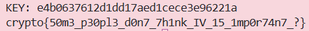

### Given
- Server có 3 endpoint:

    ```python
    @chal.route('/lazy_cbc/encrypt/<plaintext>/')
    def encrypt(plaintext):
        plaintext = bytes.fromhex(plaintext)
        if len(plaintext) % 16 != 0:
            return {"error": "Data length must be multiple of 16"}
        cipher = AES.new(KEY, AES.MODE_CBC, KEY)   # IV = KEY
        encrypted = cipher.encrypt(plaintext)
        return {"ciphertext": encrypted.hex()}

    @chal.route('/lazy_cbc/receive/<ciphertext>/')
    def receive(ciphertext):
        ciphertext = bytes.fromhex(ciphertext)
        if len(ciphertext) % 16 != 0:
            return {"error": "Data length must be multiple of 16"}
        cipher = AES.new(KEY, AES.MODE_CBC, KEY)   # IV = KEY
        decrypted = cipher.decrypt(ciphertext)
        try:
            decrypted.decode()  # kiểm tra ASCII hợp lệ
        except UnicodeDecodeError:
            return {"error": "Invalid plaintext: " + decrypted.hex()}  # Lộ plaintext
        return {"success": "Your message has been received"}

    @chal.route('/lazy_cbc/get_flag/<key>/')
    def get_flag(key):
        key = bytes.fromhex(key)
        if key == KEY:
            return {"plaintext": FLAG.encode().hex()}
        return {"error": "invalid key"}
    ```

- Ba điểm quan trọng ta cần lưu ý:

    - `IV = KEY`: dev lười không tạo IV riêng

    - `receive` trả về **plaintext hex** khi gặp lỗi decode ASCII

    - `get_flag` trả về flag nếu ta cung cấp đúng key

### Goal
- Khôi phục `KEY`, sau đó gọi `get_flag(KEY)` để lấy flag.

### Solution
- **Ý tưởng:** Khai thác CBC với IV = KEY

    Công thức **CBC decrypt** cho từng block:

    $$P_i = \text{AES\_Decrypt}(C_i) \oplus C_{i-1}$$

    Với block đầu tiên dùng IV thay cho `C_{-1}`:

    $$P_0 = \text{AES\_Decrypt}(C_0) \oplus IV$$

    Vì `IV = KEY,` nếu ta tạo ciphertext đặc biệt để lộ `AES_Decrypt(C_0)`, ta có thể tính ngược ra KEY.

- **Bước 1 — Chuẩn bị plaintext và mã hóa:**

    Gửi plaintext gồm 2 block bất kỳ (ví dụ toàn `b"a"`):

    ```python
    plaintext = b"a" * 32   # 2 block × 16 byte
    ct = encrypt(plaintext.hex())
    # ct = C0 (32 hex) + C1 (32 hex)
    C0 = ct[:32]
    C1 = ct[32:]
    ```

    Lúc này quá trình encrypt CBC như sau:

    $$C_0 = \text{AES\_Encrypt}(P_0 \oplus IV) = \text{AES\_Encrypt}(P_0 \oplus KEY)$$

    $$C_1 = \text{AES\_Encrypt}(P_1 \oplus C_0)$$

- **Bước 2 — Tạo ciphertext bẫy:**

    Gửi lên `receive` ciphertext gồm 2 block: `C0` + `C0` (block 0 lặp lại làm block 1):

    ```python
    fake_ct = C0 + C0
    result = receive(fake_ct)
    ```

    Server decrypt `fake_ct`:

    $$P'_0 = \text{AES\_Decrypt}(C_0) \oplus IV = \text{AES\_Decrypt}(C_0) \oplus KEY$$

    $$P'_1 = \text{AES\_Decrypt}(C_0) \oplus C_0$$

    `P'_0` chính là plaintext gốc `P_0 = b"a" * 16` (ASCII hợp lệ).

    `P'_1` là `AES_Decrypt(C0) ⊕ C0`: gần như chắc chắn **không phải ASCII hợp lệ** (random bytes) => server trả lỗi và lộ `P'_1` dưới dạng **hex**:

    ```
    {"error": "Invalid plaintext: 6161...XXXXXXXXXXXXXXXX"}
    #                              ^^^^^^^^^^^^^^^^  ^^^^^^^^^^^^^^^^
    #                              P'_0 (ascii ok)   P'_1 (lộ ra đây!)
    ```

- **Bước 3 — Tính KEY từ plaintext bị lộ:**

    Ta có:
    $$P'_1 = \text{AES\_Decrypt}(C_0) \oplus C_0$$

    Từ bước 1, ta cũng biết:
    $$P_0 = \text{AES\_Decrypt}(C_0) \oplus KEY \implies \text{AES\_Decrypt}(C_0) = P_0 \oplus KEY$$

    Thay vào:
    $$P'_1 = (P_0 \oplus KEY) \oplus C_0$$

    XOR hai vế với `P_0` và `C_0`:
    $$KEY = P'_1 \oplus P_0 \oplus C_0$$

    ```python
    from pwn import xor

    P0    = b"a" * 16                          # plaintext block 0 gốc ta đã gửi
    P1_leaked = bytes.fromhex(result[32:64])   # P'_1 lộ ra từ error message
    C0_bytes  = bytes.fromhex(C0)

    KEY = xor(P1_leaked, P0, C0_bytes)
    ```

- **Bước 4 — Dùng KEY để lấy flag:**

    ```python
    flag_hex = get_flag(KEY.hex())
    print(bytes.fromhex(flag_hex).decode())
    ```

- **Kết quả:**

    

    > **Bài học:** IV phải là giá trị ngẫu nhiên, dùng một lần (nonce) — không được tái sử dụng, và tuyệt đối không dùng key làm IV. Khi IV = KEY, bất kỳ ai quan sát được plaintext/ciphertext đều có thể khôi phục key chỉ với vài phép XOR đơn giản.