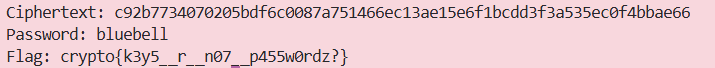

### Given
- Source code server:
    ```python
    import hashlib, random
    from Crypto.Cipher import AES

    with open("/usr/share/dict/words") as f:
        words = [w.strip() for w in f.readlines()]

    # Key được tạo từ MD5 hash của một từ ngẫu nhiên trong từ điển
    keyword = random.choice(words)
    KEY = hashlib.md5(keyword.encode()).digest()  # <- KEY yếu!

    @chal.route('/passwords_as_keys/encrypt_flag/')
    def encrypt_flag():
        cipher = AES.new(KEY, AES.MODE_ECB)
        encrypted = cipher.encrypt(FLAG.encode())
        return {"ciphertext": encrypted.hex()}

    @chal.route('/passwords_as_keys/decrypt/<ciphertext>/<password_hash>/')
    def decrypt(ciphertext, password_hash):
        key = bytes.fromhex(password_hash)
        cipher = AES.new(key, AES.MODE_ECB)
        decrypted = cipher.decrypt(bytes.fromhex(ciphertext))
        return {"plaintext": decrypted.hex()}
    ```

- Key AES 128-bit được tạo bằng cách:
    - Chọn ngẫu nhiên một từ trong file `/usr/share/dict/words` (~235.000 từ)
    - Hash từ đó bằng **MD5** -> dùng làm key

    > **CSPRNG (Cryptographically Secure Pseudorandom Number Generator):** Bộ sinh số ngẫu nhiên đạt chuẩn mật mã — không thể đoán được output tiếp theo dù biết tất cả output trước. `random.choice()` trong Python **không** phải CSPRNG và key từ hash của từ điển có thể brute-force.

### Goal
- Brute-force lại key bằng cách thử MD5 hash của toàn bộ từ trong từ điển, giải mã ciphertext offline mà không cần gọi server.

### Solution
- **Ý tưởng:** Dictionary Attack

    Key space thực tế chỉ là ~235.000 từ — cực kỳ nhỏ so với $2^{128}$ khả năng của AES-128. Với mỗi từ, ta tính `MD5(word)` rồi thử giải mã ciphertext, kiểm tra xem kết quả có bắt đầu bằng `crypto{` không.

    > **Dictionary Attack:** Thay vì brute-force toàn bộ key space, ta chỉ thử các key được sinh ra từ một tập từ điển có sẵn. Hiệu quả khi người dùng dùng từ thông thường làm password.

    > **Tại sao MD5 không an toàn để tạo key?** MD5 là hàm hash nhanh — máy tính hiện đại có thể tính hàng tỷ MD5/giây. Việc hash một từ điển nhỏ tốn chưa đến 1 giây. Key cần được tạo từ **nguồn entropy thực sự ngẫu nhiên** (`os.urandom()`), không phải từ password.

- **Bước 1 — Tải từ điển và lấy ciphertext:**
    ```python
    # Tải từ điển (giống file trên server)
    wget https://gist.githubusercontent.com/wchargin/8927565/raw/d9783627c731268fb2935a731a618aa8e95cf465/words -O words.txt
    ```

    ```python
    import requests

    # Lấy ciphertext từ server
    r = requests.get("https://aes.cryptohack.org/passwords_as_keys/encrypt_flag/")
    ciphertext_hex = r.json()["ciphertext"]
    ```

- **Bước 2 — Brute-force offline:**
    ```python
    import hashlib
    from Crypto.Cipher import AES

    # Đọc toàn bộ từ điển
    with open("words.txt") as f:
        words = [w.strip() for w in f.readlines()]

    # Thử từng từ làm password
    for word in words:
        # Tạo key bằng cách MD5 hash từ → giống hệt logic server
        key = hashlib.md5(word.encode()).digest()
        
        cipher = AES.new(key, AES.MODE_ECB)
        plaintext = cipher.decrypt(bytes.fromhex(ciphertext_hex))
        
        # Kiểm tra known plaintext: flag luôn bắt đầu bằng "crypto{"
        if plaintext.startswith(b"crypto{"):
            print(f"Password: {word}")
            print(f"Flag: {plaintext.decode()}")
            break
    ```
    
- **Kết quả:**

    