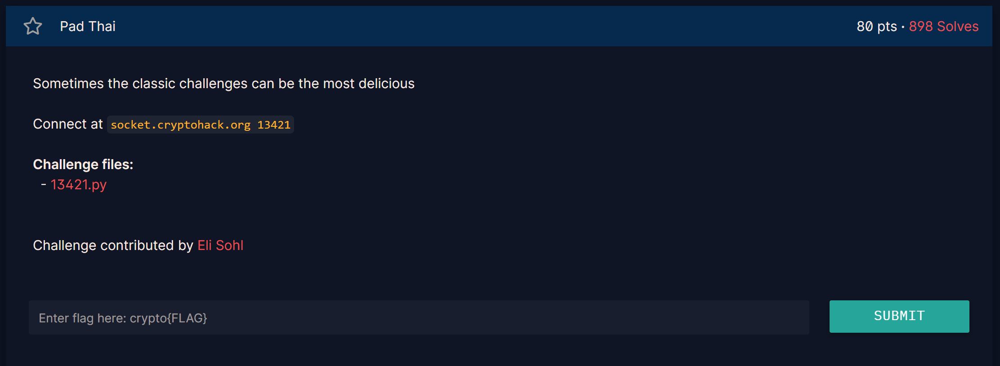
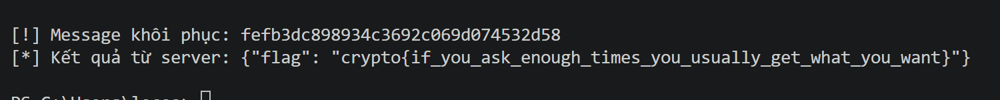

## **Pad Thai (80 pts)**

### **1. Phân tích (Given)**
* **Giao thức:** Server sử dụng AES-CBC để mã hóa một tin nhắn ngẫu nhiên (`self.message`).
* **Tính năng:**
    1. `encrypt`: Trả về Ciphertext (IV + Encrypted Message).
    2. `unpad`: Nhận vào Ciphertext, giải mã và kiểm tra xem Padding (PKCS#7) có hợp lệ hay không. Đây chính là **Oracle**.
    3. `check`: Nếu bạn gửi đúng nội dung tin nhắn (`self.message`), server sẽ trả về Flag.
* **Lỗ hổng:** Server tiết lộ việc Padding có đúng hay không (`True/False`) mà không cần biết khóa.

### **2. Mục tiêu (Goal)**
* Sử dụng lỗ hổng Padding Oracle để giải mã Ciphertext, lấy lại nội dung `message` gốc, sau đó dùng lệnh `check` để lấy Flag.

### **3. Giải pháp (Solution)**

#### **Nguyên lý Padding Oracle Attack**
Trong chế độ CBC, byte cuối của block Plaintext hiện tại ($P_i$) được tạo ra bởi:
$$P_i[k] = Decrypt(C_i)[k] \oplus C_{i-1}[k]$$
Bằng cách thay đổi IV hoặc block Ciphertext trước đó ($C_{i-1}$), ta có thể điều khiển giá trị của $P_i$. Nếu ta thử lần lượt các giá trị và Server báo "Padding hợp lệ", ta có thể suy ra giá trị trung gian ($Intermediate$) sau khi giải mã.


#### **Các bước thực hiện (Dựa trên code giải Pad Thai.py)**
1. **Lấy Ciphertext:** Gọi option `encrypt` để lấy chuỗi hex gồm 32 byte (16 byte IV + 16 byte Ciphertext của tin nhắn).
2. **Giải mã từng byte (từ phải sang trái):**
   * Giả sử cần tìm byte cuối cùng (index 15). Ta muốn $P[15]$ sau khi giải mã có giá trị là `0x01` (Padding hợp lệ cho 1 byte).
   * Ta thay đổi byte tương ứng trong IV gốc ($IV[15]$) bằng một giá trị `fake_IV[15]`.
   * Gửi chuỗi `fake_IV + C` tới server. Nếu server trả về `result: True`, ta tìm được giá trị trung gian:
     $$Intermediate[15] = fake\_IV[15] \oplus 0x01$$
   * Từ đó suy ra Plaintext gốc: $P[15] = Intermediate[15] \oplus IV_{gốc}[15]$.
3. **Mở rộng cho các byte tiếp theo:** Để tìm byte index 14, ta cần padding là `0x02 0x02`. Ta dùng $Intermediate[15]$ đã tìm được để cố định byte cuối là `0x02` và dò tìm byte 14.
4. **Gửi kết quả:** Sau khi giải mã đủ 16 byte, ta có `message`. Gửi tin nhắn này qua option `check` để nhận Flag.

### **4. Kết quả**
Chạy script `Pad Thai.py` của bạn, kết quả sẽ như sau:
* Khôi phục từng byte của message (ví dụ: `7a3...`).
* Sau khi có đủ chuỗi hex message, script gửi lệnh kiểm tra.
``` python
from pwn import *
import json
import time

# Danh sách ký tự hex để ưu tiên tìm kiếm (tăng tốc 10 lần)
HEX_CHARS = [ord(c) for c in "0123456789abcdef"]
SEARCH_SPACE = HEX_CHARS + [i for i in range(256) if i not in HEX_CHARS]

def get_connection():
    while True:
        try:
            r = remote('socket.cryptohack.org', 13421, level='error')
            r.recvline() # Bỏ banner chào mừng
            return r
        except:
            print("[!] Lỗi kết nối, thử lại sau 3s...")
            time.sleep(3)

conn = get_connection()

def oracle(ct_hex):
    global conn
    while True:
        try:
            conn.sendline(json.dumps({"option": "unpad", "ct": ct_hex}).encode())
            line = conn.recvline()
            if not line: raise EOFError
            return json.loads(line.decode())["result"]
        except:
            conn.close()
            conn = get_connection()

# 1. Lấy Ciphertext mục tiêu
conn.sendline(json.dumps({"option": "encrypt"}).encode())
ct_hex = json.loads(conn.recvline().decode())["ct"]
ct_bytes = bytes.fromhex(ct_hex)
iv = ct_bytes[:16]
# self.message.hex() có 32 ký tự -> 32 bytes ASCII -> Cần 2 blocks dữ liệu + 1 block padding
blocks = [ct_bytes[i:i+16] for i in range(16, len(ct_bytes), 16)]

# 2. Giải mã Padding Oracle
final_decrypted_bytes = []
prev_block = iv

print(f"[*] Ciphertext: {ct_hex}")

for b_idx, target_block in enumerate(blocks):
    print(f"\n[*] Giải khối {b_idx + 1}/{len(blocks)}...")
    intermediate = bytearray(16)
    block_pt = bytearray(16)
    
    for i in range(15, -1, -1):
        pad_val = 16 - i
        fake_iv = bytearray(16)
        
        # Thiết lập các byte đã giải mã để tạo padding mong muốn
        for k in range(i + 1, 16):
            fake_iv[k] = intermediate[k] ^ pad_val
            
        for val in SEARCH_SPACE:
            # Tính toán byte IV giả để sau giải mã byte tại i bằng pad_val
            # Giúp tìm ra trạng thái trung gian
            test_byte = val ^ pad_val ^ prev_block[i]
            fake_iv[i] = test_byte
            
            if oracle((fake_iv + target_block).hex()):
                # Kiểm tra tránh trường hợp pad=1 vô tình trùng pad=2,3...
                if pad_val == 1:
                    fake_iv[i-1] ^= 1
                    if not oracle((fake_iv + target_block).hex()):
                        continue
                
                intermediate[i] = test_byte ^ pad_val
                block_pt[i] = intermediate[i] ^ prev_block[i]
                print(f"    [+] Byte {i:02d}: {chr(block_pt[i])}")
                break
                
    final_decrypted_bytes.extend(block_pt)
    prev_block = target_block

# 3. Xử lý kết quả cuối cùng
full_plaintext = bytes(final_decrypted_bytes)
# Gỡ padding PKCS#7
pad_len = full_plaintext[-1]
if pad_len < 16:
    message = full_plaintext[:-pad_len].decode()
else:
    message = full_plaintext.decode() # Trường hợp hiếm không có pad block

print(f"\n[!] Message khôi phục: {message}")

# Gửi message để lấy Flag
conn.sendline(json.dumps({"option": "check", "message": message}).encode())
print(f"[*] Kết quả từ server: {conn.recvline().decode()}")
```



`flag": "crypto{if_you_ask_enough_times_you_usually_get_what_you_want}`