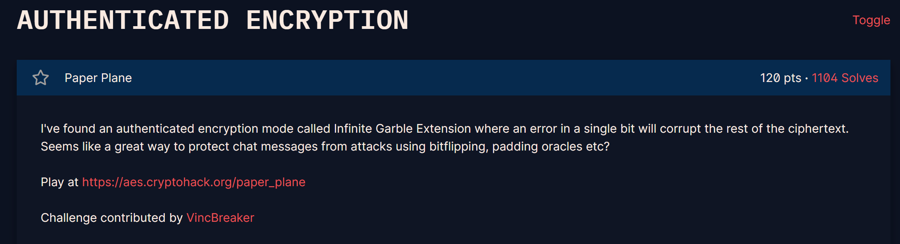

## **Paper Plane (120 pts)**

### **1. Phân tích (Given)**
**Giao thức:** Sử dụng chế độ mã hóa **AES-IGE**.
**Đặc điểm IGE:** * Công thức mã hóa: $c_i = f_K(p_i \oplus c_{i-1}) \oplus p_{i-1}$
    * Công thức giải mã: $p_i = f_K^{-1}(c_i \oplus p_{i-1}) \oplus c_{i-1}$
    * Trong đó $p_0$ và $c_0$ đóng vai trò như các vector khởi tạo (IV).
* **Lỗ hổng:** Hàm `send_msg` thực hiện giải mã và kiểm tra padding PKCS#7. Nếu padding sai, nó trả về lỗi. Đây chính là một **Padding Oracle**.

### **2. Mục tiêu (Goal)**
 Khai thác Padding Oracle trên chế độ IGE để giải mã Flag.

### **3. Giải pháp (Solution)**

#### **Nguyên lý Padding Oracle trên IGE**
Mặc dù IGE phức tạp hơn CBC, nhưng về cốt lõi, việc giải mã $p_i$ vẫn phụ thuộc vào giá trị của $p_{i-1}$ và $c_{i-1}$ mà ta có thể kiểm soát được.
Công thức giải mã block cuối cùng ($n$):
$$p_n = Decrypt_K(c_n \oplus p_{n-1}) \oplus c_{n-1}$$

Để thực hiện Padding Oracle, ta cần thay đổi giá trị của $c_{n-1}$ hoặc $p_{n-1}$ sao cho sau khi giải mã, byte cuối cùng của $p_n$ là `0x01` (padding hợp lệ). Trong challenge này, server cho phép ta gửi cả `m0` (tương ứng $p_0$) và `c0` (tương ứng $c_0$), điều này cho phép ta thao túng quá trình lan truyền lỗi của IGE.


#### **Các bước thực hiện (Dựa trên code giải Paperplane.py)**
1. **Lấy dữ liệu:** Gọi `encrypt_flag` để lấy `ciphertext`, `m0` ($p_0$) và `c0` ($c_0$).
2. **Dò tìm giá trị trung gian:**
    Ta tập trung vào block cuối cùng. Ta thay đổi 16 byte cuối của chuỗi dữ liệu (đóng vai trò là $c_{n-1}$ trong công thức) để quan sát phản hồi từ server.
    Khi server báo "không có lỗi", nghĩa là byte cuối đã được đưa về đúng định dạng padding.
    Ta tính toán giá trị XOR tương ứng để tìm ra $p_n$.
3. **Lan truyền ngược:** Vì IGE có tính chất "infinite garble", kết quả giải mã block sau phụ thuộc vào các block trước. Tuy nhiên, bằng cách điều chỉnh cặp $(m_0, c_0)$ gửi lên mỗi lần, ta có thể cô lập từng block để giải mã như CBC thông thường.

### **4. Kết quả**
Chạy script `Paperplane.py` sẽ thực hiện:
* Duyệt qua từng byte của flag từ cuối lên đầu.
* Với mỗi byte, thử 256 giá trị cho đến khi padding hợp lệ.
* Ghép các byte đã giải mã để thu được Flag hoàn chỉnh.
``` python 
import requests
from pwn import xor
from Crypto.Util.number import *

def encrypt_flag():
    url = 'https://aes.cryptohack.org/paper_plane/encrypt_flag/'
    r = requests.get(url).json()
    return bytes.fromhex(r['ciphertext']), bytes.fromhex(r["m0"]), bytes.fromhex(r["c0"])

def send_msg(ciphertext, m0, c0):
    url = 'https://aes.cryptohack.org/paper_plane/send_msg/'
    url += ciphertext.hex() + "/" + m0.hex() + "/" + c0.hex()
    r = requests.get(url).json()
    return  'error' not in r


def decrypt_block(ctt, m0, c0):
    plaintext = b""
    new_xor = b""
    for i in range(1, 17):
        tmp = c0[:16-i]
        for j in range(255, -1, -1):
            if len(plaintext) > 0:
                pad = long_to_bytes(i)*(i-1)
                send = tmp + long_to_bytes(j) + xor(pad, new_xor)
            else:
                send = tmp + long_to_bytes(j)
            if send_msg(ctt, m0, send):
                new_xor = xor(long_to_bytes(i),(j)) +new_xor
                plaintext = xor(xor(long_to_bytes(i),(j)), (c0[16-i:17-i])) + plaintext 
                print(plaintext)
                break
    return plaintext

ciphertext, m0, c0 = encrypt_flag()
print(c0.hex())
ciphertext1 = ciphertext[:16]
ciphertext2 = ciphertext[16:]

pt1 = decrypt_block(ciphertext1, m0, c0)
print("block1 done")
print(f"{pt1 = }")
pt2 = decrypt_block(ciphertext2, pt1, ciphertext1)

print("flag: " , pt1 + pt2 )
#Source: ldv
```
`crypto{h3ll0_t3l3gr4m}`