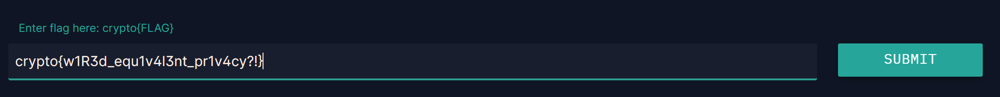
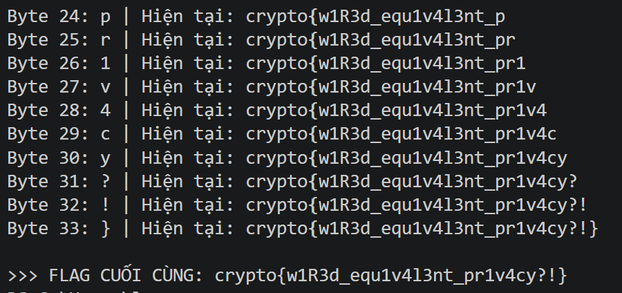

## **Oh SNAP (120 pts)**

### **1. Phân tích (Given)**
* **Giao thức:** Server sử dụng thuật toán mã hóa **RC4**.
* **Cơ chế:** Khi bạn gửi một bản tin, server sẽ tạo một `Keystream` bằng cách kết hợp `IV` (3 byte bạn gửi lên) và `SECRET_KEY` (Flag).
* **Lỗ hổng:** Server trả về lỗi kèm theo giá trị byte đầu tiên của bản mã nếu lệnh gửi lên không hợp lệ. Điều này vô tình tiết lộ byte đầu tiên của `Keystream`.
    * `keystream[0] = ciphertext[0] ^ plaintext[0]`
    * Vì ta biết byte đầu của plaintext (lệnh gửi đi), ta lấy được byte đầu của keystream ứng với mỗi IV.

### **2. Mục tiêu (Goal)**
* Sử dụng lỗ hổng **FMS Attack** để khôi phục từng byte của `SECRET_KEY` (Flag) thông qua việc gửi các IV đặc biệt.

### **3. Giải pháp (Solution)**

#### **Lỗ hổng FMS Attack**
RC4 có một điểm yếu: nếu ta biết một phần của khóa (các byte IV) và byte đầu tiên của keystream, ta có xác suất cao đoán được byte tiếp theo của khóa.


Công thức dự đoán byte thứ $a$ của khóa ($K[a]$):
$$K[a] \approx (S_{target}^{-1}[Z] - j - S[a+3]) \pmod{256}$$
Trong đó:
* $Z$ là byte đầu tiên của keystream.
* $S$ và $j$ là trạng thái của bộ sinh khóa sau khi đã xử lý các byte trước đó.

#### **Các bước thực hiện**
1.  **Thu thập dữ liệu:** Với mỗi byte Flag cần tìm (vị trí $a$):
    * Gửi các IV có dạng đặc biệt: `(a + 3, 255, X)` với $X$ chạy từ $0$ đến $255$.
    * Ghi lại byte đầu tiên của keystream từ thông báo lỗi của server.
2.  **Thống kê (Statistical Analysis):**
    * Với mỗi kết quả trả về, tính toán "ứng cử viên" cho byte Flag hiện tại.
    * Byte nào xuất hiện với tần suất cao nhất (thường là trên 5% số mẫu) sẽ là byte chính xác của Flag.
3.  **Lặp lại:** Sau khi tìm được byte $a$, dùng nó để tiếp tục tìm byte $a+1$.

### **4. Mã khai thác (Tóm tắt)**
Sử dụng script bạn đã cung cấp (`ohSNAP.py`):
* Gửi request đến `/send_cmd/00/{IV}/`.
* Trích xuất byte từ lỗi: `int(res["error"].split(": ")[1], 16)`.
* Giả lập 3 bước đầu của KSA với IV và các byte Flag đã biết để tìm $S$ và $j$.
* Dùng mảng `prob` để đếm số lần xuất hiện của các giá trị byte dự đoán.

---
``` python 
import requests
from concurrent.futures import ThreadPoolExecutor
import string

BASE_URL = "https://aes.cryptohack.org/oh_snap"
session = requests.Session()

def get_keystream_byte(nonce_hex):
    url = f"{BASE_URL}/send_cmd/00/{nonce_hex}/"
    try:
        r = session.get(url, timeout=5)
        res = r.json()
        if "error" in res:
            return int(res["error"].split(": ")[1], 16)
    except:
        return None
    return None

def solve():
    known_key = []
    print("--- Bắt đầu khôi phục FLAG (Chế độ chính xác cao) ---")

    for a in range(45): # Quét độ dài tối đa 45
        prob = [0] * 256
        # Dùng đủ 256 mẫu để đảm bảo không bị sai byte cuối
        samples = range(256) 
        nonces = [bytes([a + 3, 255, x]).hex() for x in samples]
        
        # Gửi 10 luồng cùng lúc để không quá nhanh gây lỗi server
        with ThreadPoolExecutor(max_workers=10) as executor:
            results = list(executor.map(get_keystream_byte, nonces))
        
        for x, z in enumerate(results):
            if z is None: continue
            
            iv = [a + 3, 255, x]
            # Giả lập KSA
            S = list(range(256))
            j = 0
            for i in range(3):
                j = (j + S[i] + iv[i]) % 256
                S[i], S[j] = S[j], S[i]
            
            # Trộn với các byte đã tìm được chính xác
            for i in range(a):
                j = (j + S[i+3] + known_key[i]) % 256
                S[i+3], S[j] = S[j], S[i+3]
            
            # Dự đoán byte khóa
            # FLAG[a] = (z - j - S[a+3]) % 256
            key_byte = (z - j - S[a+3]) % 256
            prob[key_byte] += 1
        
        # Lấy top các ứng cử viên
        candidates = sorted(range(256), key=lambda k: prob[k], reverse=True)
        
        # Lọc: Flag của Cryptohack chỉ chứa ký tự in được
        best_byte = candidates[0]
        for cand in candidates[:10]:
            if chr(cand) in (string.ascii_letters + string.digits + "{}_!?"):
                best_byte = cand
                break
        
        known_key.append(best_byte)
        res_flag = "".join(map(chr, known_key))
        print(f"Byte {a:02d}: {chr(best_byte)} | Hiện tại: {res_flag}")
        
        if chr(best_byte) == '}':
            break

    print("\n>>> FLAG CUỐI CÙNG: " + "".join(map(chr, known_key)))

if __name__ == "__main__":
    solve()
```


`crypto{w1R3d_equ1v4l3nt_pr1v4cy?!}`
